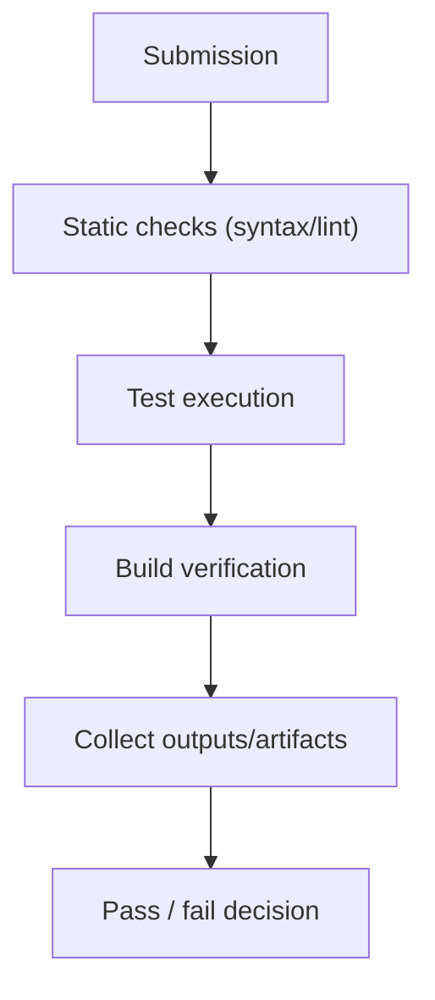

Use this guide when you need to execute user-submitted code checks (tests/lint/build) in CI without risking host integrity.

## Diagram: CI validation pipeline



## Recommended baseline

For untrusted CI workloads, start with:

- `mode: "ephemeral"`
- `network: "none"` by default
- explicit timeout and memory
- no persistent state unless explicitly required

```typescript
import { DockerIsol8 } from "isol8";

const engine = new DockerIsol8({
  mode: "ephemeral",
  network: "none",
  timeoutMs: 30000,
  memoryLimit: "512m",
});

await engine.start();
```

## Pattern 1: run unit tests against submitted code

```typescript
async function runPythonTests(submittedCode: string, testCode: string) {
  const result = await engine.execute({
    runtime: "python",
    installPackages: ["pytest"],
    code: `
with open("/sandbox/solution.py", "w") as f:
  f.write("""${submittedCode.replace(/"""/g, '"""')}""")

with open("/sandbox/test_solution.py", "w") as f:
  f.write("""${testCode.replace(/"""/g, '"""')}""")

import subprocess
proc = subprocess.run(
  ["python3", "-m", "pytest", "/sandbox/test_solution.py", "-q", "--tb=short"],
  capture_output=True, text=True, timeout=20
)
print(proc.stdout)
if proc.stderr:
  print(proc.stderr)
raise SystemExit(proc.returncode)
`,
  });

  return {
    passed: result.exitCode === 0,
    stdout: result.stdout,
    stderr: result.stderr,
    durationMs: result.durationMs,
  };
}
```

## Pattern 2: syntax validation (cheap fail-fast gate)

<Tabs>
  <Tab title="Python">
    ```typescript
    const result = await engine.execute({
      runtime: "python",
      stdin: code,
      code: `
import ast, sys
src = sys.stdin.read()
ast.parse(src)
print("VALID")
`,
    });
    ```
  </Tab>
  <Tab title="Node">
    ```typescript
    const result = await engine.execute({
      runtime: "node",
      stdin: code,
      code: `
const fs = require("node:fs");
const src = fs.readFileSync("/dev/stdin", "utf8");
new Function(src);
console.log("VALID");
`,
    });
    ```
  </Tab>
  <Tab title="CLI quick check">
    ```bash
    isol8 run -e "import ast,sys; ast.parse(sys.stdin.read()); print('VALID')" \
      --runtime python \
      --stdin "print('hello')"
    ```
  </Tab>
</Tabs>

## Pattern 3: linting gate

```typescript
const lint = await engine.execute({
  runtime: "python",
  installPackages: ["flake8"],
  stdin: submittedCode,
  code: `
import subprocess, sys
open("/sandbox/code.py", "w").write(sys.stdin.read())
proc = subprocess.run(
  ["python3", "-m", "flake8", "/sandbox/code.py", "--max-line-length=120"],
  capture_output=True, text=True
)
print(proc.stdout)
if proc.stderr:
  print(proc.stderr)
raise SystemExit(proc.returncode)
`,
});
```

## Pattern 4: build verification

If build needs external dependency resolution, explicitly allow it.

```typescript
const buildEngine = new DockerIsol8({
  mode: "ephemeral",
  network: "host", // trusted CI context only
  timeoutMs: 120000,
  memoryLimit: "1g",
});

await buildEngine.start();

const result = await buildEngine.execute({
  runtime: "bash",
  files: {
    "/sandbox/package.json": packageJson,
    "/sandbox/index.ts": indexTs,
    "/sandbox/tsconfig.json": JSON.stringify({
      compilerOptions: {
        strict: true,
        target: "ES2022",
        module: "ESNext",
      },
    }),
  },
  code: `
cd /sandbox
npm install --ignore-scripts
npx tsc --noEmit
`,
});

await buildEngine.stop();
```

<Warning>
  `network: "host"` should be used only in trusted CI contexts where unrestricted network access is acceptable.
</Warning>

## Pattern 5: artifact capture from test runs

Capture generated test reports using `outputPaths`.

```typescript
const result = await engine.execute({
  runtime: "python",
  code: `
open("/sandbox/report.txt", "w").write("tests: 42\\npassed: 41\\nfailed: 1\\n")
print("report-ready")
`,
  outputPaths: ["/sandbox/report.txt"],
});

const reportBase64 = result.files?.["/sandbox/report.txt"];
```

## Parallel CI jobs

Run independent validations concurrently; isol8 enforces concurrency with semaphores/maxConcurrent.

```typescript
const jobs = submissions.map((s) =>
  engine.execute({
    runtime: "python",
    stdin: s.code,
    code: "import ast,sys; ast.parse(sys.stdin.read()); print('ok')",
  })
);

const results = await Promise.all(jobs);
```

## Remote CI runners

For centralized build/test infrastructure, use remote server + `RemoteIsol8`.

```typescript
import { RemoteIsol8 } from "isol8";

const remote = new RemoteIsol8(
  {
    host: "http://ci-runner.internal:3000",
    apiKey: process.env.ISOL8_API_KEY!,
    sessionId: "pr-123-checks",
  },
  {
    network: "none",
    timeoutMs: 45000,
    memoryLimit: "768m",
  }
);

await remote.start();
const result = await remote.execute({
  runtime: "python",
  code: "print('remote checks start')",
});
await remote.stop();
```

## Reliability patterns for CI pipelines

- fail fast with syntax check before expensive test/build stages
- keep network off unless a stage explicitly requires dependency downloads
- pre-bake stable dependencies with `isol8 setup` for predictable timing
- return structured machine-readable output from each stage (JSON/text summary)
- enforce explicit timeouts per stage to avoid hanging workers

## Related pages

<CardGroup cols={2}>
  <Card title="Execution guide" icon="terminal" href="/execution">
    Request fields, limits, and lifecycle behavior used by CI tasks.
  </Card>
  <Card title="Packages and images" icon="boxes" href="/packages">
    Pre-bake dependencies for stable, faster CI execution.
  </Card>
  <Card title="Security model" icon="shield-check" href="/security">
    Network and isolation controls for untrusted code validation.
  </Card>
  <Card title="Remote server and client" icon="server" href="/remote">
    Run CI checks on centralized remote executors.
  </Card>
</CardGroup>
