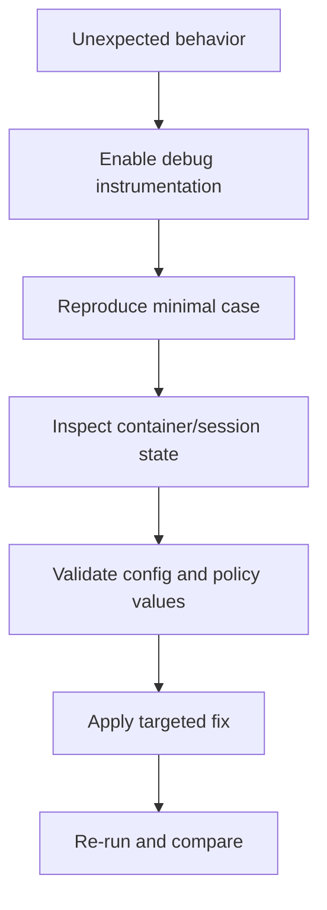

Use this guide when executions behave unexpectedly and you need to identify whether the issue is in your code, runtime setup, policy configuration, or session lifecycle.

## Diagram: Debugging workflow



## 1) Turn on observability first

### CLI debug logs

```bash
isol8 run script.py --debug
```

Useful for:
- engine option resolution (`mode`, `network`, limits)
- container lifecycle and pool behavior
- execution completion metadata (`exitCode`, `duration`, `truncated`)

### Server debug logs

```bash
isol8 serve --port 3000 --key "$ISOL8_API_KEY" --debug
```

Useful for:
- request metadata (`runtime`, code length, `sessionId`)
- session reuse vs creation
- semaphore acquire/release
- auto-prune activity

## 2) Reproduce with a minimal command

Before deep analysis, reduce moving parts:

```bash
isol8 run -e "print('hello')" \
  --runtime python \
  --net none \
  --no-stream \
  --debug
```

Then add complexity one knob at a time:
- package installs (`--install`)
- filtered network (`--net filtered`, `--allow`, `--deny`)
- persistence (`--persistent`, `--persist`)
- larger input/files

## 3) Inspect container state with `--persist`

`--persist` leaves execution containers running so you can inspect filesystem/process state.

```bash
isol8 run script.py --runtime python --persist --debug
```

Then inspect with Docker:

```bash
docker ps --filter "ancestor=isol8:python"
docker exec -it <container-id> sh
ls -la /sandbox
env
ps aux
```

<Warning>
  `--persist` is for debugging and leaves containers running by design. Clean them up after investigation.
</Warning>

Cleanup:

```bash
isol8 cleanup
```

## 4) Validate effective configuration

Many issues come from unexpected default/override values.

```bash
isol8 config --json
```

Confirm:
- `defaults.network`, `defaults.timeoutMs`, `defaults.memoryLimit`
- `network.whitelist` / `network.blacklist`
- `cleanup.autoPrune`, `cleanup.maxContainerAgeMs`
- `maxConcurrent`

## 5) Debug stream vs non-stream behavior

CLI streams by default. If debugging final output/result flags (`truncated`, final stderr), switch to non-stream mode:

```bash
isol8 run script.py --no-stream --debug
```

In non-stream mode CLI prints:
- final stdout/stderr
- truncation warning when output exceeded cap
- network logs (if present)

## 6) Debug network policy issues

For filtered mode connectivity checks:

```bash
isol8 run net_test.py \
  --net filtered \
  --allow "^api\\.github\\.com$" \
  --log-network \
  --debug \
  --no-stream
```

What to verify:
- target host actually matches allow regex
- deny rules are not shadowing allow rules
- `networkLogs` appear only when both are true:
  - `network: filtered`
  - `logNetwork: true`

## 7) Debug session and file issues (remote)

If files/sessions fail, verify `sessionId` usage and lifecycle:

1. create/reuse session via `/execute` with `sessionId`
2. call `/file` upload/download using same `sessionId`
3. check prune settings if session disappears

```bash
curl -X POST http://localhost:3000/execute \
  -H "Authorization: Bearer $ISOL8_API_KEY" \
  -H "Content-Type: application/json" \
  -d '{
    "sessionId": "debug-session-1",
    "request": { "code": "print(1)", "runtime": "python" }
  }'
```

## 8) Library-level debugging patterns

```typescript
import { DockerIsol8 } from "isol8";

const engine = new DockerIsol8({
  mode: "ephemeral",
  debug: true,
  persist: true,
  network: "none",
  timeoutMs: 15000,
});

await engine.start();

const result = await engine.execute({
  runtime: "python",
  code: "print('debug run')",
});

console.log({
  exitCode: result.exitCode,
  durationMs: result.durationMs,
  truncated: result.truncated,
  containerId: result.containerId,
});

await engine.stop();
```

For remote client debugging:

```typescript
import { RemoteIsol8 } from "isol8";

const remote = new RemoteIsol8(
  {
    host: "http://localhost:3000",
    apiKey: process.env.ISOL8_API_KEY!,
    sessionId: "debug-session-remote",
  },
  {
    timeoutMs: 20000,
    network: "none",
  }
);

await remote.start(); // validates /health reachability
const out = await remote.execute({ runtime: "python", code: "print('ok')" });
console.log(out.stdout);
await remote.stop(); // deletes session when sessionId is set
```

## 9) High-signal checks by failure class

### Runtime selection
- explicitly pass `--runtime` when extension detection is uncertain
- avoid inline Deno; run Deno code from file path (`.mts`) in current adapter model

### Resource pressure
- raise `--timeout` for long workloads
- raise `--memory` for OOM-like termination
- increase `--sandbox-size` for large package/file workloads

### Persistent mode behavior
- one persistent container supports one runtime
- local CLI process exit ends engine lifecycle
- for multi-call remote persistence, use stable `sessionId`

### Output surprises
- set `--no-stream` to inspect final aggregate output path
- raise `--max-output` when output is intentionally large

## Related pages

<CardGroup cols={2}>
  <Card title="Execution guide" icon="terminal" href="/execution">
    Execution pipeline details and mode-level semantics.
  </Card>
  <Card title="Remote server and client" icon="server" href="/remote">
    Session lifecycle, file endpoints, and auto-pruning behavior.
  </Card>
  <Card title="Security model" icon="shield-check" href="/security">
    Filtered networking, seccomp, and masking boundaries.
  </Card>
  <Card title="Troubleshooting" icon="wrench" href="/troubleshooting">
    Symptom-driven fixes and concrete recovery steps.
  </Card>
</CardGroup>
