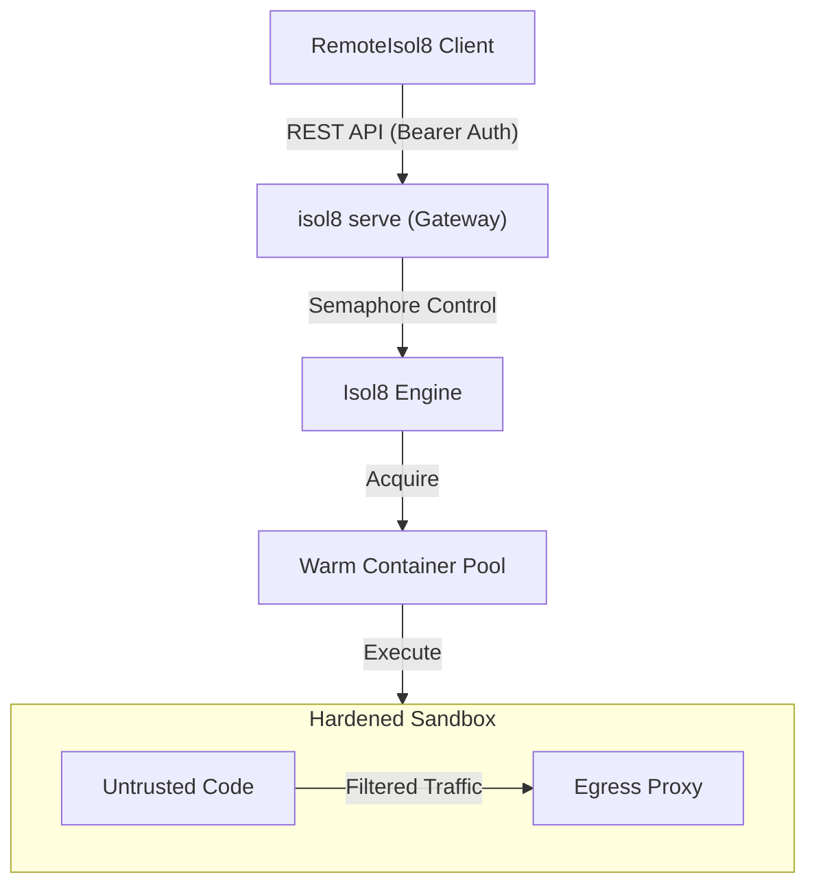

`isol8` provides all the core primitives of a serverless execution environment—API gateway, isolated sandboxes, warm container pools, and resource throttling—allowing you to build a self-hosted alternative to AWS Lambda. 

Unlike AWS Lambda, `isol8` offers lower latency through warm pools, built-in network egress filtering, and the ability to maintain state across calls via persistent sessions.

## Mapping Lambda to isol8

If you are coming from AWS Lambda, here is how the concepts map to `isol8` features:

| AWS Lambda Concept | isol8 Equivalent | Why it's better |
| :--- | :--- | :--- |
| **API Gateway** | `isol8 serve` | Single binary, no complex VPC/IAM setup. |
| **MicroVM (Firecracker)** | **Hardened Docker** | Similar isolation with better runtime compatibility. |
| **Warm Starts** | `ContainerPool` | Sub-100ms "cold starts" with `fast` pool strategy. |
| **Lambda Layers** | `isol8 setup` | Pre-bake dependencies into custom Docker images. |
| **VPC Egress Rules** | **Network Filtering** | Regex-based whitelisting for HTTP(S) traffic. |
| **IAM Auth** | **Bearer Token** | Simple, secure API key authentication. |

## Core Architecture

A self-hosted Lambda setup with `isol8` consists of three main components:



## Setup Guide

Follow these steps to deploy your own Lambda-like execution service.

<Steps>
  <Step title="Configure the Engine">
    Create an `isol8.config.json` to define your "Lambda" defaults and security boundaries.

    ```json
    {
      "maxConcurrent": 20,
      "poolStrategy": "fast",
      "poolSize": { "clean": 5, "dirty": 5 },
      "defaults": {
        "timeoutMs": 30000,
        "memoryLimit": "512m",
        "cpuLimit": 1.0,
        "network": "filtered"
      },
      "network": {
        "whitelist": ["^api\.openai\.com$", ".*\.pypi\.org$"]
      }
    }
    ```
  </Step>

  <Step title="Pre-bake Dependencies">
    Instead of installing packages during every execution (which causes high latency), pre-build your runtimes with the libraries your "Functions" will need:

    ```bash
    isol8 setup --python numpy,pandas,requests --node lodash,axios
    ```
  </Step>

  <Step title="Start the API Gateway">
    Run the server using the standalone binary or `npx`. This provides the execution endpoint for your clients.

    ```bash
    isol8 serve --port 3000 --key your-secret-api-key
    ```
  </Step>

  <Step title="Invoke from a Client">
    Use the `RemoteIsol8` client to "invoke" your function from any application.

    ```typescript
    import { RemoteIsol8 } from "isol8";

    const isol8 = new RemoteIsol8({
      host: "http://your-server-ip:3000",
      apiKey: "your-secret-api-key"
    });

    const result = await isol8.execute({
      code: "print('Hello from my self-hosted Lambda!')",
      runtime: "python"
    });
    ```
  </Step>
</Steps>

## Key Execution Patterns

### 1. Ephemeral (Pure Lambda)
Each request gets a fresh container from the warm pool. Once the execution finishes, the container is returned for cleanup and the next request starts from a blank slate. This is the default behavior.

### 2. Stateful (Session-based)
Unlike AWS Lambda, `isol8` supports stateful sessions. If you pass a `sessionId`, the execution happens in a persistent container. Files written to `/sandbox` or packages installed during the run will be available for the next call with the same `sessionId`.

### 3. Real-time Streaming
For AI agent workflows, you can stream stdout/stderr in real-time via Server-Sent Events (SSE) using the `executeStream()` method, allowing your UI to show progress immediately.

## Performance Tuning

To minimize latency and maximize throughput:

*   **Warm Pool Size**: Increase `poolSize.clean` if you expect bursts of traffic.
*   **Concurrency**: Set `maxConcurrent` to match your server's CPU/RAM capacity.
*   **Memory Limits**: Lower `memoryLimit` for simple tasks to allow more parallel containers on the same host.

## Security Best Practices

<Warning>
  When running untrusted code, always use `network: "filtered"` or `network: "none"` to prevent data exfiltration.
</Warning>

*   **Mask Secrets**: Use the `secrets` option to pass API keys to the sandbox; `isol8` will automatically scrub these values from the stdout/stderr output.
*   **ReadOnly Root**: Keep `readonlyRootFs: true` enabled to prevent code from modifying the system binaries or configuration inside the container.
*   **Seccomp**: Use the default `strict` seccomp profile to block dangerous kernel operations.

## FAQ

<Accordion title="How much does it cost?">
  The software is MIT licensed and free. Your only cost is the hosting for your Docker server (e.g., a $5/mo VPS can easily handle hundreds of daily executions).
</Accordion>

<Accordion title="Does it support automatic scaling?">
  `isol8` manages internal concurrency and pooling. For horizontal scaling across multiple servers, you can place a standard load balancer (like Nginx or HAProxy) in front of multiple `isol8 serve` instances.
</Accordion>

## Troubleshooting

### High Latency on First Run
**Symptom**
- The first execution after startup takes 2-3 seconds.

**Fix**
- This is a "Cold Start." Ensure you run `isol8 setup` beforehand to build the images, and consider increasing the `poolSize` so containers are pre-warmed and ready before the first request arrives.

### Package Install Failures
**Symptom**
- `--install` fails with "Permission denied" or "Read-only file system."

**Fix**
- Runtimes like Python and Node require specific environment variables to install to the writable `/sandbox` directory. `isol8` sets these automatically, but ensure you aren't overriding the `PYTHONUSERBASE` or `NPM_CONFIG_PREFIX` in your `ExecutionRequest.env`.
