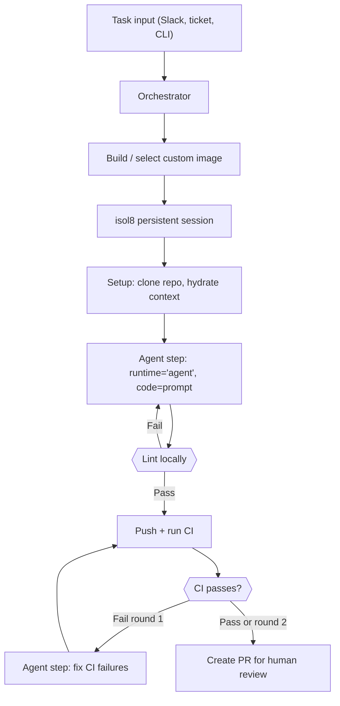

Stripe's [Minions](https://stripe.dev/blog/minions-stripes-one-shot-end-to-end-coding-agents) are unattended coding agents that one-shot tasks end to end: a developer kicks one off, and it produces a complete pull request with no human code — only human review. Over 1,300 PRs merge at Stripe each week this way.

The architecture behind Minions has three pillars:

1. **Isolated, pre-warmed developer environments** — each agent run gets its own sandbox with tools, repos, and dependencies ready to go.
2. **A blueprint-driven agent loop** — deterministic steps (lint, test, push) interleaved with agentic LLM steps (implement, fix failures).
3. **Context hydration** — rule files, MCP tools, and documentation injected before the agent starts.

isol8 gives you pillar 1 out of the box, and the building blocks to wire up pillars 2 and 3. This guide walks through the full setup using **custom images** as your pre-warmed devboxes and the **`agent` runtime** as your agentic step.

## Architecture overview

{/* prettier-ignore */}


## Step 1: Build a custom devbox image

Stripe pre-warms EC2 "devboxes" with repos, caches, and tools. With isol8, **custom images** serve the same purpose — a Docker image with your project's dependencies baked in so every agent run starts instantly.

### CLI approach

```bash
# Build a Python data-science devbox
isol8 build \
  --base python \
  --install numpy pandas scikit-learn pytest black ruff \
  --setup "git config --global user.name 'agent' && git config --global user.email 'agent@ci'" \
  --tag my-org/python-devbox:latest

# Build a Node.js fullstack devbox
isol8 build \
  --base node \
  --install typescript eslint prettier jest \
  --tag my-org/node-devbox:latest
```

The `--setup` flag bakes a shell script into the image that runs before every execution — use it for git config, SSH keys, tool setup, or anything your agent needs before it starts coding.

### Config approach (recommended for servers)

Define `prebuiltImages` in `isol8.config.json` so images are built automatically when the server starts or when you run `isol8 setup`:

```json
{
  "$schema": "https://raw.githubusercontent.com/Illusion47586/isol8/main/packages/core/schema/isol8.config.schema.json",
  "maxConcurrent": 20,
  "prebuiltImages": [
    {
      "tag": "my-org/python-devbox:latest",
      "runtime": "python",
      "installPackages": ["numpy", "pandas", "scikit-learn", "pytest", "black", "ruff"],
      "setupScript": "git config --global user.name 'agent' && git config --global user.email 'agent@ci'"
    },
    {
      "tag": "my-org/node-devbox:latest",
      "runtime": "node",
      "installPackages": ["typescript", "eslint", "prettier", "jest"]
    }
  ],
  "defaults": {
    "timeoutMs": 300000,
    "memoryLimit": "2g",
    "network": "filtered"
  },
  "network": {
    "whitelist": [
      "^api\\.anthropic\\.com$",
      "^github\\.com$",
      "^api\\.github\\.com$",
      "^registry\\.npmjs\\.org$",
      "^pypi\\.org$"
    ],
    "blacklist": ["^169\\.254\\."]
  },
  "cleanup": {
    "autoPrune": true,
    "maxContainerAgeMs": 7200000
  },
  "poolStrategy": "fast",
  "poolSize": { "clean": 5, "dirty": 5 }
}
```

Then build everything:

```bash
isol8 setup
```

<Tip>
  isol8 uses content-addressed hashing for custom images. If the packages and setup script haven't changed, `isol8 setup` skips the build entirely — making it safe to call on every deploy.
</Tip>

## Step 2: Create the orchestrator

The orchestrator is the "blueprint" — a TypeScript program that sequences deterministic bash steps and agentic `agent` runtime steps. Use `DockerIsol8` in persistent mode with your custom image.

```typescript
import { DockerIsol8 } from "@isol8/core";
import type { ExecutionResult } from "@isol8/core";

const engine = new DockerIsol8({
  mode: "persistent",
  image: "my-org/python-devbox:latest",
  network: "filtered",
  networkFilter: {
    // LLM API access + VCS + package registries
    whitelist: [
      "^api\\.anthropic\\.com$",
      "^github\\.com$",
      "^api\\.github\\.com$",
      "^pypi\\.org$",
    ],
    blacklist: ["^169\\.254\\."],
  },
  timeoutMs: 300_000, // 5 minutes per step
  memoryLimit: "2g",
  pidsLimit: 200,     // agent runtime spawns subprocesses; must be set explicitly (true default is 64)
  secrets: {
    // Passed as environment variables; values are automatically masked in stdout/stderr
    GITHUB_TOKEN: process.env.GITHUB_TOKEN!,
    ANTHROPIC_API_KEY: process.env.ANTHROPIC_API_KEY!,
  },
});

await engine.start();
```

<Note>
  `mode: "persistent"` reuses a single container across all `execute()` calls, preserving filesystem state — just like Stripe's devboxes persist across agent steps.
</Note>

<Tip>
  **Persistent vs. ephemeral:** Use `mode: "persistent"` when you need multiple `execute()` calls to share filesystem state (the multi-step blueprint pattern above). For truly fire-and-forget one-shot tasks where a single agent call does all the work, `mode: "ephemeral"` is simpler — no `start()`/`stop()` lifecycle to manage, and stale containers can't accumulate if the process crashes. See the [simple one-shot pattern](#simple-one-shot-pattern) below.
</Tip>

<Note>
  The agent runtime **requires** `network: "filtered"` with at least one whitelist entry. Passing `network: "none"` or an empty whitelist throws immediately. Pass your LLM provider's domain (e.g. `^api\\.anthropic\\.com$`) in the whitelist.
</Note>

## Simple one-shot pattern

If you don't need the multi-step lint/test/iterate blueprint, you can skip the persistent engine entirely. A single `executeStream()` call with a comprehensive prompt and a `setupScript` that clones the repo is often all you need:

```typescript
import { DockerIsol8 } from "@isol8/core";

const engine = new DockerIsol8({
  network: "filtered",
  networkFilter: {
    whitelist: ["^api\\.anthropic\\.com$", "^github\\.com$", "^api\\.github\\.com$"],
    blacklist: ["^169\\.254\\."],
  },
  memoryLimit: "2g",
  pidsLimit: 200,
  secrets: {
    GITHUB_TOKEN: process.env.GITHUB_TOKEN!,
    ANTHROPIC_API_KEY: process.env.ANTHROPIC_API_KEY!,
  },
});

await engine.start();

for await (const event of engine.executeStream({
  runtime: "agent",
  setupScript: `
    git clone https://$GITHUB_TOKEN@github.com/my-org/my-repo.git /sandbox/repo
    cd /sandbox/repo
    git checkout -b agent/fix-issue-42 origin/main
    cat > /sandbox/repo/AGENTS.md << 'EOF'
# Project rules
- Follow existing code style
- Write tests for new functions
- Do not modify the public API surface
EOF
  `,
  code: `Fix the type error in src/utils/parser.ts described in issue #42.
Lint, run tests, then commit the fix and create a PR targeting main with a clear description.`,
  agentFlags: "--model anthropic/claude-sonnet-4-5 --thinking low",
  workdir: "/sandbox/repo",
  timeoutMs: 600_000,
})) {
  if (event.type === "stdout") process.stdout.write(event.data);
  if (event.type === "stderr") process.stderr.write(event.data);
  if (event.type === "exit") console.log(`\nDone (exit ${event.data})`);
}

await engine.stop();
```

<Tip>
  In this pattern the agent is responsible for linting, testing, committing, and opening the PR — all inside the prompt. The `setupScript` handles repo setup before pi starts. Use the multi-step blueprint (Steps 3–6) when you need deterministic control over each phase or want to loop on test failures programmatically.
</Tip>

## Step 3: Hydrate context (clone repo, inject rules)

Before the agent starts coding, set up the workspace. Use `setupScript` on the agent execution itself — it runs as bash inside the container before pi receives the prompt, so the repo, rules, and any config files are all in place when the agent starts.

```typescript
const task = `Fix the type error in src/utils/parser.ts described in issue #42.
Follow existing code style, write tests for any new functions, and do not modify the public API surface.`;

const result = await engine.execute({
  runtime: "agent",
  setupScript: `
    # Clone the repo and create an agent branch
    git clone https://$GITHUB_TOKEN@github.com/my-org/my-repo.git /sandbox/repo
    cd /sandbox/repo
    git checkout -b agent/fix-issue-42 origin/main

    # Write project rules — pi auto-loads AGENTS.md from its working directory
    cat > /sandbox/repo/AGENTS.md << 'EOF'
# Project rules
- Follow existing code style — no reformatting unrelated files
- No new runtime dependencies without approval
- All new functions must have JSDoc comments
- Tests live in tests/ — use the existing test runner (pytest)
- Do not modify the public API surface
EOF
  `,
  code: task,
  agentFlags: "--model anthropic/claude-sonnet-4-5 --thinking low",
  workdir: "/sandbox/repo", // pi starts directly in the repo — no need to cd in the prompt
  timeoutMs: 300_000,
});
```

<Tip>
  `setupScript` runs as bash before pi receives the prompt. It is subject to the same `timeoutMs` as the overall request. A non-zero exit aborts the execution immediately — use it to validate that required secrets are present. The setup script always runs from `/sandbox` regardless of `workdir` — use explicit `cd` inside the script if you need a different directory.
</Tip>

<Tip>
  Set `workdir: "/sandbox/repo"` on every agent `ExecutionRequest` after cloning the repo. `workdir` sets the working directory for pi's process (the main code exec) — pi will start in `/sandbox/repo` rather than the default `/sandbox`, so `AGENTS.md` is auto-loaded and relative tool calls resolve correctly. It does not affect `setupScript`, which always runs from `/sandbox`.
</Tip>

For setup that never changes between runs (git identity, tool config, registry authentication), bake it into the custom image using `prebuiltImages[].setupScript` so it runs on every execution without adding per-request latency. The per-request `setupScript` is then only the parts specific to each task — cloning the right repo, checking out the right branch, writing the task's rules:

```json isol8.config.json
{
  "prebuiltImages": [
    {
      "tag": "my-org/python-devbox:latest",
      "runtime": "python",
      "installPackages": ["numpy", "pandas", "scikit-learn", "pytest", "black", "ruff"],
      "setupScript": "git config --global user.name 'isol8-agent' && git config --global user.email 'agent@ci.internal' && git config --global core.autocrlf false"
    }
  ]
}
```

## Step 4: Run the agent step

Use `runtime: "agent"` to run the pi coding agent inside the sandbox. The `code` field is the natural-language prompt — pi handles the full LLM loop, tool calls (`read`, `write`, `edit`, `bash`), and file edits autonomously inside the container.

The `setupScript` from Step 3 already clones the repo and writes `AGENTS.md` before pi starts. Here the `agentImplement` helper is a thin wrapper that passes a task prompt to the same pattern:

```typescript
async function agentImplement(task: string, setupScript?: string): Promise<ExecutionResult> {
  return engine.execute({
    runtime: "agent",
    setupScript,
    code: task,
    agentFlags: "--model anthropic/claude-sonnet-4-5 --thinking low",
    workdir: "/sandbox/repo", // pi starts in the repo root
    timeoutMs: 300_000,
    // Do NOT pass ANTHROPIC_API_KEY here — it is already available
    // via `secrets` in the engine config, and secrets are masked in output.
    // Using per-request env bypasses masking.
  });
}
```

<Tip>
  Always pass LLM API keys via `secrets` in the engine config, not in per-request `env`. Keys in `secrets` are automatically redacted from stdout/stderr; keys in `env` are not.
</Tip>

isol8 automatically appends a sandbox-awareness system prompt to pi's default prompt via `--append-system-prompt`. You do not need to tell pi it is in a container.

The `agentFlags` field passes extra arguments to the `pi` CLI before `-p`. Useful flags:

| Flag | Description |
|:---|:---|
| `--model <provider/id>` | LLM to use (e.g. `anthropic/claude-sonnet-4-5`, `openai/gpt-4o`) |
| `--thinking <level>` | Thinking budget: `off`, `minimal`, `low`, `medium`, `high`, `xhigh` |
| `--tools <list>` | Limit built-in tools (default: `read,bash,edit,write`) |
| `--no-tools` | Disable all built-in tools (prompt-only mode) |
| `--no-skills` | Disable auto-loading of skill files |
| `--no-extensions` | Disable auto-loading of extensions |

<Warning>
  The agent runtime enforces `network: "filtered"` at both `execute()` and `executeStream()` call sites. Passing `network: "none"` or `network: "host"` — or an empty whitelist — throws before any container work begins.
</Warning>

## Step 5: Deterministic lint and test steps

After the agent finishes coding, run linters and tests deterministically — no LLM involvement. This matches Stripe's blueprint pattern of interleaving deterministic nodes with agentic nodes.

```typescript
async function runLint(): Promise<ExecutionResult> {
  return engine.execute({
    runtime: "bash",
    code: `
      cd /sandbox/repo
      npx prettier --write 'src/**/*.ts'
      npx eslint --fix 'src/**/*.ts'
      echo "Lint complete"
    `,
    timeoutMs: 60_000,
  });
}

async function runTests(): Promise<ExecutionResult> {
  return engine.execute({
    runtime: "bash",
    code: `
      cd /sandbox/repo
      npx jest --ci --passWithNoTests 2>&1
    `,
    timeoutMs: 120_000,
  });
}
```

## Step 6: Wire up the full blueprint

Combine all steps into a single orchestration flow. The `setupScript` handles cloning and context hydration as part of the first agent call — no separate bash step needed:

```typescript
async function runMinion(task: string) {
  const MAX_CI_ROUNDS = 2;

  const setupScript = `
    git clone https://$GITHUB_TOKEN@github.com/my-org/my-repo.git /sandbox/repo
    cd /sandbox/repo
    git checkout -b agent/fix-issue-42 origin/main

    cat > /sandbox/repo/AGENTS.md << 'EOF'
# Project rules
- Follow existing code style
- No new runtime dependencies without approval
- All new functions must have JSDoc comments
- Tests live in tests/ — use pytest
EOF
  `;

  // --- Agentic: implement (runtime: "agent") with context hydration via setupScript ---
  console.log("[1/4] Agent implementing task...");
  const implResult = await agentImplement(task, setupScript);
  if (implResult.exitCode !== 0) {
    console.warn("Agent step exited non-zero:", implResult.stderr);
  }

  // --- Deterministic: lint ---
  console.log("[2/4] Running linters...");
  const lintResult = await runLint();
  if (lintResult.exitCode !== 0) {
    // Let the agent fix lint issues — repo is already in place, no setupScript needed
    await agentImplement("Fix the lint errors:\n" + lintResult.stderr);
    await runLint();
  }

  // --- Deterministic: test + iterate ---
  for (let round = 1; round <= MAX_CI_ROUNDS; round++) {
    console.log(`[3/4] Running tests (round ${round}/${MAX_CI_ROUNDS})...`);
    const testResult = await runTests();

    if (testResult.exitCode === 0) {
      console.log("Tests passed!");
      break;
    }

    if (round < MAX_CI_ROUNDS) {
      // --- Agentic: fix failures ---
      console.log("Tests failed, agent fixing...");
      await agentImplement("Fix the failing tests. Errors:\n" + testResult.stderr);
    } else {
      console.log("Tests still failing after max rounds. Proceeding with PR for human review.");
    }
  }

  // --- Deterministic: commit and push ---
  console.log("[4/4] Committing and pushing...");
  await engine.execute({
    runtime: "bash",
    code: `
      cd /sandbox/repo
      git add -A
      git commit -m "fix: resolve type error in parser (closes #42)

      Automated change produced by coding agent."
      git push origin agent/fix-issue-42
    `,
  });

  // --- Deterministic: create PR ---
  await engine.execute({
    runtime: "bash",
    code: `
      cd /sandbox/repo
      gh pr create \
        --title "fix: resolve type error in parser (closes #42)" \
        --body "## Summary
      Automated fix for issue #42.

      This PR was produced by an unattended coding agent. Please review carefully.

      ## Changes
      - Fixed type error in src/utils/parser.ts
      - Added unit tests" \
        --base main \
        --head agent/fix-issue-42
    `,
  });

  await engine.stop();
  console.log("Done! PR created for human review.");
}

// Run it
runMinion("Fix the type error in src/utils/parser.ts described in issue #42. Follow existing code style, write tests for any new functions, do not modify the public API surface.");
```

## Scaling with the remote server

For production, run isol8 as a centralized server so multiple agents can execute in parallel — the equivalent of Stripe's fleet of devboxes. Each agent gets its own persistent session.

### Start the server

```bash
isol8 serve --port 3000 --key "$ISOL8_API_KEY"
```

### Connect agents via RemoteIsol8

```typescript
import { RemoteIsol8 } from "@isol8/core";
import { randomUUID } from "node:crypto";

async function spawnAgent(task: string) {
  const sessionId = `agent-${randomUUID()}`;

  const engine = new RemoteIsol8(
    {
      host: "http://isol8-server.internal:3000",
      apiKey: process.env.ISOL8_API_KEY!,
      sessionId,
    },
    {
      mode: "persistent",
      image: "my-org/python-devbox:latest",
      network: "filtered",
      networkFilter: {
        whitelist: ["^api\\.anthropic\\.com$", "^github\\.com$", "^api\\.github\\.com$"],
        blacklist: [],
      },
      timeoutMs: 300_000,
      memoryLimit: "2g",
      pidsLimit: 200,
    }
  );

  await engine.start();

  // Run the full agent blueprint against the remote session
  await runBlueprintAgainst(engine, task);

  await engine.stop();
}

// Spawn multiple agents in parallel
await Promise.all([
  spawnAgent("Fix issue #42"),
  spawnAgent("Fix issue #43"),
  spawnAgent("Add unit tests for auth module"),
]);
```

### Stream agent output in real-time

Use streaming to pipe agent activity to a UI or Slack thread:

```typescript
for await (const event of engine.executeStream({
  runtime: "agent",
  code: "Fix the type error in src/utils/parser.ts",
  agentFlags: "--model anthropic/claude-sonnet-4-5",
  workdir: "/sandbox/repo",
})) {
  switch (event.type) {
    case "stdout":
      slackThread.postUpdate(event.data);
      break;
    case "stderr":
      slackThread.postWarning(event.data);
      break;
    case "exit":
      slackThread.postResult(`Agent finished with exit code ${event.data}`);
      break;
  }
}
```

## Stripe Minions concept mapping

| Stripe Minions concept | isol8 equivalent |
|:--|:--|
| Devbox (pre-warmed EC2 instance) | Custom image with `prebuiltImages` + persistent session |
| Devbox pool (hot and ready) | Warm container pool (`poolSize`, `poolStrategy: "fast"`) |
| Isolated environment (no production access) | `network: "filtered"` with allowlisted hosts |
| Blueprint (deterministic + agentic nodes) | Orchestrator mixing `runtime: "bash"` steps with `runtime: "agent"` steps |
| Agentic node (LLM implements/fixes) | `engine.execute({ runtime: "agent", code: prompt, agentFlags: ... })` |
| Context gathering (clone repo, gather docs) | `setupScript` on the agent execution — runs before pi receives the prompt |
| Rule files (Cursor rules, AGENTS.md) | Written via `setupScript` or `putFile()` — pi auto-loads `AGENTS.md` from cwd |
| Recurring devbox config (git identity, registries) | `prebuiltImages[].setupScript` — baked into the image, runs on every execution |
| MCP tools (Toolshed) | `network: "filtered"` allowing agent to call external APIs |
| Local lint loop (pre-push hooks) | Deterministic lint step with `runtime: "bash"` before push |
| CI feedback loop (at most 2 rounds) | Test step looped with `MAX_CI_ROUNDS` + agent fix step |
| Secret isolation (no prod credentials) | `secrets` option — values are automatically masked in output |
| Parallelization (many devboxes) | Multiple `RemoteIsol8` sessions via centralized server |

## Security considerations

Stripe isolates their devboxes from production. isol8 provides equivalent guardrails:

- **Read-only root filesystem** — agents can only write to `/sandbox` and `/tmp`
- **Non-root execution** — all code runs as `sandbox` user (uid 100)
- **Network filtering** — allowlist only the hosts your agent needs (LLM APIs, GitHub, package registries)
- **Secret masking** — credentials in `secrets` are automatically redacted from stdout/stderr
- **Resource limits** — CPU, memory, PIDs, and output size caps prevent runaway agents
- **Seccomp profiles** — strict syscall filtering applied by default
- **Session isolation** — each agent session is a separate container with no shared state
- **Sandbox-aware system prompt** — isol8 appends a prompt informing pi of sandbox constraints, so the agent doesn't attempt operations that will fail

```typescript
const engine = new DockerIsol8({
  mode: "persistent",
  image: "my-org/node-devbox:latest",
  network: "filtered",
  networkFilter: {
    whitelist: [
      "^api\\.anthropic\\.com$",
      "^github\\.com$",
      "^registry\\.npmjs\\.org$",
    ],
    blacklist: ["^169\\.254\\.", "^10\\.", "^172\\.(1[6-9]|2[0-9]|3[01])\\."],
  },
  secrets: {
    GITHUB_TOKEN: process.env.GITHUB_TOKEN!,
    ANTHROPIC_API_KEY: process.env.ANTHROPIC_API_KEY!,
  },
  cpuLimit: 2,
  memoryLimit: "2g",
  pidsLimit: 200,
  maxOutputSize: 5_242_880, // 5MB
});
```

## Tips from the Stripe playbook

1. **Shift feedback left** — run linters and fast checks inside the container before pushing to CI. This saves tokens and compute.
2. **Limit CI rounds** — diminishing returns after 1-2 rounds. Cap iterations and hand off to humans.
3. **Bake dependencies into images** — don't waste agent time installing packages. Use `prebuiltImages` to pre-install everything.
4. **Scope context tightly** — inject only relevant rule files and documentation as `AGENTS.md`. Don't dump your entire codebase.
5. **Deterministic where possible** — lint, format, test, commit, and push are deterministic steps. Don't let the LLM do what a shell script can do better.
6. **Use `secrets` for API keys** — never pass LLM credentials via per-request `env`; use `secrets` so they are masked in output.
7. **Use setup scripts for context hydration** — clone the repo, write `AGENTS.md`, and configure tools via `setupScript` on the agent execution. Use `prebuiltImages[].setupScript` for setup that never changes (git identity, registry auth); use per-request `setupScript` for task-specific setup (cloning the right branch, writing the task's rules).

## Related pages

<CardGroup cols={2}>
  <Card title="Agent in a Box" icon="microchip-ai" href="/agent-in-a-box">
    Full reference for the agent runtime: flags, networking, file injection, and streaming.
  </Card>
  <Card title="Setup scripts" icon="scroll" href="/setup-scripts">
    Full reference for setupScript: image-level vs request-level, execution order, and common patterns.
  </Card>
  <Card title="AI agent code execution" icon="robot" href="/guides/ai-agents">
    Foundational patterns for LLM tool-call loops with isol8.
  </Card>
  <Card title="Security model" icon="shield-check" href="/security">
    Network controls, seccomp, secret masking, and isolation boundaries.
  </Card>
  <Card title="Remote server" icon="server" href="/remote">
    Deploy isol8 as a centralized execution server for agent fleets.
  </Card>
</CardGroup>
