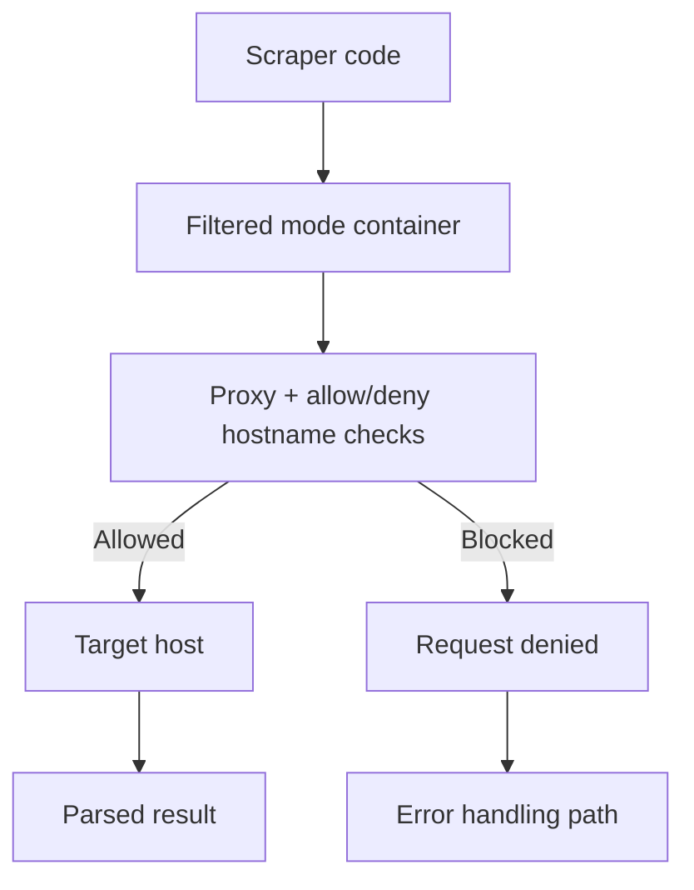

Use this guide when user code needs internet access, but you still need strict control over which destinations can be reached.

## Diagram: Policy-enforced scraping flow



## Start with filtered mode

Enable only approved hosts first, then run scraping logic.

<Tabs>
  <Tab title="Library">
    ```typescript
    import { DockerIsol8 } from "isol8";

    const engine = new DockerIsol8({
      mode: "ephemeral",
      network: "filtered",
      networkFilter: {
        whitelist: [
          "^api\\.github\\.com$",
          "^en\\.wikipedia\\.org$",
        ],
        blacklist: ["^169\\.254\\."],
      },
      timeoutMs: 30000,
      memoryLimit: "512m",
    });

    await engine.start();
    ```
  </Tab>
  <Tab title="CLI">
    ```bash
    isol8 run scraper.py \
      --net filtered \
      --allow "^api\.github\.com$" \
      --allow "^en\.wikipedia\.org$" \
      --deny "^169\.254\."
    ```
  </Tab>
  <Tab title="API">
    ```json
    {
      "request": {
        "code": "print('scrape')",
        "runtime": "python"
      },
      "options": {
        "network": "filtered",
        "networkFilter": {
          "whitelist": ["^api\\.github\\.com$"],
          "blacklist": ["^169\\.254\\."]
        }
      }
    }
    ```
  </Tab>
</Tabs>

<Warning>
  In filtered mode, blacklist rules take precedence over whitelist rules.
</Warning>

## Pattern 1: approved API fetch

```typescript
const result = await engine.execute({
  runtime: "python",
  code: `
import urllib.request, json

url = "https://api.github.com/repos/Illusion47586/isol8"
resp = urllib.request.urlopen(url)
data = json.loads(resp.read())
print(json.dumps({
  "repo": data["full_name"],
  "stars": data["stargazers_count"]
}))
`,
});

console.log(result.stdout);
```

## Pattern 2: graceful handling for blocked hosts

```typescript
const result = await engine.execute({
  runtime: "python",
  code: `
import urllib.request

targets = [
  "https://api.github.com",
  "https://example-blocked-domain.invalid"
]

for url in targets:
  try:
    urllib.request.urlopen(url, timeout=5)
    print(f"ALLOW {url}")
  except Exception as e:
    print(f"BLOCK {url}: {e}")
`,
});
```

## Pattern 3: scraping HTML with packages

For richer parsing, install parser libraries:

```typescript
const result = await engine.execute({
  runtime: "python",
  installPackages: ["requests", "beautifulsoup4"],
  code: `
import requests
from bs4 import BeautifulSoup

html = requests.get("https://en.wikipedia.org/wiki/Docker_(software)", timeout=10).text
soup = BeautifulSoup(html, "html.parser")
first_p = soup.select_one(".mw-parser-output > p:not(.mw-empty-elt)")
print(first_p.get_text(strip=True)[:300])
`,
});
```

## Authenticated API calls with secrets

When scraping private APIs, inject credentials using `secrets`.

```typescript
const secured = new DockerIsol8({
  mode: "ephemeral",
  network: "filtered",
  networkFilter: {
    whitelist: ["^api\\.example\\.com$"],
    blacklist: [],
  },
  secrets: {
    API_TOKEN: process.env.API_TOKEN!,
  },
});

const result = await secured.execute({
  runtime: "python",
  code: `
import os, urllib.request, json

req = urllib.request.Request(
  "https://api.example.com/data",
  headers={"Authorization": f"Bearer {os.environ['API_TOKEN']}"}
)
resp = urllib.request.urlopen(req)
print(resp.status)
`,
});
```

<Note>
  Secret masking applies to stdout/stderr text. If script writes secrets to files, those file contents are not auto-redacted.
</Note>

## Observe network behavior during scraping

Enable network request logs for filtered runs:

```bash
isol8 run scraper.py \
  --net filtered \
  --allow "^api\.github\.com$" \
  --log-network \
  --no-stream
```

In non-stream mode, CLI prints collected network log entries when available.

## Remote scraping workers

For centralized scraping infrastructure, run remote server and use `RemoteIsol8`.

```typescript
import { RemoteIsol8 } from "isol8";

const remote = new RemoteIsol8(
  {
    host: "http://localhost:3000",
    apiKey: process.env.ISOL8_API_KEY!,
    sessionId: "scrape-job-001",
  },
  {
    network: "filtered",
    networkFilter: {
      whitelist: ["^api\\.github\\.com$"],
      blacklist: [],
    },
    timeoutMs: 30000,
  }
);

await remote.start();
const res = await remote.execute({
  runtime: "python",
  code: "print('remote scrape run')",
});
await remote.stop();
```

## Safer scraping design patterns

- whitelist exact hostnames instead of broad wildcards
- keep timeouts short for external requests
- parse to structured output (JSON) rather than raw HTML dumps
- separate fetch and parse stages to isolate failures
- pre-bake stable dependencies to avoid per-run install overhead

## Related pages

<CardGroup cols={2}>
  <Card title="Security model" icon="shield-check" href="/security">
    Understand filtered mode enforcement and seccomp boundaries.
  </Card>
  <Card title="Remote server and client" icon="server" href="/remote">
    Run scraping workloads with centralized session/policy management.
  </Card>
  <Card title="Execution guide" icon="terminal" href="/execution">
    Execution request fields, streaming, and output behavior.
  </Card>
  <Card title="Option mapping" icon="sliders" href="/option-mapping">
    Exact CLI/config/API/library mapping for network and runtime options.
  </Card>
</CardGroup>
