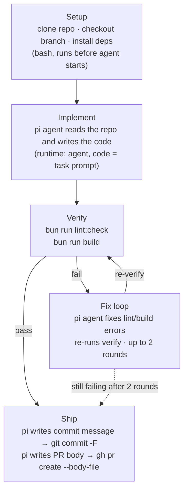
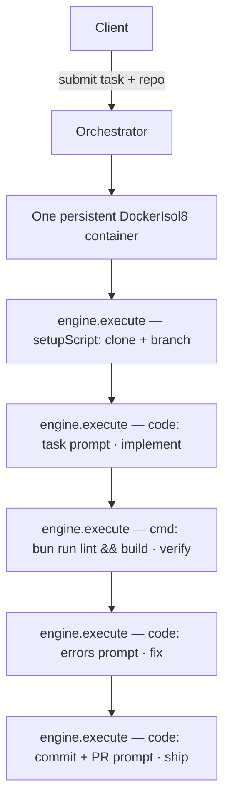
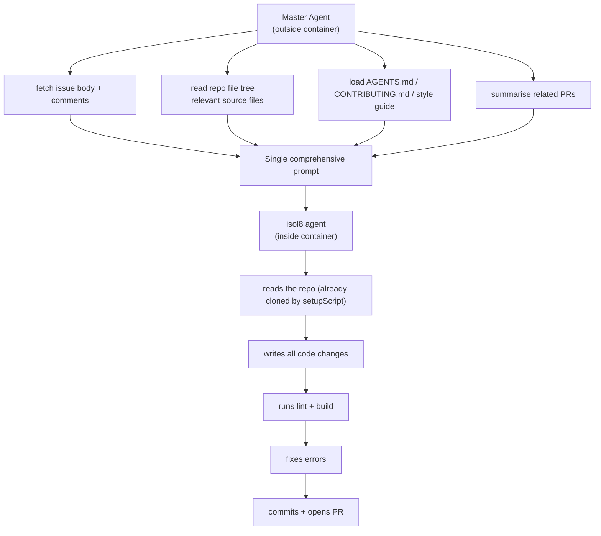

Maxions is a demonstration of what you can build on top of isol8. It is a self-hosted platform for running one-shot coding agents as a queue of jobs — inspired by [Stripe's Minions](https://stripe.dev/blog/minions-stripes-one-shot-end-to-end-coding-agents), where over 1,300 PRs merge autonomously every week. Submit a plain-English task and a target repo; Maxions clones, implements, verifies, commits, and opens a PR with no human in the loop.

[**Maxionalisa**](https://github.com/apps/maxionalisa) is the GitHub App running this platform. It raised [PR #111](https://github.com/Illusion47586/isol8/pull/111) and [PR #113](https://github.com/Illusion47586/isol8/pull/113) on this very repo autonomously — cloned, implemented, committed, and opened each PR with no human code. isol8 is the only reason this is possible without a vendor.

<Note>
  The current Maxions setup targets the isol8 repo out of the box — it exists to demonstrate isol8's capabilities in a real production context. It is straightforward to adapt for any other repository: change `TARGET_REPO` in your `.env` and install the GitHub App on the new repo.
</Note>

## Why not just use a cloud coding agent?

Cloud agents (GitHub Copilot Workspace, Devin, etc.) are convenient but opaque. Maxions is self-hosted — you own the pipeline, the environment, and the secrets.

| | Cloud agents | Maxions |
|---|---|---|
| Execution environment | Vendor-managed VMs | Your Docker host — full control |
| Network access | Opaque | Explicit: `none` / `filtered` / `host` |
| Secrets | Sent to vendor infrastructure | Stay in your environment, masked in all output |
| Cost model | Per-seat or per-task pricing | You pay only for the LLM tokens |
| Concurrency | Limited by your plan | Bounded by your hardware (`p-queue`, configurable) |
| Auditability | Vendor logs | Full stdout/stderr streamed to your own dashboard |
| Pipeline customization | Prompt only | Every step is your code — change anything |

## Pipeline

Each job runs inside a **single persistent `DockerIsol8` container**. All five stages share the same container filesystem — so the repo cloned during setup is still there for implement, verify, fix, and ship.



## Current architecture vs. the ideal

### How it works today

The orchestrator sequences discrete steps — each is a separate `execute()` call. The agent sees one step at a time: implement, then fix (if needed), then ship. The orchestrator drives control flow; the agent drives code changes.



### The ideal: master-agent architecture

The current approach works, but splitting context across multiple prompts leaves gaps. The ideal evolution is a **master agent** that runs outside the isol8 container: it gathers all relevant context first — reads the repo structure, fetches the GitHub issue body, pulls related PRs, loads the style guide and `AGENTS.md` — and synthesises everything into a single, self-sufficient prompt. It then hands off to the isol8 agent box in one shot.



The isol8 agent has everything it needs without back-and-forth. The orchestrator's job shrinks to: spin up container → inject context-rich prompt → wait for PR URL. See the [implement step patterns](/guides/one-shot-coding-agents#step-2-implement-the-agent-gets-the-task) in the one-shot guide for how to structure that context gathering today.

<Note>
  The key insight from Stripe's Minions research is that agent reliability correlates with prompt completeness, not with the number of retries. A master agent that front-loads context consistently outperforms one that iterates with thin prompts.
</Note>

## How Maxions uses isol8

<CardGroup cols={2}>
  <Card title="Persistent mode" icon="database" href="/persistence">
    A single `DockerIsol8` instance in `mode: "persistent"` with `network: "host"`. All pipeline stages share the same container filesystem — the cloned repo persists across every step without re-downloading.
  </Card>
  <Card title="Agent runtime" icon="microchip-ai" href="/agent-in-a-box">
    Each coding step uses `runtime: "agent"`, which runs the `pi` coding agent inside the `isol8:agent` Docker image. `pi` has `git`, `gh`, `bun`, and full repo access — all inside the sandbox.
  </Card>
  <Card title="Setup scripts" icon="scroll" href="/setup-scripts">
    The `setupScript` field runs bash inside the container **before the agent starts** — it clones the repo, checks out a branch, and installs dependencies. This keeps deterministic work out of the agent's hands.
  </Card>
  <Card title="Secret masking" icon="eye-slash" href="/security">
    `GITHUB_TOKEN` and `COPILOT_GITHUB_TOKEN` are passed as `secrets` — isol8 automatically redacts them from all stdout, stderr, and log output. Credentials never appear in the dashboard or SSE stream.
  </Card>
  <Card title="Network control" icon="network-wired" href="/security">
    Maxions uses `network: "host"` to reach GitHub, the Copilot LLM API, and package registries simultaneously. For stricter deployments, swap to `network: "filtered"` with an explicit allowlist — isol8 enforces it via iptables + a transparent proxy.
  </Card>
  <Card title="Resource limits" icon="gauge" href="/execution">
    `pidsLimit: 200` (default 64 is too low — the agent spawns subprocesses), `memoryLimit: "4g"`, `sandboxSize: "4g"`, and a 30-minute hard timeout per job. All enforced at the Docker level.
  </Card>
</CardGroup>

## The two-token split

Each job receives two separate GitHub tokens:

| Variable | Token type | Used by | Why |
|---|---|---|---|
| `GITHUB_TOKEN` | GitHub App installation token — short-lived, repo-scoped | `git clone`, `git push`, `gh` CLI | Minted fresh per job via `@octokit/auth-app`; expires in 1 hour |
| `COPILOT_GITHUB_TOKEN` | Personal Access Token with Copilot access | `pi` (checks this before `GITHUB_TOKEN`) | GitHub App tokens are server-to-server tokens — the Copilot LLM API rejects them. A PAT is required. |

<Warning>
  GitHub App installation tokens are not valid for the Copilot LLM API. If `pi` picks up `GITHUB_TOKEN` instead of `COPILOT_GITHUB_TOKEN`, all agent calls will fail with a 401. `pi` checks `COPILOT_GITHUB_TOKEN` first — ensure it is set in your environment.
</Warning>

## Stack

| Layer | Technology |
|---|---|
| Monorepo | Turborepo + Bun |
| API server | Hono (Bun) |
| Web dashboard | Next.js 15 + shadcn/ui + Tailwind CSS |
| Database | SQLite + Drizzle ORM |
| Agent sandbox | `@isol8/core` — `DockerIsol8` persistent mode |
| Coding agent | `pi` (`@mariozechner/pi-coding-agent`) via `runtime: "agent"` |
| LLM | GitHub Copilot (`github-copilot/gpt-5-mini`) |
| GitHub auth | GitHub App — installation tokens via `@octokit/auth-app` |
| Queue | `p-queue` (configurable concurrency) |
| Linting | Ultracite (Biome-based) |

## Project structure

```
apps/
  api/          Hono API — job queue, SSE live streaming, REST routes
  web/          Next.js dashboard — job list, detail view, live log terminal
packages/
  orchestrator/ The blueprint: all pipeline steps, DockerIsol8 engine wiring
  db/           Drizzle schema, client, SQLite migrations
  ui/           Shared React components — StatusBadge, LogTerminal, StepTimeline
```

## Prerequisites

- [Bun](https://bun.sh) 1.2+
- Docker running locally with access to `/var/run/docker.sock`
- The `isol8:agent` image built from `@isol8/core`:
  ```bash
  docker build --target agent -t isol8:agent node_modules/@isol8/core/docker/
  ```
- A [GitHub App](https://docs.github.com/en/apps/creating-github-apps) installed on the target repo with **Contents** (read/write) and **Pull Requests** (read/write) permissions
- A GitHub PAT with Copilot access for the `pi` agent

## Setup

<Steps>
  <Step title="Install dependencies">
    ```bash
    bun install
    ```
  </Step>
  <Step title="Configure environment">
    ```bash
    cp .env.example .env
    ```
    Fill in the values — see the [environment variables](#environment-variables) table below.
  </Step>
  <Step title="Run database migrations">
    ```bash
    bun run db:migrate
    ```
  </Step>
  <Step title="Start development servers">
    ```bash
    bun run dev
    ```
    - Dashboard: [http://localhost:3002](http://localhost:3002)
    - API: [http://localhost:3000](http://localhost:3000)
  </Step>
</Steps>

## Environment variables

| Variable | Description |
|---|---|
| `GITHUB_APP_ID` | GitHub App ID |
| `GITHUB_APP_PRIVATE_KEY` | App private key in PEM format — use literal `\n` between lines |
| `GITHUB_APP_INSTALLATION_ID` | Installation ID for the target repo |
| `COPILOT_GITHUB_TOKEN` | Personal Access Token with Copilot access — used by `pi` for the LLM API |
| `DATABASE_URL` | SQLite path, e.g. `file:./maxions.db` |
| `API_PORT` | Port for the Hono API server (default: `3000`) |
| `WEB_PORT` | Port for the Next.js dashboard (default: `3002`) |
| `TARGET_REPO` | Default target repository (`owner/repo`) — overridable per-task via the API |

## Docker Compose

```bash
docker compose up --build
```

<Note>
  The API container mounts `/var/run/docker.sock` to spawn sandbox containers as siblings on the host Docker daemon (Docker-outside-of-Docker). The `isol8:agent` image must be built on the host **before** starting the compose stack — the API container does not build it automatically.
</Note>

## Implementation notes

Non-obvious things discovered while building this:

<AccordionGroup>
  <Accordion title="for await deadlocks Bun when consuming Docker TCP streams">
    Bun's `for await` blocks the event loop when iterating Docker TCP streams, preventing `data` events from firing. The stream consumer in `packages/orchestrator/src/blueprint.ts` uses `.then()` + `setImmediate` chaining instead — this keeps the Bun event loop free between iterations so Docker TCP events can interleave.
  </Accordion>
  <Accordion title="git commit without -m hangs in a non-interactive container">
    Calling `git commit` without `-m` opens an interactive editor, which hangs forever in a non-interactive Docker container. The commit step instructs the agent to write the message to `/tmp/commit-msg.txt` and run `git commit -F /tmp/commit-msg.txt` — no editor involved.
  </Accordion>
  <Accordion title="Shell escaping breaks gh pr create --body">
    `gh pr create --body "..."` is broken by backticks or `$(...)` in the PR body — the shell interprets them as command substitution. The PR body is written to `/tmp/pr-body.md` and passed via `--body-file` instead.
  </Accordion>
  <Accordion title="Bun SSE connections drop after 10 seconds">
    Bun's default idle timeout kills long-lived connections before the SSE heartbeat runs. The Bun server export requires `idleTimeout: 0` to keep SSE connections alive for the duration of a job.
  </Accordion>
  <Accordion title="nginx buffers SSE responses without X-Accel-Buffering: no">
    When the API sits behind nginx, SSE responses are buffered by default — the client sees nothing until the connection closes. Add `X-Accel-Buffering: no` to SSE responses to disable nginx response buffering.
  </Accordion>
  <Accordion title="git checkout -b fails on retry with set -e">
    With `set -e` active, `git checkout -b branch-name` exits non-zero if the branch already exists (e.g. on a retry). The setup script uses `git checkout -b ${branch} || git checkout ${branch}` — the fallback is load-bearing; removing it breaks retries silently.
  </Accordion>
</AccordionGroup>

## Further reading

<CardGroup cols={2}>
  <Card title="One-shot coding agents" icon="wand-magic-sparkles" href="/guides/one-shot-coding-agents">
    The architectural guide Maxions is built on — pipeline stages, prompt construction, fix loops, and streaming patterns.
  </Card>
  <Card title="Agent in a Box" icon="microchip-ai" href="/agent-in-a-box">
    Full reference for the agent runtime: the pi agent, flags, networking, file injection, and resource limits.
  </Card>
  <Card title="Persistent execution" icon="database" href="/persistence">
    How persistent containers work — lifecycle, session management, and when to use them.
  </Card>
  <Card title="Security model" icon="shield-check" href="/security">
    Network controls, secret masking, seccomp filtering, and isolation boundaries.
  </Card>
  <Card title="Maxions on GitHub" icon="github" href="https://github.com/Illusion47586/maxions">
    Source code, API reference, and issue tracker.
  </Card>
</CardGroup>
