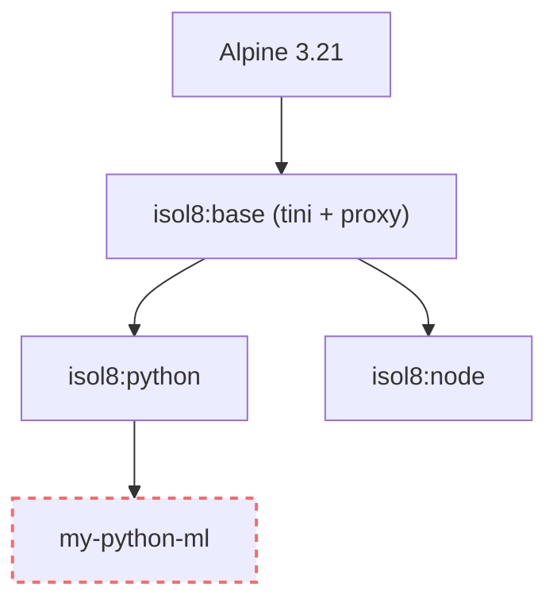

Dependency management is crucial for robust code execution. isol8 offers two strategies:

1. **On-the-fly Installation**: Install packages before each execution. Flexible but slower.
2. **Custom Images**: Bake packages into the Docker image. Fast and reproducible.

## Strategy 1: On-the-Fly Installation

Great for prototyping or when you need different packages for every run.

<Tabs>
  <Tab title="CLI">
    Use `--install <package>` (can be repeated).

    <CodeGroup>
    ```bash Command
    # Python
    isol8 run \
      -e "import numpy" \
      --runtime python \
      --install numpy

    # Node.js
    isol8 run \
      -e "require('lodash')" \
      --runtime node \
      --install lodash
    ```

    ```text Expected behavior
    Packages are installed inside the sandbox before execution starts.
    ```
    </CodeGroup>
  </Tab>
  <Tab title="Library">
    Pass an array of package names.

    ```typescript
    const result = await isol8.execute({
      code: 'import pandas as pd',
      runtime: "python",
      installPackages: ["pandas", "numpy"],
    });
    ```
  </Tab>
  <Tab title="API">
    Include `installPackages` in the request body.

    ```json
    {
      "request": {
        "code": "import numpy",
        "runtime": "python",
        "installPackages": ["numpy"]
      }
    }
    ```
  </Tab>
</Tabs>

<Warning>
  Installation happens inside the container before code execution. This adds overhead (seconds to minutes depending on package size). For frequently used packages, prefer custom images.
</Warning>

<Info>
  Runtime installs are written under `/sandbox` (for example `/sandbox/.local`, `/sandbox/.npm-global`, `/sandbox/.bun-global`). This is intentional because `/tmp` is mounted `noexec`.
</Info>

## Strategy 2: Custom Images (Recommended)

Bake your dependencies into a named custom Docker image. This eliminates installation time during execution.

### Creating Custom Images

Use `isol8 build` with an explicit `--tag` name:

```bash
# Bake numpy and pandas into a custom Python image
isol8 build --base python --install numpy --install pandas --tag my-python-ml

# Bake lodash into a custom Node.js image
isol8 build --base node --install lodash --tag my-node-utils
```

This creates a named image (e.g. `my-python-ml`) that extends the base `isol8:python` image. Metadata labels (`org.isol8.runtime`, `org.isol8.dependencies`) are embedded in the image for automatic discovery.

### Using Custom Images

Once built, isol8 **automatically discovers and uses** matching custom images. When you pass `--install` flags, the engine queries local Docker images for one that already satisfies the requested runtime and dependencies — if found, it skips the install step entirely.

```bash
# Automatically uses the "my-python-ml" image (numpy + pandas are pre-baked)
isol8 run \
  -e "import numpy; print(numpy.__version__)" \
  --runtime python \
  --install numpy
```

You can also explicitly select a custom image:

```bash
isol8 run \
  -e "import numpy; print(numpy.__version__)" \
  --runtime python \
  --image my-python-ml
```

### Listing Custom Images

See what custom images are available locally:

```bash
isol8 list-custom
```

This shows all Docker images with `org.isol8.runtime` labels, their runtimes, and installed dependencies.

### Config File (`isol8.config.json`)

Define prebuilt images in your config file to ensure they exist before the server starts or when running `isol8 setup`.

```json
{
  "prebuiltImages": [
    { "tag": "my-python-ml", "runtime": "python", "installPackages": ["numpy", "pandas", "scikit-learn"] },
    { "tag": "my-node-utils", "runtime": "node", "installPackages": ["lodash", "express"] }
  ]
}
```

Run `isol8 setup` to build any missing images. The server (`isol8 serve`) also auto-builds these images on startup.

## Image Architecture

Understanding how images are built helps optimize your setup.

### Base Images

- **`isol8:python`**: Python 3.x + pip
- **`isol8:node`**: Node.js LTS + npm
- **`isol8:bun`**: Bun runtime
- **`isol8:deno`**: Deno runtime
- **`isol8:bash`**: Bash + apk

Built from a minimal Alpine 3.21 base for security and speed.



### Custom Images

Custom images extend the base image. For example, `my-python-ml` is built like this:

```dockerfile
FROM isol8:python
RUN pip install --no-cache-dir --break-system-packages numpy pandas scikit-learn
```

This ensures your custom image inherits all security features (non-root user, proxy, etc.) from the base image.

### Smart Discovery

When you request packages via `--install` or `installPackages`, the engine automatically:

1. Searches local Docker images with `org.isol8.runtime` and `org.isol8.dependencies` labels
2. Prefers an **exact match** (same set of dependencies)
3. Falls back to a **superset match** (image has all requested packages plus extras)
4. If no match is found, uses the base runtime image and installs packages at runtime

Use `--force` on `isol8 build` to bypass caching and rebuild unconditionally.

## FAQ

<Accordion title="Should I use `--install` or custom images?">
  Use `--install` for ad-hoc experimentation. Use custom images for repeatable production workloads and lower execution latency.
</Accordion>

<Accordion title="Why do some native packages fail when installed in temp directories?">
  Native modules often need executable mount points. isol8 installs runtime packages under `/sandbox` because `/tmp` is mounted with `noexec`.
</Accordion>

<Accordion title="How does the server handle prebuiltImages?">
  On startup, the server iterates `config.prebuiltImages`, checks if each image exists locally, and builds any missing ones before accepting connections. This ensures all declared environments are ready for execution.
</Accordion>

## Troubleshooting quick checks

- **Install step is too slow**: pre-bake dependencies with `isol8 build --tag <name>` or declare them in `prebuiltImages` config.
- **Package import still fails after install**: verify runtime/package pairing (for example Python package in Python runtime).
- **Custom image not updating**: rerun `isol8 build --tag <name> --force`.
- **Disk usage growing from images**: run `isol8 cleanup --images` to remove isol8 images.

## Reference

<CardGroup cols={2}>
  <Card title="How to CLI" icon="terminal" href="/cli">
    All `isol8 setup` and `isol8 build` options and flags.
  </Card>
  <Card title="Configuration" icon="gear" href="/configuration">
    Full schema for `prebuiltImages` in `isol8.config.json`.
  </Card>
  <Card title="Execution guide" icon="square-terminal" href="/execution">
    See install behavior in the full execution lifecycle.
  </Card>
  <Card title="Troubleshooting" icon="wrench" href="/troubleshooting">
    Diagnose setup, install, and runtime issues.
  </Card>
</CardGroup>
