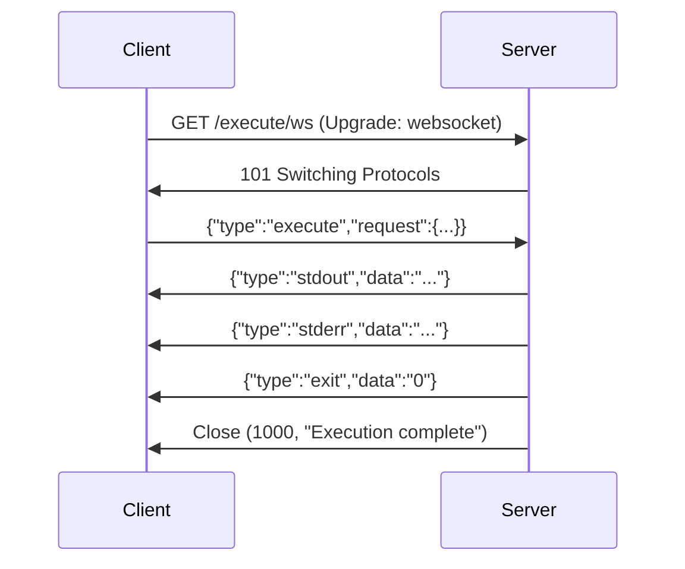

Upgrades to a WebSocket connection for real-time bidirectional streaming of execution events.

## When to use WebSocket vs SSE

| Concern | WebSocket (`/execute/ws`) | SSE (`/execute/stream`) |
|:--|:--|:--|
| Direction | Bidirectional | Server → client only |
| Transport | Single persistent TCP connection | HTTP response stream |
| Future interactivity | Supports `stdin` and `signal` messages (reserved) | No client-to-server messaging |
| Proxy compatibility | Requires WebSocket-capable proxy | Works through any HTTP proxy |
| Client support | Bun, modern browsers, Node 21+ | Any HTTP client |

<Tip>
  `RemoteIsol8.executeStream()` automatically attempts WebSocket first and falls back to SSE if the server doesn't support WebSocket upgrade. You get the best available transport without manual selection.
</Tip>

## Authentication

Authentication uses the `Authorization` header on the WebSocket upgrade request, identical to all other authenticated endpoints.

```
Authorization: Bearer <api-key>
```

<Warning>
  Unlike some WebSocket implementations, isol8 does **not** use query-parameter authentication. Tokens in query strings leak into server logs, proxy logs, and browser history.
</Warning>

## Connection lifecycle



1. Client sends HTTP upgrade request with `Authorization` header.
2. Server validates auth and upgrades to WebSocket.
3. Client sends an `execute` message with the code and options.
4. Server streams `stdout`, `stderr`, `exit`, and `error` events as JSON messages.
5. Server closes the connection with code `1000` after execution completes.

## Client → server messages (`WsClientMessage`)

<ParamField body="type" type="string" required>
  Message type discriminator. One of `"execute"`, `"stdin"`, or `"signal"`.
</ParamField>

### `execute`

Triggers code execution. Only one execution per WebSocket connection.

<ParamField body="request" type="ExecutionRequest" required>
  Execution request with `code` and `runtime`.
</ParamField>

<ParamField body="options" type="Isol8Options">
  Optional execution options merged over server defaults. `poolStrategy` and `poolSize` are always taken from server config.
</ParamField>

### `stdin` (reserved)

<ParamField body="data" type="string">
  Data to send to the running process's stdin. Reserved for future interactive execution support.
</ParamField>

### `signal` (reserved)

<ParamField body="signal" type="string">
  Control signal to forward to the running process. Accepts `"SIGINT"` or `"SIGTERM"`. Reserved for future use.
</ParamField>

## Server → client messages (`WsServerMessage`)

Server messages use the same `StreamEvent` format as the SSE endpoint.

<ResponseField name="type" type="string">
  Event kind: `stdout`, `stderr`, `exit`, or `error`.
</ResponseField>

<ResponseField name="data" type="string">
  Event payload. For `exit`, this is the exit code as a string (e.g. `"0"`).
</ResponseField>

## Close codes

| Code | Meaning |
|:--|:--|
| `1000` | Execution completed normally |
| `1003` | Client sent invalid JSON |

## Error handling

- **Invalid JSON**: Server sends `{"type":"error","data":"Invalid JSON message"}` then closes with code `1003`.
- **Unknown message type**: Server sends `{"type":"error","data":"Unknown message type: ..."}` (connection stays open).
- **Execution error**: Server sends `{"type":"error","data":"..."}` then closes with `1000`.
- **Queue full**: Server sends `{"type":"error","data":"Queue is full (N/N)"}` then closes with `1000`. Unlike HTTP endpoints which return `429`, WebSocket connections are already upgraded, so queue errors are delivered as error events.
- **Queue timeout**: Server sends `{"type":"error","data":"Queue timeout after Nms (limit: Nms)"}` then closes with `1000`.

<Note>
  The WebSocket endpoint always uses ephemeral execution mode. Persistent sessions via `sessionId` are not supported on WebSocket — use `POST /execute` for persistent sessions.
</Note>

<RequestExample>
```javascript JavaScript
const ws = new WebSocket("ws://localhost:3000/execute/ws", {
  headers: { Authorization: `Bearer ${API_KEY}` },
});

ws.onopen = () => {
  ws.send(JSON.stringify({
    type: "execute",
    request: {
      runtime: "python",
      code: "for i in range(3): print(i)",
    },
  }));
};

ws.onmessage = (event) => {
  const msg = JSON.parse(event.data);
  if (msg.type === "stdout") process.stdout.write(msg.data);
  if (msg.type === "stderr") process.stderr.write(msg.data);
  if (msg.type === "exit") console.log(`\nExited: ${msg.data}`);
  if (msg.type === "error") console.error(`Error: ${msg.data}`);
};

ws.onclose = (event) => {
  console.log(`Closed: ${event.code} ${event.reason}`);
};
```
</RequestExample>

<ResponseExample>
```json Messages received
{"type":"stdout","data":"0\n"}
{"type":"stdout","data":"1\n"}
{"type":"stdout","data":"2\n"}
{"type":"exit","data":"0"}
```
</ResponseExample>
