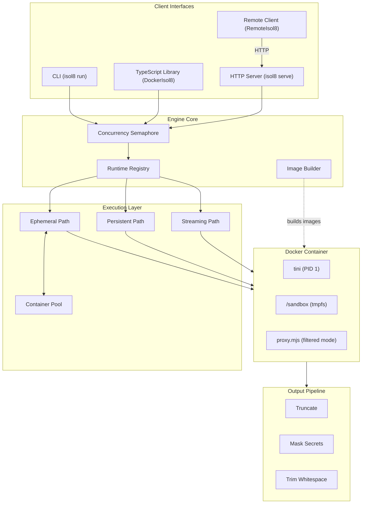
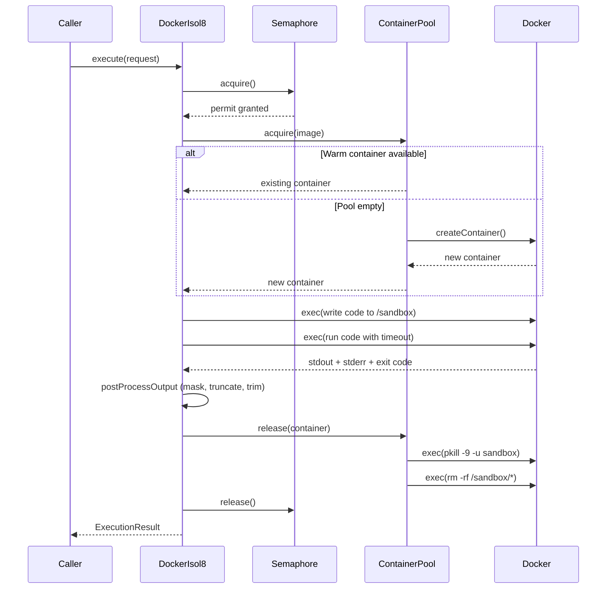
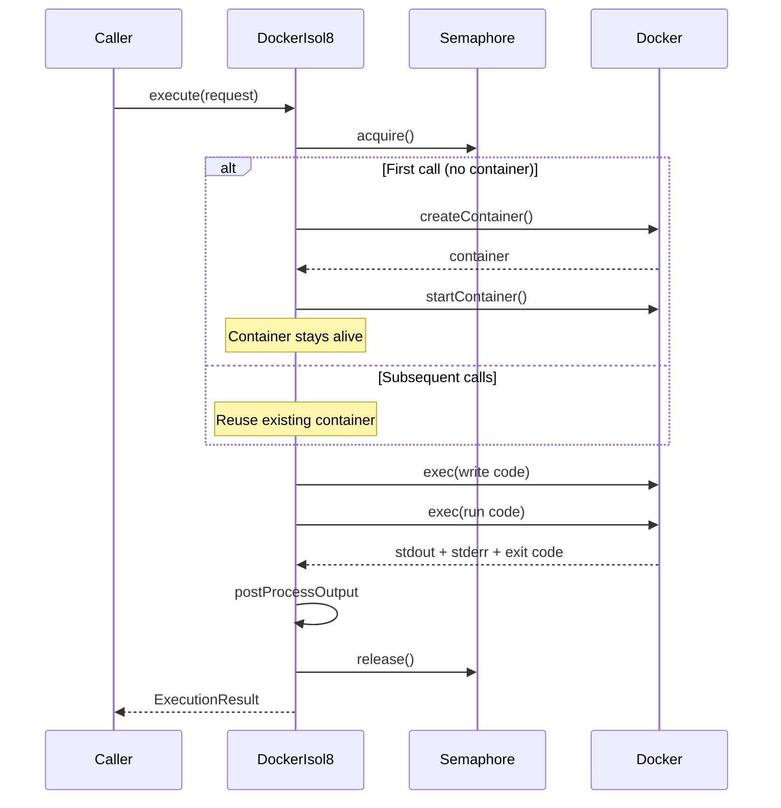
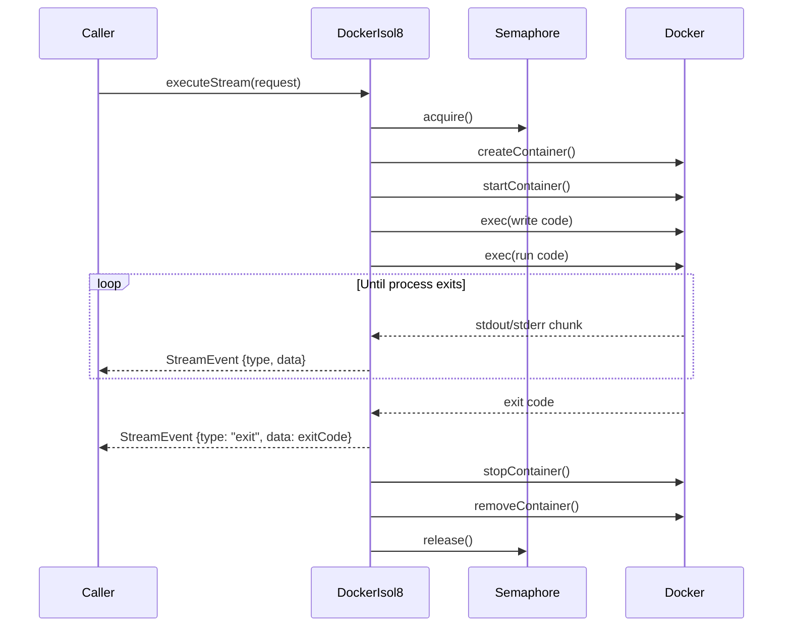
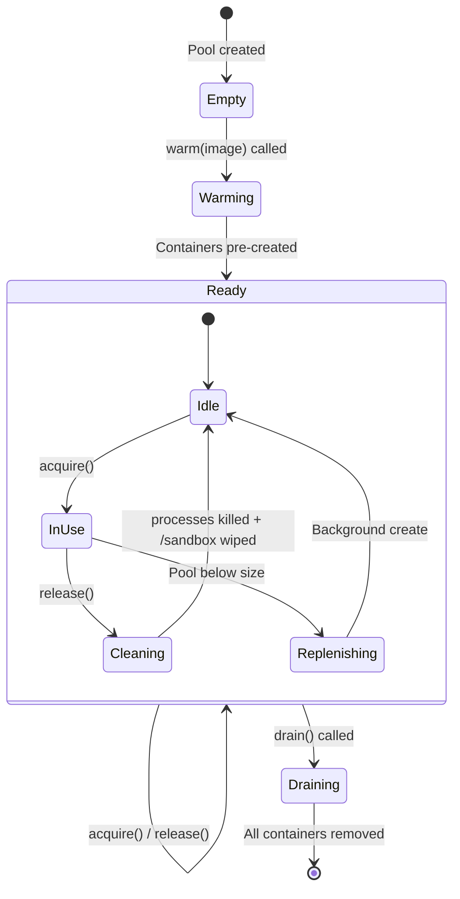
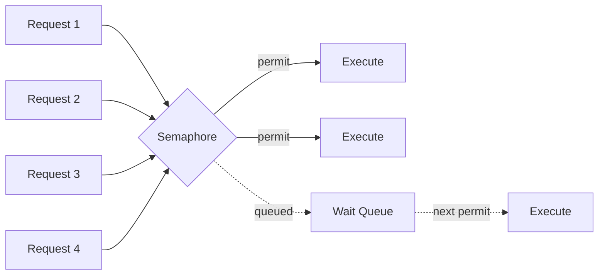
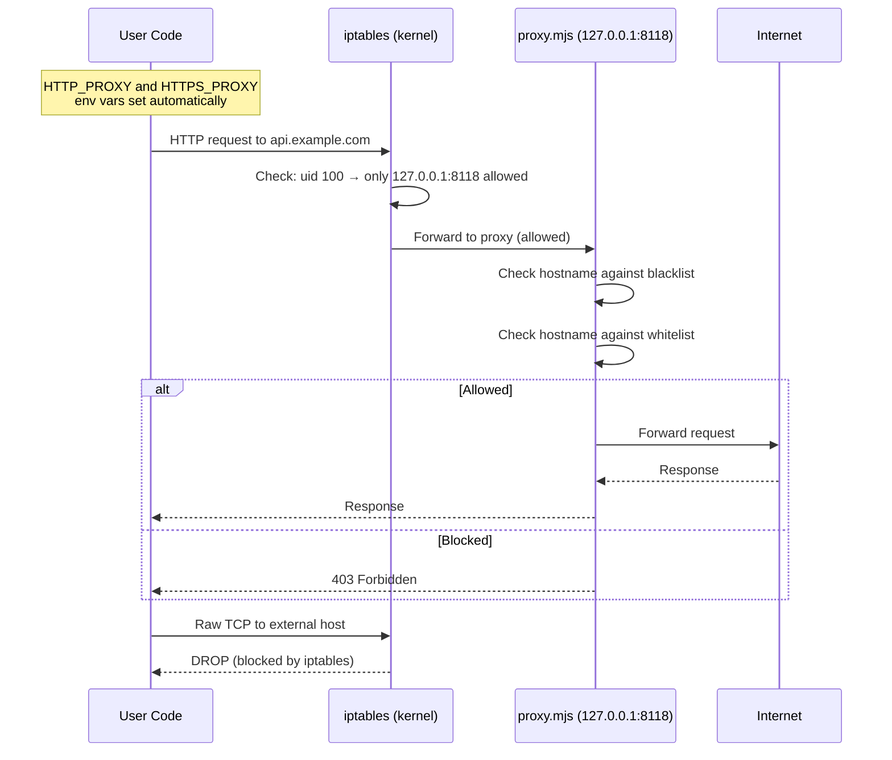
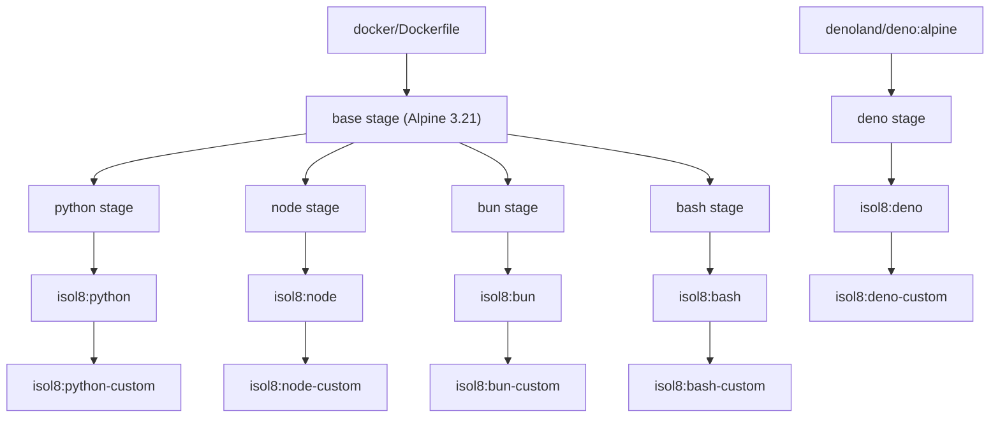
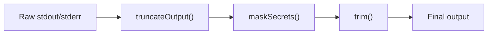
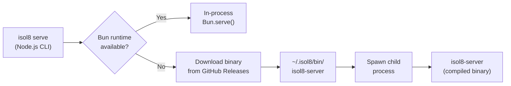

This page covers the internal design of isol8 in detail. It is intended for contributors, advanced users, and anyone who wants to understand exactly what happens under the hood.

## System Overview



## Execution Modes

isol8 supports three execution paths, each with different container lifecycle behavior.

### Ephemeral Execution

The default mode. A container is borrowed from the warm pool, code runs, output is collected, and the container is returned to the pool with its `/sandbox` wiped clean.



**Key details:**
- The semaphore limits concurrent executions (default: 10, configurable via `maxConcurrent`)
- Code is written to `/sandbox/code.<ext>` via `docker exec` using base64 encoding (avoids tar/putArchive issues with read-only root filesystems)
- Commands are wrapped with `timeout -s KILL <seconds>` for hard enforcement
- On release, the pool first kills all user processes (`pkill -9 -u sandbox`) then wipes the filesystem (`rm -rf /sandbox/*`) before returning the container. This prevents background processes from persisting across executions.

### Persistent Execution

A single container is created on first use and reused across all subsequent `execute()` calls on that `DockerIsol8` instance. State (files, packages, environment) persists between runs.



**Key details:**
- Each persistent `DockerIsol8` instance is locked to **one runtime**. Attempting to switch runtimes throws an error.
- The container is not destroyed until `stop()` is called
- `putFile()` and `getFile()` are only available in persistent mode
- The pool is **not used** in persistent mode

### Streaming Execution

`executeStream()` creates a **fresh container every time** (bypasses the pool entirely) and yields `StreamEvent` objects as an async iterable.



**Key details:**
- A new container is created and destroyed per call (no pool reuse)
- Output is streamed chunk-by-chunk via an internal queue mechanism
- The Docker exec stream is demultiplexed (stdout vs stderr headers) and bridged to an async generator
- Timeout is enforced via the `timeout` command wrapper; if triggered, a stderr event is emitted before the kill
- On the HTTP server, streaming always forces ephemeral mode (ignores `sessionId`)

## Container Pool

The `ContainerPool` keeps pre-started containers warm for fast ephemeral execution, reducing cold-start latency from ~200-400ms to ~55-95ms.



| Property | Value | Notes |
|:---------|:------|:------|
| Pool size | 2 | Hardcoded, not configurable |
| Per-image pools | Yes | Each Docker image gets its own pool |
| Replenishment | Background | Fire-and-forget, deduplicated via `replenishing` Set |
| Cleanup on release | `pkill -9 -u sandbox` then `rm -rf /sandbox/*` | Kill user processes, then wipe filesystem |
| Overflow handling | Destroy | If pool is full on release, container is force-removed |

### Pool Lifecycle

1. **`warm(image)`** -- Pre-creates containers up to `poolSize` for a given image. Called lazily on first `execute()`.
2. **`acquire(image)`** -- Returns a container from the pool if available, otherwise creates a new one. Triggers background replenishment.
3. **`release(container, image)`** -- Kills all user processes (`pkill -9 -u sandbox`), wipes `/sandbox`, and returns the container to the pool. If the pool is already at capacity, the container is destroyed instead.
4. **`drain()`** -- Force-removes all pooled containers across all images. Called by `stop()`.

## Concurrency Model

All execution paths go through a counting `Semaphore` that limits the maximum number of concurrent container operations.



- **Default limit:** 10 concurrent operations
- **Configurable:** via `maxConcurrent` in config or `DockerIsol8Options`
- **Queuing:** Callers exceeding the limit are queued and resolved FIFO when a permit is released
- **Server double-gating:** The HTTP server creates its own semaphore (`maxConcurrent`) in addition to the engine's semaphore -- both are set to the same value by default

## Network Modes

isol8 supports three network configurations per container.

### `none` (Default)

No network access. The container is created with `NetworkMode: "none"`. This is the most secure option and the default for both CLI and library usage.

### `host`

Full host network access. The container shares the host's network stack via `NetworkMode: "host"`. Use only when the executed code needs unrestricted internet access.

### `filtered`

HTTP/HTTPS traffic is routed through a filtering proxy (`proxy.mjs`) running inside the container. Kernel-level iptables rules enforce that the `sandbox` user can **only** reach the proxy — all other outbound traffic is dropped.



**iptables enforcement:**

Before user code runs, iptables OUTPUT chain rules are set (as root) inside the container:

1. **Allow loopback** — all traffic on `lo` interface is permitted
2. **Allow established** — responses to existing connections are permitted
3. **Allow proxy** — sandbox user (uid 100) can reach `127.0.0.1:8118`
4. **Drop all other** — all other outbound traffic from uid 100 is dropped

This prevents bypass via raw sockets, direct TCP connections, or any non-HTTP protocol. The container is given `CAP_NET_ADMIN` to set these rules.

**Proxy details:**
- Runs on `127.0.0.1:8118` inside the container (configurable via `ISOL8_PROXY_PORT`)
- Reads `ISOL8_WHITELIST` and `ISOL8_BLACKLIST` environment variables (JSON arrays of regex strings)
- **Blacklist-first evaluation:** if a hostname matches any blacklist pattern, it is blocked regardless of whitelist
- **Empty whitelist = allow all:** if no whitelist patterns are provided, all non-blacklisted hostnames are allowed
- **HTTPS tunneling:** uses HTTP CONNECT method; the proxy establishes a TCP tunnel but cannot inspect encrypted traffic
- The proxy is started inside the container via `docker exec` and isol8 polls until it's ready before running user code

## Docker Image Architecture

### Build Process



### Base Stage

All runtimes (except Deno) share a common `base` stage:

| Component | Details |
|:----------|:--------|
| OS | Alpine 3.21 |
| Init system | tini (PID 1, proper signal handling) |
| Non-root user | `sandbox` (uid 100, gid 101) |
| Network proxy | `proxy.mjs` copied to `/usr/local/bin/` |
| Working directory | `/sandbox` |
| Additional packages | `curl`, `ca-certificates`, `iptables` |

<Note>
  The Deno stage does **not** extend `base`. It uses `denoland/deno:alpine` as its base image and re-applies the base setup (tini, proxy, workdir, sandbox user, entrypoint) manually. This is because Deno's official Alpine image has its own specific setup requirements.
</Note>

### Custom Images

When packages are specified via `isol8 setup --python numpy,pandas` or the `dependencies` config field, custom images are built by layering a `RUN <install-command>` on top of the base image:

```dockerfile
FROM isol8:python
RUN pip install --no-cache-dir --break-system-packages numpy pandas
```

The `resolveImage()` function automatically prefers custom images (`isol8:python-custom`) over base images when they exist.

## Container Hardening

Every container is created with the following security constraints applied via `buildHostConfig()`:

| Control | Setting | Purpose |
|:--------|:--------|:--------|
| Read-only root FS | `ReadonlyRootfs: true` | Prevents writes outside tmpfs mounts |
| Sandbox tmpfs | `/sandbox` (default 512MB) | Writable workspace for code and files |
| Tmp tmpfs | `/tmp` (default 256MB) | Temporary files |
| Non-root user | `User: "sandbox"` | Code runs as unprivileged `sandbox` user (uid 100) |
| Memory limit | Default 512MB | Hard cap, container killed if exceeded |
| CPU quota | Default 0.5 cores | Expressed as NanoCPUs |
| PID limit | Default 100 | Prevents fork bombs |
| Security opts | `no-new-privileges` | Prevents privilege escalation |
| Network capability | `CAP_NET_ADMIN` (filtered mode only) | Allows iptables rules to enforce proxy-only access |
| Stop timeout | 2 seconds | Hardcoded; container force-killed after |

## Output Pipeline

Every execution result passes through a three-stage output pipeline before being returned to the caller:



1. **Truncate** -- If output exceeds `maxOutputSize` (default 1MB), it is byte-aware truncated with a summary suffix indicating the total size and truncation point.
2. **Mask secrets** -- All values passed via the `secrets` option are replaced with `***` using string replacement. This runs on both stdout and stderr.
3. **Trim** -- Leading and trailing whitespace is removed.

## File Transfer

Files are transferred between the host and containers using `docker exec` with base64 encoding (not the Docker `putArchive`/`getArchive` API). This approach works reliably with read-only root filesystems.

- **Write:** `echo '<base64>' | base64 -d > /sandbox/file.txt` via `docker exec`
- **Read:** `base64 /sandbox/file.txt` via `docker exec`, then decode on the host side

The `createTarBuffer()` and `extractFromTar()` utilities in `engine/utils.ts` build minimal POSIX tar archives (512-byte header blocks with proper checksums and ustar magic) for the per-request `files` and `outputPaths` fields.

## Standalone Server Binary

The `isol8 serve` command runs the server as a pre-compiled standalone binary that embeds the Bun runtime. This eliminates the need to install Bun to use the server.



**Two modes:**

1. **Dev mode** — when running under Bun (e.g. `bun run dev -- serve`), the server starts directly in-process via `Bun.serve()`. Detected by checking `globalThis.Bun`.
2. **Built CLI mode** — when running under Node.js (the distributed npm package), the CLI downloads a compiled binary from GitHub Releases on first use and spawns it as a child process. The binary is cached at `~/.isol8/bin/isol8-server`.

Binaries are named `isol8-server-{os}-{arch}` (e.g. `isol8-server-darwin-arm64`, `isol8-server-linux-x64`) and compiled with `bun build --compile` from `src/server/standalone.ts`.

### Lazy Imports

Both `src/server/standalone.ts` and `src/server/index.ts` use dynamic `await import()` to defer loading of `dockerode` and its transitive dependencies (`ssh2` → `protobufjs` → `long`). This is critical because:

1. The `long` polyfill crashes on Linux x64 when compiled with `bun build --compile --bytecode`
2. By lazy-importing, `--version` and `--help` always work even if Docker is unavailable
3. `createServer()` is `async` to support this pattern

```typescript
// src/server/standalone.ts — lazy-imports after arg parsing
const { createServer } = await import("./index");
const server = await createServer({ port, apiKey, debug });

// src/server/index.ts — lazy-imports inside createServer()
export async function createServer(options: ServerOptions) {
  const { DockerIsol8 } = await import("../engine/docker");
  await import("../runtime");
  // ...
}
```
