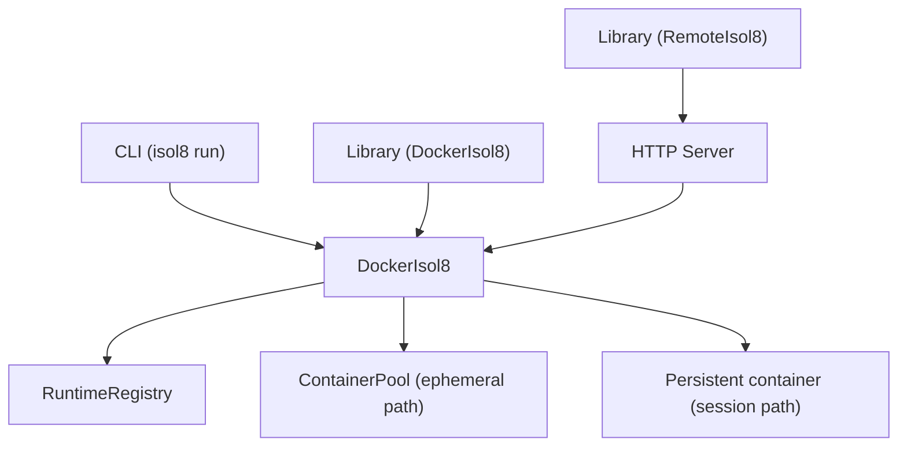
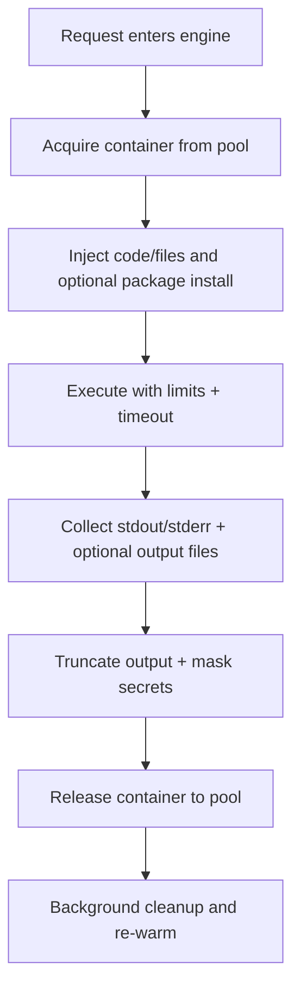

This page explains how isol8 is assembled under the hood so you can reason about behavior, performance, and operational tradeoffs.

## Core building blocks

| Layer | Key implementation | Responsibility |
|:--|:--|:--|
| Public engine contract | `Isol8Engine` in `src/types.ts` | common `start/stop/execute/executeStream/putFile/getFile` interface |
| Local engine | `DockerIsol8` in `src/engine/docker.ts` | Docker-backed execution, pooling, security controls |
| Remote engine | `RemoteIsol8` in `src/client/remote.ts` | HTTP client for remote server execution |
| Runtime selection | `RuntimeRegistry` in `src/runtime/adapter.ts` + `src/runtime/index.ts` | runtime adapter lookup and file extension detection |
| HTTP server | `createServer()` in `src/server/index.ts` | `/execute`, `/execute/stream`, session + file endpoints |
| Concurrency control | `Semaphore` in `src/engine/concurrency.ts` | caps parallel execution both engine-side and server-side |

## Diagram 1: Request path by interface

## Execution model

isol8 uses one engine abstraction with three execution paths:

- **Ephemeral (`mode: "ephemeral"`)**: container acquired from warm pool, executed, then released back for cleanup/reuse.
  For simple requests, the ephemeral path can execute runtime inline commands directly instead of writing a script file first.
- **Persistent (`mode: "persistent"`)**: one long-lived container per session/engine, state preserved across calls.
- **Streaming (`executeStream`)**: creates an ephemeral-style container for that stream execution and yields chunked events.

<Info>
  In server mode, persistent behavior is keyed by `sessionId`. If `sessionId` is absent, the request is treated as ephemeral.
</Info>

## Diagram 2: Ephemeral pool lifecycle

## Pool and concurrency architecture

### Container pool

`ContainerPool` maintains pre-started containers to reduce startup overhead:

- **`poolStrategy: "fast"`** (default): dual-pool behavior (`clean` + `dirty`), background cleanup.
- In `fast` mode, clean-pool acquires trigger asynchronous replenishment to keep warm capacity available.
- **`poolStrategy: "secure"`**: cleanup in acquire path.
- **`poolSize`**: number or `{ clean, dirty }` depending on strategy.

### Semaphores

- `DockerIsol8` uses an internal semaphore with `maxConcurrent`.
- The HTTP server also applies a global semaphore (`config.maxConcurrent`) before execution.
- Effect: protects host resources and creates predictable queueing under load.

## Runtime adapter architecture

Runtime behavior is delegated to adapters:

- each adapter provides image + command generation + default file extension
- registry loads built-ins (Python, Node, Bun, Deno, Bash)
- CLI file-based runs can auto-detect runtime via registry rules

This keeps engine orchestration generic while runtime specifics stay isolated in adapter modules.

## Server session architecture

`src/server/index.ts` keeps a `Map<sessionId, SessionState>` for persistent sessions:

- create/reuse session engines on `/execute` with `sessionId`
- update `lastAccessedAt` on execute/file operations
- `DELETE /session/:id` explicitly tears down session containers
- optional auto-prune removes stale inactive sessions when enabled by config cleanup policy

<Note>
  File endpoints (`/file`) require `sessionId` because file I/O is tied to an active persistent container.
</Note>

## Security and output pipeline placement

Inside the engine execution path:

1. container/network/security options are applied (`network`, seccomp mode, readonly rootfs, limits)
2. code runs as `sandbox` user with timeout enforcement
3. stdout/stderr are captured and bounded (`maxOutputSize`)
4. secret values are masked from text output
5. optional network logs/audit metadata are attached when enabled

## Audit and observability hooks

When audit config is enabled:

- `AuditLogger` records execution provenance
- optional resource tracking (CPU/memory/network) is captured
- optional network request logs are collected in filtered mode (`logNetwork`)
- privacy switches control code/output inclusion

## FAQ

<Accordion title="Why both a container pool and semaphores?">
  The pool reduces container startup overhead. The semaphore controls total parallelism to protect host capacity. They solve different problems.
</Accordion>

<Accordion title="Does RemoteIsol8 execute code differently?">
  It sends the same `ExecutionRequest` shape to the server. Execution still happens in `DockerIsol8` on the server side.
</Accordion>

<Accordion title="When should I use persistent mode?">
  Use it when state must persist across calls (files, installed packages, incremental workflows). Use ephemeral for independent runs and higher isolation between tasks.
</Accordion>

## Troubleshooting

- **Session state not persisting**: ensure you pass a stable `sessionId` for every related API call.
- **High queue latency**: inspect `maxConcurrent` and host resource saturation before raising pool sizes.
- **Runtime mismatch errors**: verify adapter registration and selected runtime/file extension combination.
- **Missing network logs**: network logs require `network: "filtered"` and `logNetwork: true`.

## Related pages

<CardGroup cols={2}>
  <Card title="Execution guide" icon="terminal" href="/execution">
    Detailed request lifecycle, mode behavior, and streaming semantics.
  </Card>
  <Card title="Security model and network controls" icon="shield-check" href="/security">
    Isolation boundaries, filtered egress enforcement, and seccomp behavior.
  </Card>
  <Card title="Performance tuning" icon="gauge-high" href="/performance">
    Pool sizing, concurrency tuning, and latency optimization loop.
  </Card>
  <Card title="Remote server and client" icon="server" href="/remote">
    Deploy and operate the HTTP service with session lifecycle controls.
  </Card>
</CardGroup>
