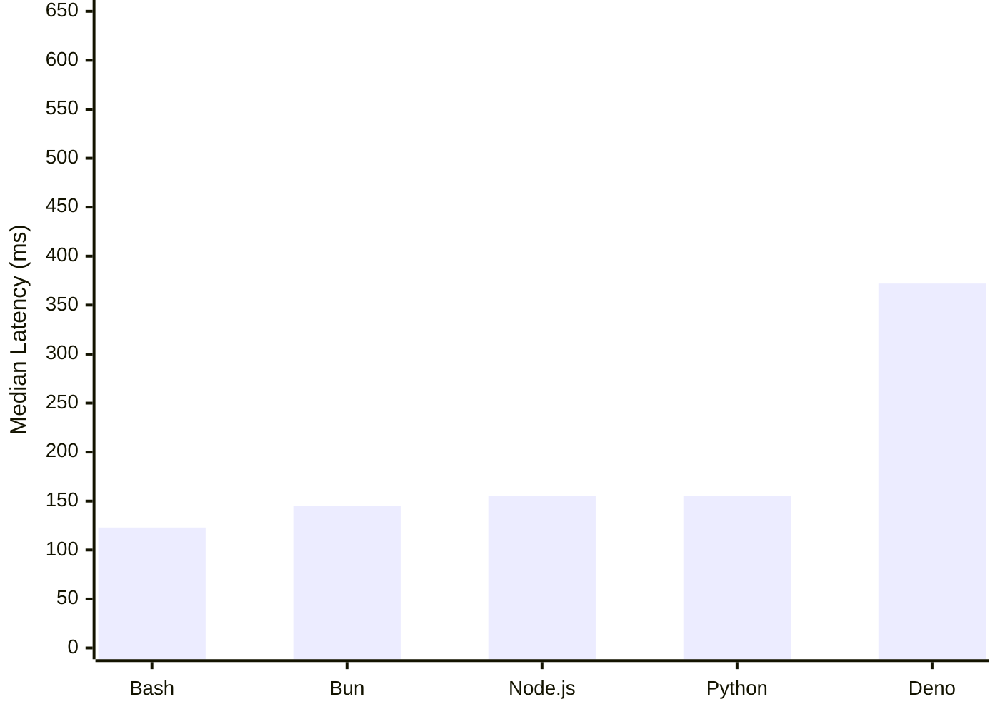
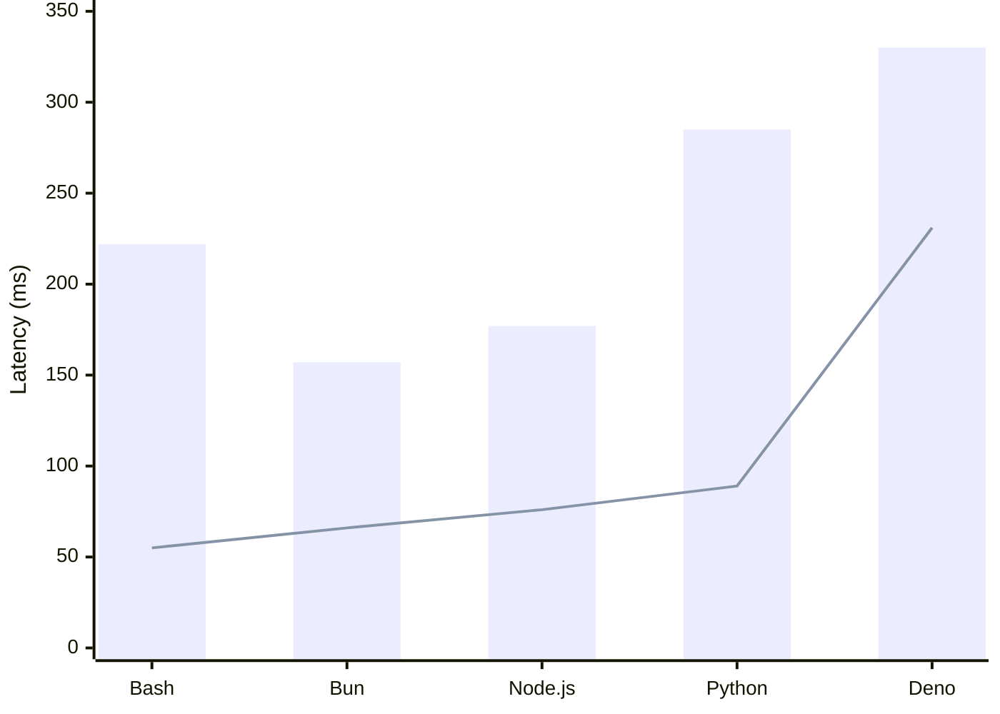
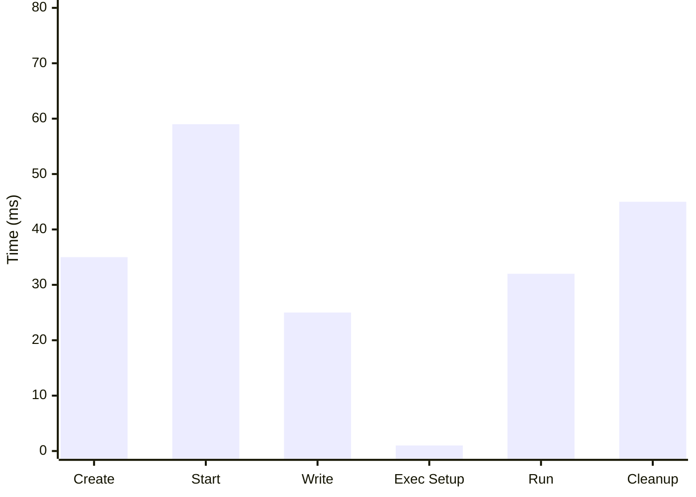
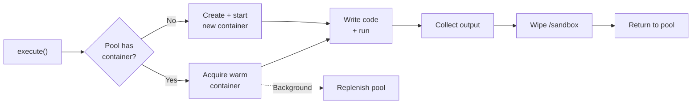

isol8 ships with three benchmark scripts that measure end-to-end execution latency for a minimal "hello world" program across all supported runtimes. These benchmarks run on real Docker containers with the same security constraints used in production.

<Info>
Results below were measured on Apple Silicon (Docker Desktop). Your numbers will vary depending on hardware, Docker configuration, and system load.
</Info>

## Running Benchmarks

Benchmarks are available as npm scripts. They require Docker to be running and base images to be built (`isol8 setup`).

```bash
# Cold start — fresh engine per run, no pool reuse
bun run bench

# Warm pool — single engine instance, measures pool speedup
bun run bench:pool

# Detailed breakdown — per-phase timing using raw Docker API
bun run bench:detailed
```

You can also run them directly via `bunx`, `npx`, or `pnpx`:

```bash
bunx tsx benchmarks/spawn.ts
npx tsx benchmarks/spawn.ts
pnpx tsx benchmarks/spawn.ts
```

## Cold Start

Each iteration creates a fresh `DockerIsol8` instance, executes a single "hello world" script, and tears down the engine. This measures worst-case latency when no warm containers are available.

| Runtime | Min | Median | Max | Avg |
|---------|-----|--------|-----|-----|
| Python | 148ms | 155ms | 414ms | 239ms |
| Node.js | 152ms | 155ms | 186ms | 165ms |
| Bun | 124ms | 145ms | 260ms | 176ms |
| Deno | 339ms | 372ms | 626ms | 446ms |
| Bash | 115ms | 123ms | 148ms | 128ms |

**Takeaways:**
- Bash and Bun are the fastest cold-start runtimes (~120-145ms median)
- Deno is the slowest due to its startup overhead and permission system (~370ms median)
- Python and Node.js fall in between (~155ms median each)



## Warm Pool

A single `DockerIsol8` instance is reused across 5 sequential runs. The first run is cold (the pool is empty and a container must be created). Subsequent runs acquire pre-started containers from the warm pool, which eliminates the container create+start overhead.

| Runtime | Cold | Warm Avg | Warm Min | Speedup |
|---------|------|----------|----------|---------|
| Python | 285ms | 95ms | 89ms | 3.2x |
| Node.js | 177ms | 91ms | 76ms | 2.3x |
| Bun | 157ms | 72ms | 66ms | 2.4x |
| Deno | 330ms | 264ms | 231ms | 1.4x |
| Bash | 222ms | 68ms | 55ms | 4.0x |

**Takeaways:**
- The warm pool delivers **2-4x speedup** for most runtimes
- Bash benefits the most (4.0x speedup, 55ms warm minimum)
- Deno benefits the least (1.4x) because its startup overhead is within the runtime itself, not in container creation
- Warm execution for Bash, Bun, Node.js, and Python is consistently **under 100ms**



<Note>
The bar shows cold start latency. The line shows warm pool minimum. The gap between them is the overhead eliminated by the pool.
</Note>

## Execution Phase Breakdown

This benchmark bypasses `DockerIsol8` and uses the raw `dockerode` API directly to measure time spent in each phase of the container lifecycle. No warm pool is involved.

| Phase | Description |
|-------|-------------|
| **Create** | `docker.createContainer()` — allocates the container |
| **Start** | `container.start()` — boots the container |
| **Write** | Writes user code to `/sandbox/main.*` via `exec` |
| **Exec Setup** | `container.exec()` — creates the exec instance |
| **Run** | `exec.start()` — runs the code and collects output |
| **Cleanup** | `container.remove({ force: true })` — tears down |

| Runtime | Create | Start | Write | Exec Setup | Run | Cleanup | Total |
|---------|--------|-------|-------|------------|-----|---------|-------|
| Python | 41ms | 49ms | 17ms | 1ms | 40ms | 43ms | 190ms |
| Node.js | 32ms | 63ms | 34ms | 1ms | 39ms | 43ms | 212ms |
| Bun | 32ms | 56ms | 26ms | 1ms | 27ms | 44ms | 186ms |
| Bash | 35ms | 69ms | 23ms | 1ms | 20ms | 48ms | 196ms |

<Note>
Deno is excluded from the detailed breakdown because it uses a different base image (`denoland/deno:alpine`) rather than the shared multi-stage build.
</Note>

**Takeaways:**
- **Create + Start** dominate at ~70-110ms combined — this is exactly what the warm pool eliminates
- **Exec Setup** is negligible (~1ms) — Docker exec creation is fast
- **Run** time reflects actual runtime startup: Bash (20ms) and Bun (27ms) are fastest, Python (40ms) and Node.js (39ms) are similar
- **Cleanup** is consistent at ~43-48ms regardless of runtime
- **Write** varies by runtime (17-34ms) due to file size and base64 encoding overhead



## How the Warm Pool Works

The container pool is the primary performance optimization in isol8. Understanding it helps explain the benchmark results.



1. **Acquire**: If the pool has a pre-started container for the requested image, it is returned immediately. Otherwise, a new container is created and started inline (cold path).
2. **Execute**: Code is written to `/sandbox/main.*` and executed via `docker exec`.
3. **Release**: After execution, the container's `/sandbox` tmpfs is wiped clean and the container is returned to the pool for reuse.
4. **Replenish**: When a container is acquired from the pool, a background task creates a replacement container so the pool stays warm for the next request.

The pool maintains up to **2 containers per image** (hardcoded). This means after the first cold execution of a given runtime, subsequent executions skip the ~100ms create+start overhead entirely.

## Methodology

All benchmarks:
- Execute a minimal "hello world" program (e.g., `print("hello")` for Python, `console.log("hello")` for Node.js)
- Use default security settings: read-only rootfs, network disabled, 512MB memory, 1 CPU, 64 PID limit
- Run inside Docker Desktop on the host machine (no remote Docker)
- Use `performance.now()` for high-resolution timing
- Are located in the `benchmarks/` directory and can be run via `bun run bench`, `bun run bench:pool`, or `bun run bench:detailed`
