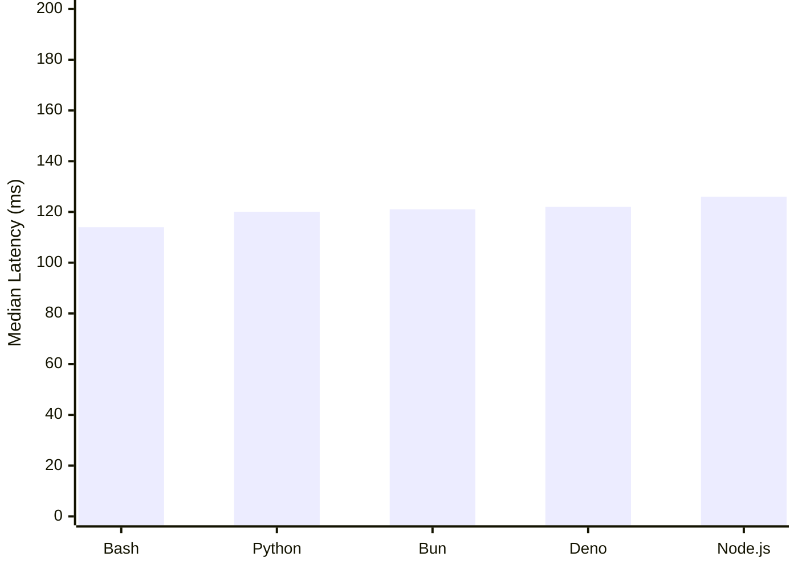
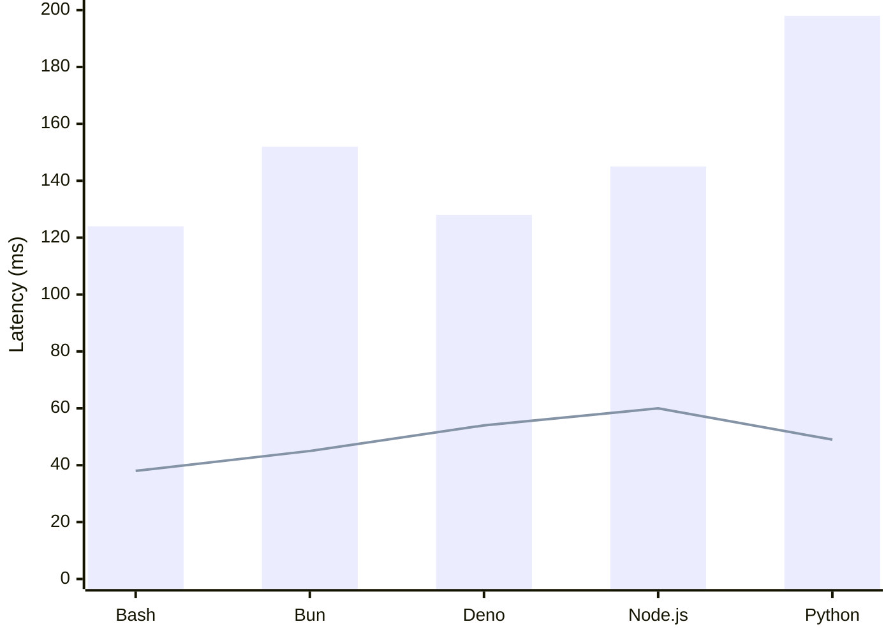

isol8 ships with three benchmark scripts that measure end-to-end execution latency for a minimal "hello world" program across all supported runtimes. These benchmarks run on real Docker containers with the same security constraints used in production.

<Info>
Results below were measured on Apple Silicon (Docker Desktop). Your numbers will vary depending on hardware, Docker configuration, and system load.
</Info>

## Running Benchmarks

Benchmarks are available as npm scripts. They require Docker to be running and base images to be built (`isol8 setup`).

```bash
# Cold start — fresh engine per run, no pool reuse
bun run bench

# Warm pool — single engine instance, measures pool speedup
bun run bench:pool

# Detailed breakdown — per-phase timing using raw Docker API
bun run bench:detailed
```

You can also run them directly via `bunx`, `npx`, or `pnpx`:

```bash
bunx tsx benchmarks/spawn.ts
npx tsx benchmarks/spawn.ts
pnpx tsx benchmarks/spawn.ts
```

## Cold Start

Each iteration creates a fresh `DockerIsol8` instance, executes a single "hello world" script, and tears down the engine. This measures worst-case latency when no warm containers are available.

| Runtime | Min | Median | Max | Avg |
|---------|-----|--------|-----|-----|
| Python | 111ms | 120ms | 188ms | 140ms |
| Node.js | 114ms | 126ms | 178ms | 130ms |
| Bun | 104ms | 121ms | 196ms | 139ms |
| Deno | 112ms | 122ms | 199ms | 139ms |
| Bash | 104ms | 114ms | 152ms | 121ms |

**Takeaways:**
- Bash and Bun are the fastest cold-start runtimes (~114-121ms median)
- All runtimes achieve sub-130ms median cold start latency
- Python and Node.js fall in between (~120-126ms median)



## Warm Pool

A single `DockerIsol8` instance is reused across 5 sequential runs. The first run is cold (the pool is empty and a container must be created). Subsequent runs acquire pre-started containers from the warm pool, which eliminates the container create+start overhead.

| Runtime | Cold | Warm Avg | Warm Min | Speedup |
|---------|------|----------|----------|---------|
| Python | 198ms | 56ms | 49ms | 4.1x |
| Node.js | 145ms | 69ms | 60ms | 2.4x |
| Bun | 152ms | 51ms | 45ms | 3.4x |
| Deno | 128ms | 62ms | 54ms | 2.4x |
| Bash | 124ms | 43ms | 38ms | 3.3x |

**Takeaways:**
- The warm pool delivers **2-4x speedup** for most runtimes
- Python benefits the most (4.1x speedup, 49ms warm minimum)
- Warm execution for all runtimes is consistently **under 70ms**
- Bash is the fastest warm runtime at 38ms minimum



<Note>
The bar shows cold start latency. The line shows warm pool minimum. The gap between them is the overhead eliminated by the pool.
</Note>

## Execution Phase Breakdown

This benchmark bypasses `DockerIsol8` and uses the raw `dockerode` API directly to measure time spent in each phase of the container lifecycle. No warm pool is involved.

| Phase | Description |
|-------|-------------|
| **Create** | `docker.createContainer()` — allocates the container |
| **Start** | `container.start()` — boots the container |
| **Write** | Writes user code to `/sandbox/main.*` via `exec` |
| **Exec Setup** | `container.exec()` — creates the exec instance |
| **Run** | `exec.start()` — runs the code and collects output |
| **Cleanup** | `container.remove({ force: true })` — tears down |

| Runtime | Create | Start | Write | Exec Setup | Run | Cleanup | Total |
|---------|--------|-------|-------|------------|-----|---------|-------|
| Python | 69ms | 52ms | 19ms | 1ms | 22ms | 51ms | 213ms |
| Node.js | 47ms | 41ms | 15ms | 1ms | 30ms | 36ms | 169ms |
| Bun | 55ms | 42ms | 15ms | 1ms | 18ms | 37ms | 166ms |
| Bash | 50ms | 50ms | 14ms | 1ms | 13ms | 43ms | 172ms |

<Note>
Deno is excluded from the detailed breakdown because it uses a different base image (`denoland/deno:alpine`) rather than the shared multi-stage build.
</Note>

**Takeaways:**
- **Create + Start** dominate at ~90-120ms combined — this is exactly what the warm pool eliminates
- **Exec Setup** is negligible (~1ms) — Docker exec creation is fast
- **Run** time reflects actual runtime startup: Bash (13ms) and Bun (18ms) are fastest, Python (22ms) and Node.js (30ms) are similar
- **Cleanup** is consistent at ~36-51ms regardless of runtime
- **Write** is fast at ~14-19ms due to base64 encoding via exec


## How the Warm Pool Works

The container pool is the primary performance optimization in isol8. Understanding it helps explain the benchmark results.


1. **Acquire**: If the pool has a pre-started container for the requested image, it is returned immediately. Otherwise, a new container is created and started inline (cold path).
2. **Execute**: Code is written to `/sandbox/main.*` and executed via `docker exec` as the `sandbox` user.
3. **Release**: After execution, all processes owned by the `sandbox` user are killed (`pkill -9 -u sandbox`), then the container's `/sandbox` tmpfs is wiped clean and the container is returned to the pool for reuse.
4. **Replenish**: When a container is acquired from the pool, a background task creates a replacement container so the pool stays warm for the next request.

The pool maintains up to **2 containers per image** (hardcoded). This means after the first cold execution of a given runtime, subsequent executions skip the ~100ms create+start overhead entirely.

## Methodology

All benchmarks:
- Execute a minimal "hello world" program (e.g., `print("hello")` for Python, `console.log("hello")` for Node.js)
- Use default security settings: read-only rootfs, network disabled, 512MB memory, 1 CPU, 64 PID limit
- Run inside Docker Desktop on the host machine (no remote Docker)
- Use `performance.now()` for high-resolution timing
- Are located in the `benchmarks/` directory and can be run via `bun run bench`, `bun run bench:pool`, or `bun run bench:detailed`
