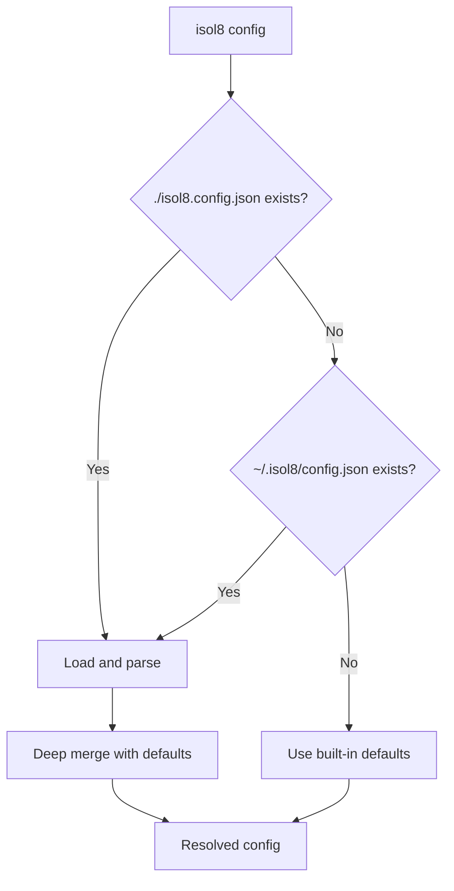

Display the fully resolved isol8 configuration, showing built-in defaults merged with any config file overrides.

```bash
isol8 config [options]
```

## Options

<ResponseField name="--json" type="boolean" default="false">
  Output raw JSON instead of the formatted human-readable display.
</ResponseField>

## Config File Resolution



isol8 searches for a configuration file in order:

1. `./isol8.config.json` — in the current working directory
2. `~/.isol8/config.json` — in the home directory

The first file found wins. If no config file is found, built-in defaults are used. Partial configs are deep-merged with defaults — you only need to specify the fields you want to override.

## Merge Strategy

The `mergeConfig` function merges each top-level section independently:

| Section | Strategy | Details |
|:--------|:---------|:--------|
| `maxConcurrent` | Override or default | Uses override value if provided, otherwise the default (`10`). |
| `defaults` | Shallow spread | Individual fields (`timeoutMs`, `memoryLimit`, `cpuLimit`, `network`, `sandboxSize`, `tmpSize`) are overridden independently. Unspecified fields keep their defaults. |
| `network` | Override or default | `whitelist` and `blacklist` arrays are replaced entirely if provided in the override. They are not merged/concatenated with defaults. |
| `cleanup` | Shallow spread | `autoPrune` and `maxContainerAgeMs` are overridden independently. Unspecified fields keep their defaults. |
| `dependencies` | Shallow spread | Runtime keys (`python`, `node`, `bun`, `deno`, `bash`) are overridden independently. Specifying `python` packages doesn't affect `node` packages from defaults. |

This means specifying `{ "defaults": { "timeoutMs": 5000 } }` in your config file preserves all other default values (`memoryLimit`, `cpuLimit`, etc.), but specifying `{ "network": { "whitelist": ["^example\\.com$"] } }` replaces the entire whitelist (the default empty array is not merged in).

## Example Output

### Formatted (default)

```bash
isol8 config
```

```
Isol8 Configuration

  Source: defaults (no config file found)

  ── General ──
  Max concurrent:  10

  ── Defaults ──
  Timeout:         30000ms
  Memory limit:    512m
  CPU limit:       1
  Network:         none

  ── Network Filter ──
  Whitelist:       (none)
  Blacklist:       (none)

  ── Cleanup ──
  Auto-prune:      yes
  Max idle time:   3600000ms (60min)

  ── Dependencies ──
  (none configured)
```

### JSON output

```bash
isol8 config --json
```

```json
{
  "maxConcurrent": 10,
  "defaults": {
    "timeoutMs": 30000,
    "memoryLimit": "512m",
    "cpuLimit": 1,
    "network": "none",
    "sandboxSize": "64m",
    "tmpSize": "64m"
  },
  "network": {
    "whitelist": [],
    "blacklist": []
  },
  "cleanup": {
    "autoPrune": true,
    "maxContainerAgeMs": 3600000
  },
  "dependencies": {}
}
```

### With a config file

```bash
# Given ./isol8.config.json:
# { "defaults": { "timeoutMs": 60000, "memoryLimit": "1g" }, "dependencies": { "python": ["numpy"] } }

isol8 config
```

```
Isol8 Configuration

  Source: /home/user/project/isol8.config.json

  ── General ──
  Max concurrent:  10

  ── Defaults ──
  Timeout:         60000ms
  Memory limit:    1g
  CPU limit:       1
  Network:         none

  ── Network Filter ──
  Whitelist:       (none)
  Blacklist:       (none)

  ── Cleanup ──
  Auto-prune:      yes
  Max idle time:   3600000ms (60min)

  ── Dependencies ──
  Python:          numpy
```

See the [Configuration](/configuration) page for the full schema reference and all available options.
