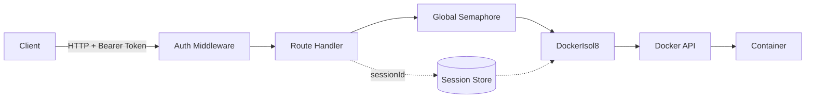

Start the isol8 HTTP server for remote code execution. The server exposes REST endpoints for executing code, managing persistent sessions, and transferring files.

```bash
isol8 serve [options]
```

<Warning>
  The `isol8 serve` command requires the [Bun](https://bun.sh) runtime. It checks for `globalThis.Bun` at startup and exits with an error if running under Node.js. Run with `bun run src/cli.ts serve` if using from source.
</Warning>

## Options

<ResponseField name="--port, -p" type="number" default="3000">
  Port to listen on.
</ResponseField>

<ResponseField name="--key, -k" type="string" required>
  API key for Bearer token authentication. All requests except `GET /health` must include an `Authorization: Bearer <key>` header. Falls back to the `$ISOL8_API_KEY` environment variable. The server exits with an error if neither is provided.
</ResponseField>

## Architecture



Persistent sessions are tracked in an in-memory `Map<string, SessionState>`. When a request includes a `sessionId`, the server reuses the existing `DockerIsol8` engine for that session. Ephemeral requests create a new engine per request and destroy it after execution.

## Server Features

### Global Concurrency Control

A server-wide `Semaphore` limits the number of concurrent container executions. The limit is set by `config.maxConcurrent` (default: 10). Every `/execute` and `/execute/stream` request must acquire a permit before running code.

### Config Defaults

The server loads the isol8 config at startup and merges `config.defaults` into every incoming request. This means server-side defaults for `network`, `memoryLimit`, `cpuLimit`, `timeoutMs`, `sandboxSize`, and `tmpSize` are applied automatically. Client-provided `options` in the request body override these defaults.

### Session Management

Persistent sessions are stored in an in-memory `Map`, keyed by `sessionId`. Each session holds a `DockerIsol8` engine instance and a `lastAccessedAt` timestamp. Sessions are created on the first request with a given `sessionId` and reused on subsequent requests. Sessions can be explicitly destroyed via `DELETE /session/:id`.

### Auto-Pruning

When `config.cleanup.autoPrune` is enabled (default: `true`), the server runs a cleanup interval every 60 seconds. Sessions that haven't been accessed within `config.cleanup.maxContainerAgeMs` (default: 3,600,000ms / 1 hour) are stopped and removed.

### Authentication

All endpoints except `GET /health` require a Bearer token matching the configured API key. The auth middleware returns `401 Unauthorized` for missing or invalid tokens.

## Endpoints

| Method | Path | Description |
|:-------|:-----|:------------|
| `GET` | `/health` | Health check (no auth required) |
| `POST` | `/execute` | Execute code, return result as JSON |
| `POST` | `/execute/stream` | Execute code, stream output as SSE |
| `POST` | `/file` | Upload a file to a persistent session |
| `GET` | `/file` | Download a file from a persistent session |
| `DELETE` | `/session/:id` | Destroy a persistent session |

See the [Server Endpoints](/server/endpoints) documentation for full request/response schemas.

## Example

```bash
# Start the server
isol8 serve --port 3000 --key my-secret-key

# Or using an environment variable
ISOL8_API_KEY=my-secret-key isol8 serve --port 3000
```

Execute code via curl:

```bash
curl -X POST http://localhost:3000/execute \
  -H "Authorization: Bearer my-secret-key" \
  -H "Content-Type: application/json" \
  -d '{
    "request": {
      "code": "print(1 + 1)",
      "runtime": "python"
    }
  }'
```

Stream execution output:

```bash
curl -X POST http://localhost:3000/execute/stream \
  -H "Authorization: Bearer my-secret-key" \
  -H "Content-Type: application/json" \
  -d '{
    "request": {
      "code": "for i in range(5): print(i)",
      "runtime": "python"
    }
  }'
```
