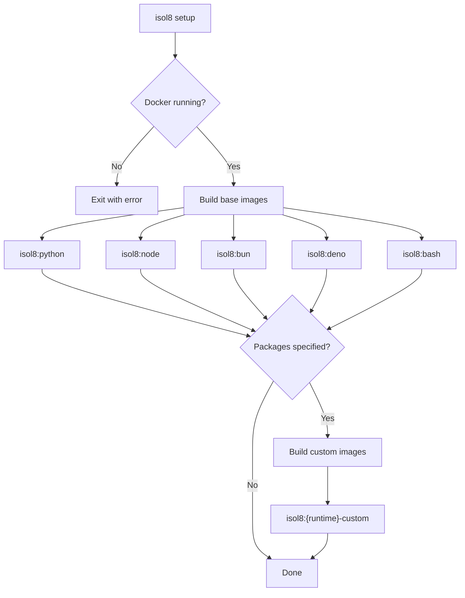

Verify Docker connectivity and build all base `isol8:<runtime>` images. Optionally build custom images with pre-installed dependencies.

```bash
isol8 setup [options]
```

## What It Does



1. **Verify Docker** — Pings the Docker daemon to confirm it's running and accessible.
2. **Build base images** — Builds all 5 runtime images from the multi-stage `docker/Dockerfile`. Each runtime is a separate build target (`python`, `node`, `bun`, `deno`, `bash`).
3. **Build custom images** — If package flags are provided (via CLI flags or `config.dependencies`), builds custom images with dependencies pre-installed.

## Options

<ResponseField name="--python" type="string">
  Comma-separated Python packages to install via pip.

  ```bash
  isol8 setup --python numpy,pandas,scipy
  ```
</ResponseField>

<ResponseField name="--node" type="string">
  Comma-separated Node.js packages to install via npm.

  ```bash
  isol8 setup --node lodash,express,axios
  ```
</ResponseField>

<ResponseField name="--bun" type="string">
  Comma-separated Bun packages to install via bun.

  ```bash
  isol8 setup --bun zod,hono,drizzle-orm
  ```
</ResponseField>

<ResponseField name="--deno" type="string">
  Comma-separated Deno module URLs to pre-cache via `deno cache`.

  ```bash
  isol8 setup --deno https://deno.land/std/path/mod.ts
  ```
</ResponseField>

<ResponseField name="--bash" type="string">
  Comma-separated Alpine apk packages to install.

  ```bash
  isol8 setup --bash curl,git,jq,wget
  ```
</ResponseField>

## Custom Images

When you provide package flags (or have `dependencies` in your config file), isol8 builds a custom image tagged `isol8:<runtime>-custom`. These custom images are **automatically preferred** over base images via the `resolveImage()` logic — if `isol8:python-custom` exists, all Python executions use it without any additional flags.

Package names are validated to prevent command injection. Allowed characters are alphanumeric, `-`, `_`, `.`, `/`, `@`, and `=`.

For example, after running:

```bash
isol8 setup --python numpy,pandas
```

The image `isol8:python-custom` is created with numpy and pandas pre-installed. All subsequent Python executions automatically use this image.

### How Custom Images Are Built

Custom images extend the base image with runtime-specific install commands. The generated Dockerfile for each runtime:

| Runtime | Generated Dockerfile |
|:--------|:--------------------|
| `python` | `FROM isol8:python`<br/>`RUN pip install --no-cache-dir numpy pandas` |
| `node` | `FROM isol8:node`<br/>`RUN npm install -g lodash express` |
| `bun` | `FROM isol8:bun`<br/>`RUN bun install -g zod hono` |
| `deno` | `FROM isol8:deno`<br/>`RUN deno cache https://deno.land/std/path/mod.ts` |
| `bash` | `FROM isol8:bash`<br/>`RUN apk add --no-cache jq curl` |

CLI flags are merged with any packages already specified in `config.dependencies`, so both sources contribute to the custom image.

## Base Images

All base images are built from a multi-stage `Dockerfile` in the `docker/` directory. The shared `base` stage is Alpine 3.21 and includes:

- `tini` as the init process (PID 1 signal handling)
- `curl` and `ca-certificates`
- The HTTP/HTTPS filtering proxy (`proxy.sh` + `proxy-handler.sh`) copied to `/usr/local/bin/`
- `/sandbox` as the working directory
- `tini` as the entrypoint

Each runtime stage extends `base` with its specific runtime binary:

| Stage | Base | Installs |
|:------|:-----|:---------|
| `python` | `base` | `python3`, `py3-pip` |
| `node` | `base` | `nodejs`, `npm` |
| `bun` | `base` | `bash`, `unzip`, `libstdc++`, `libgcc`, then downloads Bun via install script |
| `deno` | `denoland/deno:alpine` | `tini`, `curl`, `ca-certificates`, `proxy.sh`, `proxy-handler.sh` |
| `bash` | `base` | `bash` |

<Note>
  The Deno stage uses `denoland/deno:alpine` as its base image instead of the shared `base` stage. It independently installs `tini`, `curl`, and `ca-certificates`, and copies `proxy.sh` + `proxy-handler.sh` — mirroring the setup from `base` but starting from the official Deno Alpine image.
</Note>
