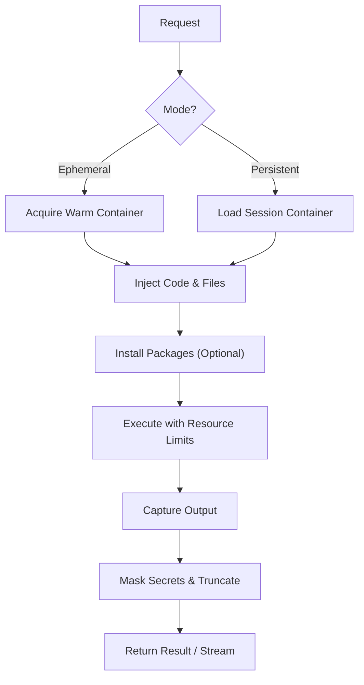

isol8 provides a unified execution engine accessible through three interfaces: a **CLI** for local development, a **TypeScript Library** for application integration, and an **HTTP API** for remote services.

## Execution Lifecycle

Every execution request follows a strict pipeline to ensure security and isolation.

### Pipeline Overview



## Execution Modes

isol8 supports two execution modes, determined by your use case.

| Mode | Behavior | Best For |
|:---|:---|:---|
| **Ephemeral** (Default) | Creates a fresh container for every request. State is lost after execution. | stateless tasks, untrusted code, parallel workloads |
| **Persistent** | Reuses a single container across multiple requests. Files and state are preserved. | interactive sessions, multi-step workflows, notebooks |

### Selecting a Mode

<Tabs>
  <Tab title="CLI">
    Use the `--persistent` flag to enable persistent mode.

    ```bash
    # Ephemeral (Default)
    isol8 run script.py

    # Persistent (Keeps container alive)
    isol8 run --persistent script.py
    ```

    <Note>
      In CLI persistent mode, the container is tied to the CLI process. To reuse a persistent container across multiple CLI commands, you would need to use the API or Library.
    </Note>
  </Tab>
  <Tab title="Library">
    Configure the mode when initializing the engine.

    ```typescript
    // Ephemeral (Default)
    const engine = new DockerIsol8({ mode: "ephemeral" });

    // Persistent
    const session = new DockerIsol8({ mode: "persistent" });
    await session.execute({ ... }); // State preserved for next call
    ```
  </Tab>
  <Tab title="API">
    Include a `sessionId` to trigger persistent mode.

    ```json
    // Ephemeral (No sessionId)
    {
      "request": { "code": "x = 1", "runtime": "python" }
    }

    // Persistent (With sessionId)
    {
      "sessionId": "user-session-123",
      "request": { "code": "print(x)", "runtime": "python" }
    }
    ```
  </Tab>
</Tabs>

## Inputs & Outputs

You can pass code, environment variables, and files into the sandbox.

### 1. Source Code
The core of every request.

<Tabs>
  <Tab title="CLI">
    Pass a file path, an inline string, or pipe from stdin.

    ```bash
    # File
    isol8 run script.py

    # Inline
    isol8 run -e "print('Hello')" --runtime python

    # Stdin
    echo "print('Piped')" | isol8 run --runtime python
    ```
  </Tab>
  <Tab title="Library">
    Pass the `code` string in the request object.

    ```typescript
    await engine.execute({
      code: "console.log('Hello')",
      runtime: "node"
    });
    ```
  </Tab>
  <Tab title="API">
    ```json
    {
      "request": {
        "code": "console.log('Hello')",
        "runtime": "node"
      }
    }
    ```
  </Tab>
</Tabs>

### 1.1 Remote Code URLs
isol8 can fetch source code from a URL before execution.

<Warning>
  `code` and `codeUrl` are mutually exclusive. Provide only one per request.
</Warning>

Remote URL execution is controlled by:
- request fields: `codeUrl`, `codeHash`, `allowInsecureCodeUrl`
- CLI flags: `--url`, `--github`, `--gist`, `--hash`, `--allow-insecure-code-url`
- config policy: `remoteCode.*` in `isol8.config.json`

<Tabs>
  <Tab title="CLI">
    ```bash
    # Direct URL
    isol8 run --url https://raw.githubusercontent.com/user/repo/main/script.py --runtime python

    # GitHub shorthand
    isol8 run --github user/repo/main/script.py --runtime python

    # Gist shorthand
    isol8 run --gist abcd1234/example.js --runtime node

    # Integrity verification
    isol8 run --url https://example.com/script.py --hash <sha256> --runtime python
    ```
  </Tab>
  <Tab title="Library">
    ```typescript
    await engine.execute({
      codeUrl: "https://raw.githubusercontent.com/user/repo/<sha>/script.py",
      codeHash: "<sha256>",
      runtime: "python",
    });
    ```
  </Tab>
  <Tab title="API">
    ```json
    {
      "request": {
        "codeUrl": "https://raw.githubusercontent.com/user/repo/<sha>/script.py",
        "codeHash": "<sha256>",
        "runtime": "python"
      }
    }
    ```
  </Tab>
</Tabs>

<Note>
  URL fetching is disabled by default. Enable and tune `remoteCode` policy in config first.
  For full policy fields and security guidance, see <a href="/remote-code">Remote code URLs</a>.
</Note>

### 2. Environment Variables
Inject configuration or secrets.

<Warning>
  **Security Note:** Environment variables are visible to the running process. For sensitive data, use the "Secrets" feature to ensure values are masked in logs and output.
</Warning>

<Tabs>
  <Tab title="CLI">
    The CLI only supports **Secrets** via `--secret`. These are injected as environment variables but their values are masked in stdout/stderr.

    ```bash
    isol8 run script.py --secret API_KEY=sk_12345
    ```
  </Tab>
  <Tab title="Library">
    You can pass plain `env` variables (visible) or global `secrets` (masked).

    ```typescript
    const engine = new DockerIsol8({
      // Global secrets (masked in output)
      secrets: { API_KEY: "sk_12345" }
    });

    await engine.execute({
      code: "...",
      runtime: "python",
      // Per-request env vars (visible in output)
      env: { LOG_LEVEL: "debug" }
    });
    ```
  </Tab>
  <Tab title="API">
    ```json
    {
      "request": {
        "runtime": "python",
        "code": "import os; print(os.getenv('LOG_LEVEL', 'unset'))",
        "env": { "LOG_LEVEL": "debug" }
      }
    }
    ```
  </Tab>
</Tabs>

### 3. Files
Inject files *before* execution and retrieve them *after*.

<Tabs>
  <Tab title="CLI">
    <Note>
      The CLI does not currently support generic file injection (`files`) or retrieval (`outputPaths`). It can only capture `stdout` to a file using `--out`.
    </Note>

    ```bash
    isol8 run script.py --out result.txt
    ```
  </Tab>
  <Tab title="Library">
    Full support for virtual file I/O.

    ```typescript
    const result = await engine.execute({
      code: "print(open('/sandbox/data.txt').read())",
      runtime: "python",
      // Inject files
      files: {
        "/sandbox/data.txt": "Hello from file!"
      },
      // Retrieve files
      outputPaths: ["/sandbox/output.json"]
    });

    const fileContent = result.files["/sandbox/output.json"]; // base64 encoded
    ```
  </Tab>
  <Tab title="API">
    ```json
    {
      "request": {
        "runtime": "python",
        "code": "print(open('/sandbox/data.txt').read())",
        "files": {
          "/sandbox/data.txt": "Hello from file!"
        },
        "outputPaths": ["/sandbox/output.json"]
      }
    }
    ```
  </Tab>
</Tabs>

## Streaming Output

Real-time output is essential for long-running tasks or LLM code generation.

<Tabs>
  <Tab title="CLI">
    Streaming is **enabled by default**. Use `--no-stream` to wait for completion.

    ```bash
    # Streams output as it appears
    isol8 run long_task.py

    # Waits until finished, then prints all output
    isol8 run long_task.py --no-stream
    ```
  </Tab>
  <Tab title="Library">
    Use `executeStream` instead of `execute`.

    ```typescript
    const stream = engine.executeStream({
      code: "...",
      runtime: "python"
    });

    for await (const event of stream) {
      if (event.type === 'stdout') process.stdout.write(event.data);
      if (event.type === 'stderr') process.stderr.write(event.data);
      if (event.type === 'exit') console.log(`Exited with ${event.data}`);
    }
    ```
  </Tab>
  <Tab title="API">
    ```bash
    curl -N -X POST http://localhost:3000/execute/stream \
      -H "Authorization: Bearer $ISOL8_API_KEY" \
      -H "Content-Type: application/json" \
      -d '{
        "request": {
          "runtime": "python",
          "code": "import time\nfor i in range(3):\n print(i)\n time.sleep(1)"
        }
      }'
    ```
  </Tab>
</Tabs>

## Resource Limits & Safety

isol8 enforces strict limits to contain untrusted code.

| Parameter | CLI Flag | Library Option | Default | Description |
|:---|:---|:---|:---|:---|
| **Timeout** | `--timeout` | `timeoutMs` | 30s | Hard execution time limit. |
| **Memory** | `--memory` | `memoryLimit` | 512m | RAM limit for the container. |
| **CPU** | `--cpu` | `cpuLimit` | 1.0 | CPU shares (1.0 = 1 core). |
| **Network** | `--net` | `network` | none | `none`, `host`, or `filtered`. |
| **Output** | `--max-output` | `maxOutputSize` | 1MB | Max stdout/stderr size before truncation. |

### Output Truncation
If a script produces excessive output, isol8 truncates it to prevent memory issues.
- `result.truncated` will be `true`.
- The output will end with a truncation message.

### Secret Masking
If you provide `secrets` (via CLI `--secret` or Library config), isol8 scans `stdout` and `stderr` and replaces occurrences of secret values with `***`.

```bash
# Input
isol8 run -e "print('my-secret-value')" --secret KEY=my-secret-value

# Output
***
```

## Troubleshooting

<AccordionGroup>
  <Accordion title="Execution Timed Out">
    The code ran longer than `timeoutMs`.
    - **Fix:** Increase limit via `--timeout` or optimize the code.
    - **Note:** Infinite loops are a common cause.
  </Accordion>

  <Accordion title="Output Truncated">
    The script printed more data than `maxOutputSize` allowed.
    - **Fix:** Reduce logging or increase the limit via `--max-output`.
  </Accordion>

  <Accordion title="File Not Found">
    Remember that the code runs in an isolated container.
    - It **cannot** see files on your host machine unless you explicitly inject them (Library/API).
    - CLI users should pipe data via stdin or use inline strings for simple inputs.
  </Accordion>
</AccordionGroup>

## FAQ

<AccordionGroup>
  <Accordion title="Should I pass timeout in request or options?">
    Use `request.timeoutMs` when you want a per-execution timeout. Use `options.timeoutMs` as a baseline engine default for a client/session.
  </Accordion>

  <Accordion title="When should I use codeUrl instead of code?">
    Use `codeUrl` for pinned remote artifacts (for example immutable GitHub raw URLs). Keep `code` for direct inline or generated source. Never set both in one request.
  </Accordion>

  <Accordion title="Why does persistent mode not carry over between separate CLI invocations?">
    CLI runs are process-scoped. For durable cross-call state, use a stable `sessionId` through the API or `RemoteIsol8`.
  </Accordion>
</AccordionGroup>

## Related pages

<CardGroup cols={2}>
  <Card title="Passing values" icon="sliders" href="/passing-values">
    Exact option mapping across CLI, config, API, and library.
  </Card>
  <Card title="Runtime reference" icon="layers" href="/runtimes">
    Runtime-specific behavior, extensions, and package semantics.
  </Card>
  <Card title="Remote code URLs" icon="link" href="/remote-code">
    URL-based source fetching policy and integrity controls.
  </Card>
  <Card title="Troubleshooting" icon="wrench" href="/troubleshooting">
    Symptom-based fixes for execution and session issues.
  </Card>
</CardGroup>
