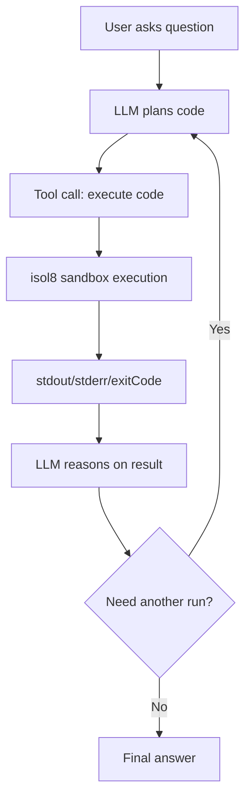

Use this guide when your LLM needs a reliable code-execution tool and you want strong isolation by default.

## Diagram: Agent execution loop



## Recommended baseline

For agent workloads, start with:

- `mode: "ephemeral"` for stateless runs
- `network: "none"` unless explicitly required
- explicit `timeoutMs`, `memoryLimit`, and output cap
- secrets passed via engine `secrets` (not raw echoing in code/output)

```typescript
import { DockerIsol8 } from "isol8";

const engine = new DockerIsol8({
  mode: "ephemeral",
  network: "none",
  timeoutMs: 15000,
  memoryLimit: "512m",
  maxOutputSize: 1_048_576,
});

await engine.start();
```

## Build a reusable tool function

Wrap execution so your orchestrator always receives normalized fields.

```typescript
import type { Runtime } from "isol8";

async function executeAgentCode(code: string, runtime: Runtime) {
  const result = await engine.execute({
    code,
    runtime,
  });

  return {
    stdout: result.stdout,
    stderr: result.stderr,
    exitCode: result.exitCode,
    durationMs: result.durationMs,
    truncated: result.truncated,
  };
}
```

<Tip>
  Keep the tool contract small and stable (`stdout`, `stderr`, `exitCode`, `durationMs`) so your LLM prompt doesn’t drift.
</Tip>

## Integrate with an LLM tool-call loop

The pattern is the same regardless of model provider:
1. model requests a tool call
2. agent executes code with isol8
3. tool result is fed back
4. model decides whether another iteration is needed

```typescript
async function runToolCall(code: string) {
  const result = await engine.execute({
    code,
    runtime: "python",
    timeoutMs: 12000,
  });

  return JSON.stringify({
    stdout: result.stdout,
    stderr: result.stderr,
    exitCode: result.exitCode,
  });
}
```

## Stream output for long tasks

For long-running tool calls, stream events to your UI so users see progress.

```typescript
async function runWithStreaming(code: string) {
  for await (const event of engine.executeStream({ code, runtime: "python" })) {
    if (event.type === "stdout") process.stdout.write(event.data);
    if (event.type === "stderr") process.stderr.write(event.data);
    if (event.type === "exit") console.log(`\nexit=${event.data}`);
  }
}
```

## Stateful agent workflows

When one step should reuse files/state from prior steps, use persistent execution in a long-lived process.

```typescript
const sessionEngine = new DockerIsol8({ mode: "persistent", timeoutMs: 20000 });
await sessionEngine.start();

await sessionEngine.execute({
  runtime: "python",
  code: `
import json
json.dump([{"x": 1}, {"x": 2}], open("/sandbox/data.json", "w"))
print("prepared")
`,
});

const result = await sessionEngine.execute({
  runtime: "python",
  code: `
import json
d = json.load(open("/sandbox/data.json"))
print(sum(row["x"] for row in d))
`,
});

console.log(result.stdout); // 3
await sessionEngine.stop();
```

<Note>
  Persistent containers are runtime-bound. Do not switch Python -> Node in the same persistent container.
</Note>

## Remote multi-agent deployment

Use the same tool contract with remote execution when you need centralized policy and shared infrastructure.

<Tabs>
  <Tab title="CLI server">
    ```bash
    isol8 serve --port 3000 --key "$ISOL8_API_KEY"
    ```
  </Tab>
  <Tab title="Library client">
    ```typescript
    import { RemoteIsol8 } from "isol8";

    const remote = new RemoteIsol8(
      {
        host: "http://localhost:3000",
        apiKey: process.env.ISOL8_API_KEY!,
        sessionId: "agent-session-123",
      },
      {
        network: "none",
        timeoutMs: 15000,
      }
    );

    await remote.start();
    const result = await remote.execute({
      runtime: "python",
      code: "print('remote agent run')",
    });
    await remote.stop();
    ```
  </Tab>
  <Tab title="API request">
    ```bash
    curl -X POST http://localhost:3000/execute \
      -H "Authorization: Bearer $ISOL8_API_KEY" \
      -H "Content-Type: application/json" \
      -d '{
        "sessionId": "agent-session-123",
        "request": { "code": "print(2**8)", "runtime": "python" },
        "options": { "timeoutMs": 15000, "network": "none" }
      }'
    ```
  </Tab>
</Tabs>

## Secrets and network policy for tool calls

If the agent must call external APIs:

1. move from `network: "none"` to `network: "filtered"`
2. set strict allow/deny rules
3. pass credentials through `secrets`

```typescript
const netEngine = new DockerIsol8({
  mode: "ephemeral",
  network: "filtered",
  networkFilter: {
    whitelist: ["^api\\.openai\\.com$"],
    blacklist: ["^169\\.254\\."],
  },
  secrets: {
    API_KEY: process.env.OPENAI_API_KEY!,
  },
});
```

<Warning>
  Secret masking applies to stdout/stderr text, not arbitrary files written by executed code.
</Warning>

## Patterns for reliable agent behavior

- keep execution snippets short and focused
- prefer deterministic tool outputs (JSON when possible)
- gate package installs; pre-bake stable dependencies for production
- enforce hard timeouts per tool run
- return both `stderr` and `exitCode` to model, not just `stdout`

## Related pages

<CardGroup cols={2}>
  <Card title="Execution guide" icon="terminal" href="/execution">
    Understand lifecycle, modes, streaming, and request fields.
  </Card>
  <Card title="Option mapping" icon="sliders" href="/option-mapping">
    Exact CLI/config/API/library mapping for each option.
  </Card>
  <Card title="Security model" icon="shield-check" href="/security">
    Network controls, seccomp, and secret masking boundaries.
  </Card>
  <Card title="Remote server and client" icon="server" href="/remote">
    Run agents against centralized isolated execution infrastructure.
  </Card>
</CardGroup>
