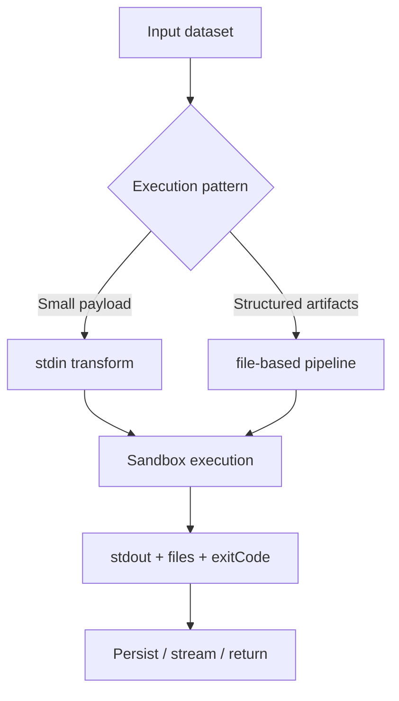

Use this guide when users submit data transformations or analysis scripts and you need strong execution isolation with predictable resource controls.

## Diagram: Typical data-processing flow



## Choose the right execution pattern

| Pattern | Best for | Core fields |
|:--|:--|:--|
| stdin transform | small/medium JSON payloads | `stdin`, `code`, `runtime` |
| file-based run | CSV/images/multi-file artifacts | `files`, `outputPaths` |
| persistent pipeline | multi-step transformations with shared state | `mode: "persistent"`, `putFile/getFile` or remote `sessionId` |

## Baseline configuration

```typescript
import { DockerIsol8 } from "isol8";

const engine = new DockerIsol8({
  mode: "ephemeral",
  network: "none",
  timeoutMs: 60000,
  memoryLimit: "1g",
  sandboxSize: "512m",
});

await engine.start();
```

## Pattern 1: stdin transformations

Great for row-wise mapping, filtering, and aggregation where input/output are JSON.

<Tabs>
  <Tab title="Library">
    ```typescript
    const transformCode = `
    import json, sys

    data = json.load(sys.stdin)
    result = [
      {**row, "total": row["price"] * row["quantity"]}
      for row in data
    ]
    json.dump(result, sys.stdout)
    `;

    const input = JSON.stringify([
      { item: "Widget", price: 9.99, quantity: 100 },
      { item: "Gadget", price: 24.99, quantity: 50 },
    ]);

    const result = await engine.execute({
      runtime: "python",
      code: transformCode,
      stdin: input,
    });

    const transformed = JSON.parse(result.stdout);
    ```
  </Tab>
  <Tab title="API">
    ```bash
    curl -X POST http://localhost:3000/execute \
      -H "Authorization: Bearer $ISOL8_API_KEY" \
      -H "Content-Type: application/json" \
      -d '{
        "request": {
          "runtime": "python",
          "code": "import json,sys; d=json.load(sys.stdin); print(len(d))",
          "stdin": "[{\"x\":1},{\"x\":2}]"
        },
        "options": { "network": "none", "timeoutMs": 30000 }
      }'
    ```
  </Tab>
  <Tab title="CLI">
    ```bash
    isol8 run -e "import json,sys; d=json.load(sys.stdin); print(len(d))" \
      --runtime python \
      --stdin '[{"x":1},{"x":2}]'
    ```
  </Tab>
</Tabs>

## Pattern 2: file-based processing and artifact retrieval

Use this when jobs need multiple inputs or non-text outputs (CSV, PNG, parquet, etc.).

<Tabs>
  <Tab title="Library">
    ```typescript
    const result = await engine.execute({
      runtime: "python",
      code: `
    import pandas as pd

    df = pd.read_csv("/sandbox/data.csv")
    out = df.groupby("category")["revenue"].sum().reset_index()
    out.to_csv("/sandbox/summary.csv", index=False)
    print("summary ready")
    `,
      installPackages: ["pandas"],
      files: {
        "/sandbox/data.csv": csvContent,
      },
      outputPaths: ["/sandbox/summary.csv"],
    });

    const summaryCsvBase64 = result.files?.["/sandbox/summary.csv"];
    ```
  </Tab>
  <Tab title="API">
    ```json
    {
      "request": {
        "runtime": "python",
        "code": "print('process files')",
        "files": {
          "/sandbox/data.csv": "Y2F0ZWdvcnkscmV2ZW51ZQphLDEwCg=="
        },
        "outputPaths": ["/sandbox/summary.csv"]
      },
      "options": {
        "network": "none",
        "timeoutMs": 60000
      }
    }
    ```
  </Tab>
</Tabs>

<Note>
  CLI `run` does not expose full generic `files`/`outputPaths` request fields. Use library or API for full file injection/retrieval workflows.
</Note>

## Pattern 3: multi-step persistent pipelines

Use persistent mode when later steps must reuse files from earlier ones.

```typescript
const session = new DockerIsol8({ mode: "persistent", timeoutMs: 60000 });
await session.start();

await session.putFile("/sandbox/raw.json", JSON.stringify(rawData));

await session.execute({
  runtime: "python",
  code: `
import json
raw = json.load(open("/sandbox/raw.json"))
clean = [r for r in raw if r.get("value") is not None]
json.dump(clean, open("/sandbox/clean.json", "w"))
print(len(clean))
`,
});

await session.execute({
  runtime: "python",
  code: `
import json
clean = json.load(open("/sandbox/clean.json"))
report = {"count": len(clean)}
json.dump(report, open("/sandbox/report.json", "w"))
`,
});

const report = await session.getFile("/sandbox/report.json");
console.log(report.toString("utf-8"));
await session.stop();
```

<Warning>
  Persistent containers are runtime-bound. Do not switch Python -> Node in the same persistent container.
</Warning>

## Remote pipelines with shared sessions

For distributed workers, use remote `sessionId` instead of keeping local engine state.

```typescript
import { RemoteIsol8 } from "isol8";

const remote = new RemoteIsol8(
  {
    host: "http://localhost:3000",
    apiKey: process.env.ISOL8_API_KEY!,
    sessionId: "data-job-123",
  },
  {
    network: "none",
    timeoutMs: 120000,
  }
);

await remote.start();
await remote.putFile("/sandbox/input.json", JSON.stringify(rawData));
await remote.execute({ runtime: "python", code: "print('step 1')" });
await remote.stop();
```

## Package strategy for stable throughput

`installPackages` is powerful but adds latency. For production data workloads:

1. move stable dependencies into `isol8.config.json` `dependencies.*`
2. run `isol8 setup` to pre-build custom images
3. keep per-request installs for truly dynamic packages only

## Parallel batch processing

You can schedule many independent jobs with `Promise.all`; engine semaphores and `maxConcurrent` bound active container count.

```typescript
const jobs = datasets.map((dataset) =>
  engine.execute({
    runtime: "python",
    code: "import json,sys; d=json.load(sys.stdin); print(len(d))",
    stdin: JSON.stringify(dataset),
  })
);

const results = await Promise.all(jobs);
```

## Returning chart/image artifacts

For visual outputs, write image files into `/sandbox` and retrieve via `outputPaths`.

```typescript
const result = await engine.execute({
  runtime: "python",
  code: `
import matplotlib
matplotlib.use("Agg")
import matplotlib.pyplot as plt

plt.plot([1,2,3],[2,4,8])
plt.savefig("/sandbox/chart.png", dpi=150)
print("chart ready")
`,
  installPackages: ["matplotlib"],
  outputPaths: ["/sandbox/chart.png"],
});

const chartBase64 = result.files?.["/sandbox/chart.png"];
```

## Related pages

<CardGroup cols={2}>
  <Card title="Execution guide" icon="terminal" href="/execution">
    Request fields, execution modes, streaming, and output semantics.
  </Card>
  <Card title="Packages and images" icon="boxes" href="/packages">
    Pre-bake dependencies to reduce per-job install latency.
  </Card>
  <Card title="Remote server and client" icon="server" href="/remote">
    Run processing jobs on centralized remote infrastructure.
  </Card>
  <Card title="Performance tuning" icon="gauge-high" href="/performance">
    Tune concurrency, pool behavior, and resource limits.
  </Card>
</CardGroup>
