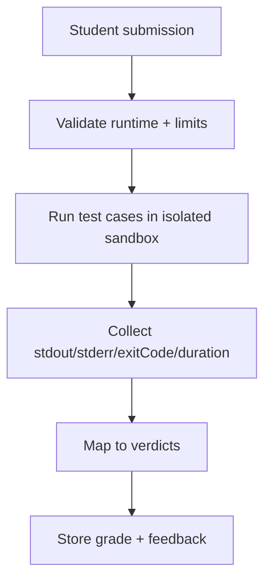

Use this guide when students submit code and you need reliable grading, strict isolation, and predictable execution behavior at classroom scale.

## Diagram: Submission to verdict flow



## Baseline policy for student workloads

| Option | Recommended value | Why |
|:--|:--|:--|
| `mode` | `"ephemeral"` | each run starts clean; no student-to-student state bleed |
| `network` | `"none"` | prevents internet-assisted answers and reduces risk |
| `timeoutMs` | short per question (for example `3000-10000`) | stops infinite loops quickly |
| `memoryLimit` | conservative (for example `256m` or `512m`) | protects host resources |
| `pidsLimit` | low (for example `32`) | limits fork/process abuse |

<Note>
  Use `mode: "persistent"` only for deliberate stateful labs. Standard grading pipelines should stay ephemeral.
</Note>

## Platform bootstrap across interfaces

<Tabs>
  <Tab title="Library">
    ```typescript
    import { DockerIsol8 } from "isol8";

    const engine = new DockerIsol8({
      mode: "ephemeral",
      network: "none",
      timeoutMs: 5000,
      memoryLimit: "256m",
      pidsLimit: 32,
      maxOutputSize: 128 * 1024,
    });

    await engine.start();
    ```
  </Tab>
  <Tab title="CLI">
    <CodeGroup>
      ```bash Command
      isol8 run -e "print(int(input())**2)" \
      --runtime python \
      --stdin "7" \
      --timeout 5000 \
      --memory 256m \
      --pids 32 \
      --net none
      ```

      ```text Expected output
      49
      ```
    </CodeGroup>
  </Tab>
  <Tab title="API">
    ```bash
    curl -X POST http://localhost:3000/execute \
      -H "Authorization: Bearer $ISOL8_API_KEY" \
      -H "Content-Type: application/json" \
      -d '{
        "request": {
          "runtime": "python",
          "code": "print(int(input())**2)",
          "stdin": "7"
        },
        "options": {
          "mode": "ephemeral",
          "network": "none",
          "timeoutMs": 5000,
          "memoryLimit": "256m",
          "pidsLimit": 32
        }
      }'
    ```
  </Tab>
</Tabs>

## Pattern 1: deterministic test-case grading

Use normalized comparison and collect per-case diagnostics.

```typescript
interface TestCase {
  input: string;
  expectedOutput: string;
}

interface GradeResult {
  caseId: number;
  passed: boolean;
  expected: string;
  actual: string;
  stderr?: string;
  exitCode: number;
  durationMs: number;
}

async function gradeSubmission(
  engine: DockerIsol8,
  code: string,
  runtime: "python" | "node" | "bun" | "deno" | "bash",
  testCases: TestCase[]
): Promise<GradeResult[]> {
  const out: GradeResult[] = [];

  for (let i = 0; i < testCases.length; i++) {
    const tc = testCases[i];
    const result = await engine.execute({
      code,
      runtime,
      stdin: tc.input,
      timeoutMs: 5000,
    });

    const actual = result.stdout.trim();
    const expected = tc.expectedOutput.trim();

    out.push({
      caseId: i + 1,
      passed: actual === expected && result.exitCode === 0,
      expected,
      actual,
      stderr: result.stderr || undefined,
      exitCode: result.exitCode,
      durationMs: result.durationMs,
    });
  }

  return out;
}
```

## Pattern 2: verdict mapping (OK / TLE / RTE / MLE)

```typescript
type Verdict = "OK" | "TIME_LIMIT_EXCEEDED" | "RUNTIME_ERROR" | "MEMORY_LIMIT_EXCEEDED";

function mapVerdict(result: {
  exitCode: number;
  stdout: string;
  stderr: string;
}): Verdict {
  if (result.stderr.includes("EXECUTION TIMED OUT")) return "TIME_LIMIT_EXCEEDED";
  if (result.stderr.includes("MemoryError") || result.stderr.includes("Killed")) {
    return "MEMORY_LIMIT_EXCEEDED";
  }
  if (result.exitCode !== 0) return "RUNTIME_ERROR";
  return "OK";
}
```

<Info>
  Keep verdict mapping centralized so all products (judge, classroom UI, analytics) classify failures the same way.
</Info>

## Pattern 3: interactive playground with streaming feedback

Use `executeStream()` for live feedback while students type/run code.

```typescript
for await (const event of engine.executeStream({
  runtime: "python",
  code: "import time\nfor i in range(3):\n  print(i)\n  time.sleep(1)",
})) {
  if (event.type === "stdout") {
    // push incremental output to UI
    process.stdout.write(event.data);
  }
  if (event.type === "stderr") {
    process.stderr.write(event.data);
  }
  if (event.type === "exit") {
    console.log(`\nexitCode=${event.data}`);
  }
}
```

## Pattern 4: multi-language problem support

Keep one problem statement and allow selected runtimes through an explicit allow-list.

```typescript
const ALLOWED_RUNTIMES = ["python", "node", "bun", "deno", "bash"] as const;
type AllowedRuntime = (typeof ALLOWED_RUNTIMES)[number];

function assertAllowedRuntime(runtime: string): asserts runtime is AllowedRuntime {
  if (!ALLOWED_RUNTIMES.includes(runtime as AllowedRuntime)) {
    throw new Error(`Unsupported runtime for this course: ${runtime}`);
  }
}

async function runStudentCode(code: string, runtime: string, stdin: string) {
  assertAllowedRuntime(runtime);
  return engine.execute({ code, runtime, stdin, timeoutMs: 5000 });
}
```

## Pattern 5: class-scale batch grading

Process submissions concurrently while respecting capacity and queue depth.

```typescript
interface Submission {
  studentId: string;
  runtime: "python" | "node";
  code: string;
}

async function gradeBatch(
  engine: DockerIsol8,
  submissions: Submission[],
  testCases: TestCase[],
  appBatchSize = 10
) {
  const scores: Record<string, GradeResult[]> = {};

  for (let i = 0; i < submissions.length; i += appBatchSize) {
    const chunk = submissions.slice(i, i + appBatchSize);
    const graded = await Promise.all(
      chunk.map(async (s) => ({
        studentId: s.studentId,
        results: await gradeSubmission(engine, s.code, s.runtime, testCases),
      }))
    );

    for (const item of graded) {
      scores[item.studentId] = item.results;
    }
  }

  return scores;
}
```

<Tip>
  isol8 also applies an internal concurrency limit (`maxConcurrent`) for container execution. Tune both your app batch size and engine concurrency for stable throughput.
</Tip>

## Assessment design patterns that reduce noise

- normalize output before diffing (`trim`, newline normalization) to avoid formatting-only failures
- separate compile/syntax checks from full test execution so students get faster feedback
- return per-case feedback (`caseId`, expected, actual, stderr) instead of a single pass/fail flag
- keep limits aligned to assignment difficulty and document them in the classroom UI
- use `network: "none"` for default assignments; explicitly allow network only for network-specific labs

## Related pages

<CardGroup cols={2}>
  <Card title="Execution guide" icon="terminal" href="/execution">
    Request fields, execution lifecycle, streaming, and output behavior.
  </Card>
  <Card title="Runtime reference" icon="square-terminal" href="/runtimes">
    Runtime selection details and extension-based auto-detection behavior.
  </Card>
  <Card title="Security model" icon="shield-check" href="/security">
    Isolation controls and network policy for untrusted student code.
  </Card>
  <Card title="CI and automated testing" icon="vial" href="/guides/ci-testing">
    Reuse judge-style grading patterns in CI pipelines.
  </Card>
  <Card title="Option mapping" icon="sliders" href="/option-mapping">
    Exact CLI, config, API, and library mapping for execution options.
  </Card>
</CardGroup>
