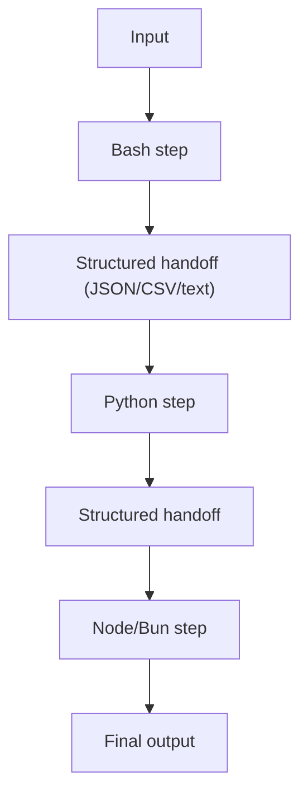
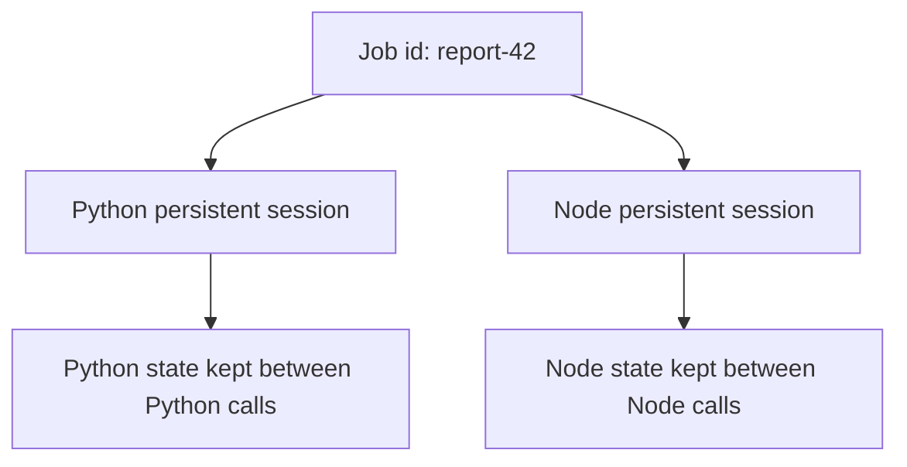

Use this guide when one workflow is easier or safer to split by runtime, such as Bash for ingestion, Python for analysis, and Node for final formatting.

## Diagram: Stateless pipeline across runtimes



## Runtime roles and extension mapping

| Runtime | Typical role in workflow | Default extension |
|:--|:--|:--|
| Python | data transforms, analytics, scientific packages | `.py` |
| Node | JSON shaping, ecosystem tooling, JS scripts | `.mjs` (`.js` and `.cjs` aliases) |
| Bun | fast TS/JS steps | `.ts` |
| Deno | TypeScript with explicit Deno runtime | `.mts` |
| Bash | shell glue and orchestration helpers | `.sh` |

<Note>
  Runtime auto-detection is extension-based. `.ts` maps to Bun, while Deno uses `.mts` to avoid ambiguity.
</Note>

## Choose an orchestration mode

| Mode | When to use | Constraint |
|:--|:--|:--|
| Stateless chaining (ephemeral) | each step independent, clean sandbox per step | pass state through `stdin`/files between calls |
| Per-runtime persistent sessions | same runtime needs shared state across steps | keep one session per runtime; do not runtime-switch in one session |

## Pattern 1: stateless chaining (recommended default)

Run each step in an isolated execution and pass structured output forward via `stdin`.

```typescript
import { DockerIsol8 } from "isol8";

const engine = new DockerIsol8({
  mode: "ephemeral",
  network: "none",
  timeoutMs: 30000,
});
await engine.start();

// Step 1: generate rows with Bash
const gen = await engine.execute({
  runtime: "bash",
  code: `
for i in $(seq 1 20); do
  echo "$i,$((RANDOM % 1000))"
done
`,
});

// Step 2: aggregate with Python
const agg = await engine.execute({
  runtime: "python",
  stdin: gen.stdout,
  code: `
import csv, io, json, sys
rows = list(csv.reader(io.StringIO(sys.stdin.read())))
vals = [int(r[1]) for r in rows]
print(json.dumps({
  "count": len(vals),
  "avg": sum(vals)/len(vals),
  "max": max(vals)
}))
`,
});

// Step 3: format report with Node
const report = await engine.execute({
  runtime: "node",
  stdin: agg.stdout,
  code: `
const fs = require("node:fs");
const stats = JSON.parse(fs.readFileSync("/dev/stdin", "utf8"));
console.log("=== Report ===");
console.log("count:", stats.count);
console.log("avg:", Number(stats.avg).toFixed(2));
console.log("max:", stats.max);
`,
});

console.log(report.stdout);
await engine.stop();
```

## Pattern 2: same request shape across interfaces

Use tabs when demonstrating equivalent CLI, library, and API usage.

<Tabs>
  <Tab title="CLI">
    <CodeGroup>
      ```bash Command
      isol8 run -e "console.log(JSON.stringify({ step: 'format', ok: true }))" \
      --runtime node \
      --mode ephemeral
      ```

      ```text Expected output
      {"step":"format","ok":true}
      ```
    </CodeGroup>
  </Tab>
  <Tab title="Library">
    <CodeGroup>
      ```typescript Request
      const result = await engine.execute({
        runtime: "node",
        code: "console.log(JSON.stringify({ step: 'format', ok: true }))",
      });
      ```

      ```text Expected behavior
      result.stdout === '{"step":"format","ok":true}\\n'
      result.exitCode === 0
      ```
    </CodeGroup>
  </Tab>
  <Tab title="API">
    <CodeGroup>
      ```bash Request
      curl -X POST http://localhost:3000/execute \
        -H "Authorization: Bearer $ISOL8_API_KEY" \
        -H "Content-Type: application/json" \
        -d '{
          "request": {
            "runtime": "node",
            "code": "console.log(JSON.stringify({ step: '\''format'\'', ok: true }))"
          },
          "options": { "mode": "ephemeral", "network": "none" }
        }'
      ```

      ```json Expected response fields
      {
        "stdout": "{\"step\":\"format\",\"ok\":true}\n",
        "exitCode": 0,
        "runtime": "node"
      }
      ```
    </CodeGroup>
  </Tab>
</Tabs>

## Pattern 3: compare implementations across runtimes

Useful for performance comparisons or parity testing.

```typescript
const cases = [
  {
    runtime: "python" as const,
    code: `
import json
def fib(n): return n if n < 2 else fib(n-1) + fib(n-2)
print(json.dumps({"result": fib(20)}))
`,
  },
  {
    runtime: "node" as const,
    code: `
function fib(n){ return n < 2 ? n : fib(n-1) + fib(n-2); }
console.log(JSON.stringify({ result: fib(20) }));
`,
  },
  {
    runtime: "bun" as const,
    code: `
function fib(n:number):number{ return n < 2 ? n : fib(n-1) + fib(n-2); }
console.log(JSON.stringify({ result: fib(20) }));
`,
  },
];

const outputs = await Promise.all(
  cases.map(async (c) => {
    const r = await engine.execute({ runtime: c.runtime, code: c.code });
    return { runtime: c.runtime, out: JSON.parse(r.stdout).result };
  })
);
```

## Diagram: Persistent sessions per runtime



## Pattern 4: persistent workflows by runtime

Persistent containers are runtime-bound. For stateful polyglot systems, use one persistent engine/session per runtime.

```typescript
const pySession = new DockerIsol8({ mode: "persistent", timeoutMs: 30000 });
const nodeSession = new DockerIsol8({ mode: "persistent", timeoutMs: 30000 });

await pySession.start();
await nodeSession.start();

await pySession.execute({
  runtime: "python",
  code: `
open("/sandbox/data.json","w").write('{"x": 10}')
print("py ready")
`,
});

await nodeSession.execute({
  runtime: "node",
  code: `
require("node:fs").writeFileSync("/sandbox/info.json", JSON.stringify({ y: 20 }));
console.log("node ready");
`,
});

await pySession.stop();
await nodeSession.stop();
```

<Warning>
  Do not switch runtimes in a single persistent container. Create one persistent session per runtime.
</Warning>

## Runtime selection and overrides

<Tabs>
  <Tab title="CLI auto-detect by extension">
    ```bash
    isol8 run step1.sh      # bash
    isol8 run step2.py      # python
    isol8 run step3.js      # node
    isol8 run step4.ts      # bun
    isol8 run step5.mts     # deno
    ```
  </Tab>
  <Tab title="CLI explicit override">
    ```bash
    isol8 run script.any --runtime python
    ```
  </Tab>
  <Tab title="Library explicit runtime">
    ```typescript
    await engine.execute({
      runtime: "python",
      code: "print('forced runtime')",
    });
    ```
  </Tab>
  <Tab title="API explicit runtime">
    ```json
    {
      "request": {
        "runtime": "python",
        "code": "print('forced runtime')"
      }
    }
    ```
  </Tab>
</Tabs>

## Cross-runtime code generation pattern

Generate code in one runtime and execute in another.

```typescript
const generated = await engine.execute({
  runtime: "bun",
  code: `
const lines = [
  "data = [1,2,3,4]",
  "print(sum(data))",
];
console.log(lines.join("\\n"));
`,
});

const executed = await engine.execute({
  runtime: "python",
  code: generated.stdout,
});

console.log(executed.stdout); // 10
```

## Remote multi-runtime orchestrator

For centralized orchestration, use dedicated remote sessions per runtime role.

```typescript
import { RemoteIsol8 } from "isol8";

const pyRemote = new RemoteIsol8(
  {
    host: "http://localhost:3000",
    apiKey: process.env.ISOL8_API_KEY!,
    sessionId: "job-42-python",
  },
  { network: "none", timeoutMs: 30000 }
);

const nodeRemote = new RemoteIsol8(
  {
    host: "http://localhost:3000",
    apiKey: process.env.ISOL8_API_KEY!,
    sessionId: "job-42-node",
  },
  { network: "none", timeoutMs: 30000 }
);
```

<Info>
  Reuse a stable `sessionId` per runtime role when you need cross-call state in remote workflows. Rotate session IDs per job for strict isolation.
</Info>

## Design rules for polyglot systems

- keep cross-runtime handoff format explicit (JSON, CSV, newline-delimited text)
- keep each step deterministic and small
- isolate heavyweight dependencies to the runtime that needs them
- pre-bake dependencies for stable production latency
- use explicit runtime selection when extension detection is ambiguous

## Related pages

<CardGroup cols={2}>
  <Card title="Runtime reference" icon="square-terminal" href="/runtimes">
    Runtime capabilities, extensions, and package behavior.
  </Card>
  <Card title="Execution guide" icon="terminal" href="/execution">
    Request fields, modes, streaming, and file I/O semantics.
  </Card>
  <Card title="Packages and images" icon="boxes" href="/packages">
    Pre-bake dependencies for repeatable multi-runtime pipelines.
  </Card>
  <Card title="Remote server and client" icon="server" href="/remote">
    Session-based orchestration across centralized infrastructure.
  </Card>
  <Card title="Option mapping" icon="sliders" href="/option-mapping">
    Exact CLI, config, API, and library mapping for options and flags.
  </Card>
</CardGroup>
