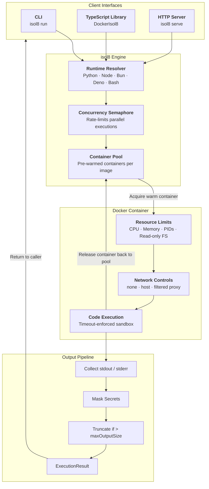

# What is isol8?

isol8 is a secure code execution engine that runs untrusted code inside Docker containers with strict resource limits, network controls, and output sanitization. It is purpose-built for AI agents, chatbots, coding assistants, and any application that needs to safely execute user-provided code without risking the host system.

isol8 ships as three interfaces — a **TypeScript library**, a **CLI tool**, and a **remote HTTP server** — all backed by the same battle-hardened Docker-based execution engine.

## Architecture

The following diagram shows the end-to-end flow from code submission to result delivery:

## Key Features

<CardGroup cols={2}>
  <Card title="Multi-Runtime Support" icon="code">
    Execute Python, Node.js, Bun, Deno, and Bash out of the box. Each runtime has its own optimized Docker image with the correct toolchain and package manager pre-installed.
  </Card>
  <Card title="Container Isolation" icon="shield">
    Every execution runs in a Docker container with a read-only root filesystem, PID limits, memory and CPU caps, and `no-new-privileges` security policy. Containers are fully disposable.
  </Card>
  <Card title="Network Control" icon="globe">
    Choose between three network modes: `none` (all traffic blocked, default and most secure), `host` (full host network access), or `filtered` (HTTP/HTTPS traffic routed through a hostname-level allow/deny proxy).
  </Card>
  <Card title="Real-Time Streaming" icon="bolt">
    Stream stdout and stderr as code executes via `executeStream()` in the library or Server-Sent Events (SSE) over HTTP. No need to wait for the process to finish.
  </Card>
  <Card title="File I/O" icon="file">
    Inject input files into the container before execution and retrieve output files after — even in ephemeral mode. Files are transferred as tar archives via the Docker API.
  </Card>
  <Card title="Sub-100ms Latency" icon="gauge-high">
    The warm container pool keeps pre-started containers ready for immediate use, reducing execution latency from ~200-400ms (cold start) to ~55-95ms (warm). Containers are cleaned and recycled after each run.
  </Card>
  <Card title="Secret Masking" icon="eye-slash">
    Pass sensitive values via the `secrets` option. isol8 automatically replaces any occurrence of secret values in stdout and stderr with `***`, preventing accidental leakage.
  </Card>
  <Card title="Package Installation" icon="box">
    Install runtime-specific packages on the fly with `installPackages`. Supports pip (Python), npm (Node.js), bun (Bun), deno cache (Deno), and apk (Bash/Alpine).
  </Card>
</CardGroup>

## Three Ways to Use isol8

  <Card title="CLI" icon="terminal" href="/cli/run" horizontal>
    Run code from the command line with `isol8 run`. Supports inline code (`-e`), file execution, stdin piping, persistent mode, secret injection, and package installation.
  </Card>
  <Card title="TypeScript Library" icon="brackets-curly" href="/library/overview" horizontal>
    Import `DockerIsol8` for local execution or `RemoteIsol8` to connect to a remote server. Both implement the same `Isol8Engine` interface with `execute()`, `executeStream()`, `putFile()`, and `getFile()`.
  </Card>
  <Card title="HTTP Server" icon="server" href="/server/overview" horizontal>
    Deploy `isol8 serve` as a standalone execution service. Exposes REST endpoints for code execution, streaming via SSE, and file I/O — all protected by Bearer token authentication.
  </Card>

## Supported Runtimes

| Runtime | Image | File Extension | Package Manager | Inline Code |
|:--------|:------|:---------------|:----------------|:------------|
| Python 3.x | `isol8:python` | `.py` | pip | Yes |
| Node.js LTS | `isol8:node` | `.js` | npm | Yes |
| Bun | `isol8:bun` | `.ts` | bun | Yes |
| Deno | `isol8:deno` | `.mts` | deno cache | No (file only) |
| Bash | `isol8:bash` | `.sh` | apk | Yes |

<Note>
  `.ts` files default to Bun. Use `--runtime deno` or the `.mts` extension for Deno.
</Note>

<Warning>
  Deno does **not** support inline code execution (the `-e` flag). It requires a file path. The Deno adapter will throw an error if no file path is provided.
</Warning>
