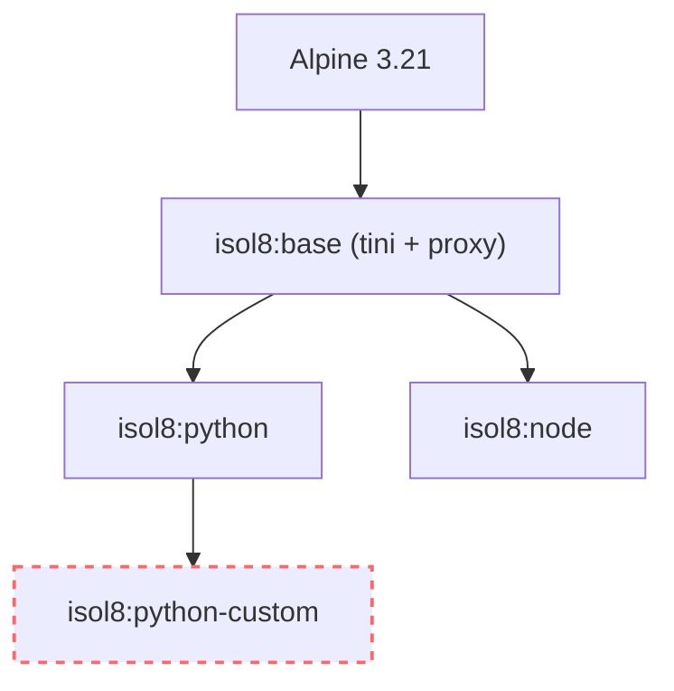

Dependency management is crucial for robust code execution. isol8 offers two strategies:

1. **On-the-fly Installation**: Install packages before each execution. Flexible but slower.
2. **Custom Images**: Bake packages into the Docker image. Fast and reproducible.

## Strategy 1: On-the-Fly Installation

Great for prototyping or when you need different packages for every run.

<Tabs>
  <Tab title="CLI">
    Use `--install <package>` (can be repeated).

    <CodeGroup>
    ```bash Command
    # Python
    isol8 run \
      -e "import numpy" \
      --runtime python \
      --install numpy

    # Node.js
    isol8 run \
      -e "require('lodash')" \
      --runtime node \
      --install lodash
    ```

    ```text Expected behavior
    Packages are installed inside the sandbox before execution starts.
    ```
    </CodeGroup>
  </Tab>
  <Tab title="Library">
    Pass an array of package names.

    ```typescript
    const result = await isol8.execute({
      code: 'import pandas as pd',
      runtime: "python",
      installPackages: ["pandas", "numpy"],
    });
    ```
  </Tab>
  <Tab title="API">
    Include `installPackages` in the request body.

    ```json
    {
      "request": {
        "code": "import numpy",
        "runtime": "python",
        "installPackages": ["numpy"]
      }
    }
    ```
  </Tab>
</Tabs>

<Warning>
  Installation happens inside the container before code execution. This adds overhead (seconds to minutes depending on package size). For frequently used packages, prefer custom images.
</Warning>

<Info>
  Runtime installs are written under `/sandbox` (for example `/sandbox/.local`, `/sandbox/.npm-global`, `/sandbox/.bun-global`). This is intentional because `/tmp` is mounted `noexec`.
</Info>

## Strategy 2: Custom Images (Recommended)

Bake your dependencies into a custom Docker image (`isol8:python-custom`, etc.). This eliminates installation time during execution.

### Creating Custom Images

Run `isol8 setup` with package flags.

```bash
# Bake numpy and pandas into the Python image
isol8 setup --python numpy,pandas

# Bake lodash into the Node.js image
isol8 setup --node lodash
```

This creates a new Docker image tagged `isol8:python-custom` that extends the base `isol8:python` image.

### Using Custom Images

Once built, isol8 automatically prefers the custom image. You don't need any special flags.

```bash
# Automatically uses isol8:python-custom (with numpy pre-installed)
isol8 run \
  -e "import numpy; print(numpy.__version__)" \
  --runtime python
```

### Config File (`isol8.config.json`)

Define dependencies in your config file to ensure consistent environments across your team.

```json
{
  "dependencies": {
    "python": ["numpy", "pandas", "scikit-learn"],
    "node": ["lodash", "express"],
    "bun": ["zod"],
    "bash": ["jq", "curl"]
  }
}
```

Run `isol8 setup` to apply changes.

## Image Architecture

Understanding how images are built helps optimize your setup.

### Base Images

- **`isol8:python`**: Python 3.x + pip
- **`isol8:node`**: Node.js LTS + npm
- **`isol8:bun`**: Bun runtime
- **`isol8:deno`**: Deno runtime
- **`isol8:bash`**: Bash + apk

Built from a minimal Alpine 3.21 base for security and speed.



### Custom Images

Custom images extend the base image. For example, `isol8:python-custom` is built like this:

```dockerfile
FROM isol8:python
RUN pip install --no-cache-dir numpy pandas scikit-learn
```

This ensures your custom image inherits all security features (non-root user, proxy, etc.) from the base image.

### Smart Rebuilds

`isol8 setup` is intelligent. It avoids unnecessary work by tracking build state using Docker labels.

1.  **Change Detection**: It computes SHA256 hashes of your `docker/` directory (for base images) and your dependency lists (for custom images).
2.  **Metadata**: These hashes are stored in the image labels `org.isol8.build.hash` and `org.isol8.deps.hash`.
3.  **Fast Path**: If the hashes match the existing image, the build is skipped instantly.
4.  **Auto-Cleanup**: When a rebuild is necessary, isol8 automatically removes the old image version to prevent "dangling images" from clogging your disk.

```bash
# Up to date - skips build (0s)
isol8 setup

# Add a package - triggers rebuild & cleanup
isol8 setup \
  --python requests
```

Use `--force` to bypass this check and rebuild unconditionally.

## FAQ

<Accordion title="Should I use `--install` or custom images?">
  Use `--install` for ad-hoc experimentation. Use custom images for repeatable production workloads and lower execution latency.
</Accordion>

<Accordion title="Why do some native packages fail when installed in temp directories?">
  Native modules often need executable mount points. isol8 installs runtime packages under `/sandbox` because `/tmp` is mounted with `noexec`.
</Accordion>

<Accordion title="Do setup flags and config dependencies combine?">
  Yes. `isol8 setup` merges dependency flags (`--python`, `--node`, etc.) with configured `dependencies` before building custom images.
</Accordion>

## Troubleshooting quick checks

- **Install step is too slow**: pre-bake dependencies with `isol8 setup` and `dependencies` config.
- **Package import still fails after install**: verify runtime/package pairing (for example Python package in Python runtime).
- **Custom image not updating**: rerun `isol8 setup --force`.
- **Disk usage growing from images**: run `isol8 cleanup` and prune unused Docker images.

## Reference

<CardGroup cols={2}>
  <Card title="How to CLI" icon="terminal" href="/cli">
    All `isol8 setup` options and flags.
  </Card>
  <Card title="Configuration" icon="gear" href="/configuration">
    Full schema for `dependencies` in `isol8.config.json`.
  </Card>
  <Card title="Execution guide" icon="square-terminal" href="/execution">
    See install behavior in the full execution lifecycle.
  </Card>
  <Card title="Troubleshooting" icon="wrench" href="/troubleshooting">
    Diagnose setup, install, and runtime issues.
  </Card>
</CardGroup>
