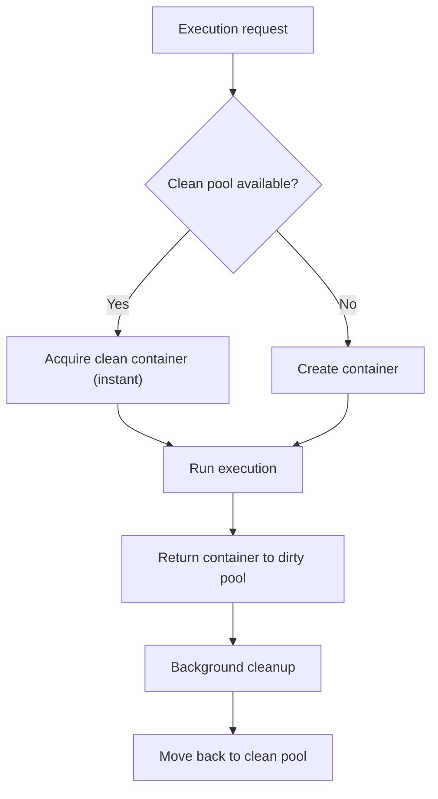
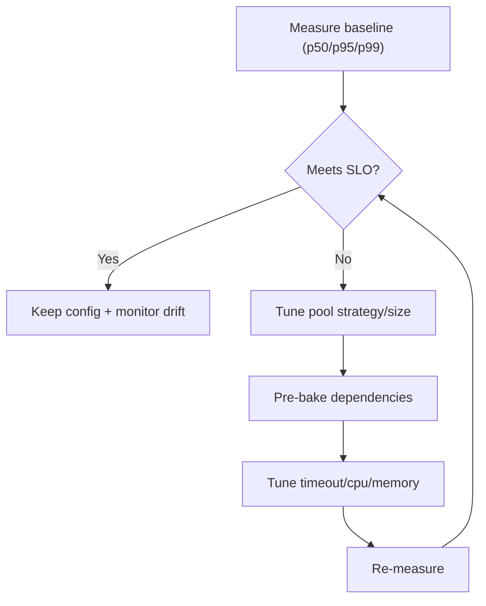

isol8 performance is mostly driven by container lifecycle decisions and dependency handling. This page shows what to tune, where each value is configured, and how to iterate safely.

## Primary tuning levers

- pool behavior (`poolStrategy`, `poolSize`)
- global concurrency cap (`maxConcurrent`)
- execution resource limits (`cpuLimit`, `memoryLimit`, `timeoutMs`)
- dependency approach (runtime install vs pre-baked images)
- streaming choice (`executeStream` / CLI default streaming)

## Where to set performance values

| Value | CLI | Config | API (`/execute`) | Library |
|:--|:--|:--|:--|:--|
| `poolStrategy` | not exposed on `run` | `poolStrategy` (serve defaults) | not request-configurable | `new DockerIsol8({ poolStrategy })` |
| `poolSize` | not exposed on `run` | `poolSize` (serve defaults) | not request-configurable | `new DockerIsol8({ poolSize })` |
| `maxConcurrent` | no `run` flag | `maxConcurrent` | server-level (from config) | `new DockerIsol8(opts, maxConcurrent)` |
| `timeoutMs` | `--timeout` | `defaults.timeoutMs` | `request.timeoutMs` or `options.timeoutMs` | request-level or engine default |
| `memoryLimit` | `--memory` | `defaults.memoryLimit` | `options.memoryLimit` | `memoryLimit` |
| `cpuLimit` | `--cpu` | `defaults.cpuLimit` | `options.cpuLimit` | `cpuLimit` |

<Info>
  On `isol8 run`, concurrency is indirectly controlled by `config.maxConcurrent` (used when creating the local Docker engine). There is no dedicated `run` flag for it.
</Info>

## Pool strategy trade-off

| Strategy | Runtime behavior | Best fit |
|:--|:--|:--|
| `fast` (default) | instant acquire from clean pool, background cleanup through dirty pool | low-latency interactive and API workloads |
| `secure` | cleanup happens in the acquire path | stricter cleanup semantics over raw latency |

### Fast mode internals

In `fast` mode:
- `clean` pool: ready-to-run containers
- `dirty` pool: returned containers waiting cleanup
- acquire path prefers clean containers for lower start latency
- each clean acquire kicks off async replenishment so warm capacity refills in the background
- simple no-artifact requests can execute inline (no code-file write exec), reducing warm-path overhead

<Note>
  For a typical one-shot `isol8 run`, the process exits after execution and calls `engine.stop()`, which drains/removes pooled containers. Background cleanup is mainly beneficial in long-lived processes (for example `isol8 serve` or an app that keeps a `DockerIsol8` instance alive).
</Note>

<Warning>
  `--persist` changes this behavior by intentionally leaving execution containers running for inspection/debugging. Do not use it when you expect normal pooled cleanup semantics.
</Warning>



## Setting pool and limit options

<Tabs>
  <Tab title="CLI">
    ```bash
    isol8 run script.py \
      --timeout 30000 \
      --memory 512m \
      --cpu 1
    ```
  </Tab>
  <Tab title="API">
    ```json
    {
      "request": {
        "code": "print('ok')",
        "runtime": "python"
      },
      "options": {
        "timeoutMs": 30000,
        "memoryLimit": "512m",
        "cpuLimit": 1
      }
    }
    ```
  </Tab>
  <Tab title="Library">
    ```typescript
    const engine = new DockerIsol8(
      {
        poolStrategy: "fast",
        poolSize: { clean: 3, dirty: 3 },
        timeoutMs: 30000,
        memoryLimit: "512m",
        cpuLimit: 1,
      },
      20
    );
    ```
  </Tab>
  <Tab title="Config">
    ```json
    {
      "maxConcurrent": 20,
      "poolStrategy": "fast",
      "poolSize": { "clean": 3, "dirty": 3 },
      "defaults": {
        "timeoutMs": 30000,
        "memoryLimit": "512m",
        "cpuLimit": 1
      }
    }
    ```
  </Tab>
</Tabs>

<Note>
  Config-level `poolStrategy` and `poolSize` are server defaults (`isol8 serve`). API request options cannot override them; library engine options can.
</Note>

<Note>
  Pool tuning examples are intentionally shown in Library and Config contexts only.
</Note>

<Tip>
  Start with `poolStrategy: "fast"` and `poolSize: { clean: 1, dirty: 1 }`, then increase `clean` for steady load and `dirty` for burst absorption.
</Tip>

## Concurrency and throughput

`maxConcurrent` acts as a semaphore cap:
- local engine: passed to `new DockerIsol8(options, maxConcurrent)`
- server mode: loaded from `isol8.config.json` and applied globally

If latency spikes happen under burst traffic, first check queueing pressure before raising CPU/memory limits.

### How `poolSize` and `maxConcurrent` work together

They control different bottlenecks:
- `maxConcurrent`: how many executions can run at once.
- `poolSize`: how many warm containers are available per runtime image.

Example:
- If `maxConcurrent` is `10` but Python `poolSize.clean` is `1`, a burst of Python requests can still hit cold container creation once warm capacity is exhausted.
- Increasing `poolSize.clean` for your hottest runtime reduces cold misses and improves p95/p99 latency.

Practical tuning:
1. Set `maxConcurrent` to host capacity (CPU/memory).
2. Set `poolSize.clean` to expected per-runtime burst.
3. Set `poolSize.dirty` to absorb release spikes while background cleanup catches up.

## Dependency installation cost

Per-request installs (`installPackages` / `--install`) are usually the biggest latency contributor.

For stable workloads:
1. Move dependencies to `dependencies` in config.
2. Build custom images via `isol8 setup`.
3. Run requests without per-request installs when possible.

<Note>
  Pre-baked dependencies shift cost from request time to build time and produce much more stable tail latency.
</Note>

## Streaming and perceived latency

- CLI streams output by default (`--no-stream` disables streaming).
- Library can use `executeStream()` for chunked output.
- Streaming improves user-perceived responsiveness even if total wall-clock duration is unchanged.

## Optimization loop



## FAQ

<Accordion title="Should I always use fast pool strategy?">
  Usually yes for production latency. Use `secure` only if your security/compliance posture requires cleanup in the acquire path.
</Accordion>

<Accordion title="Why does first request feel slow?">
  Cold image/container startup and dependency installation dominate first-run latency. Warm pools and pre-baked images reduce this.
</Accordion>

<Accordion title="Does increasing memory always improve speed?">
  Not always. Memory helps when workloads are constrained or pressure occurs. CPU and package install overhead can still dominate.
</Accordion>

## Troubleshooting

- **High p95/p99 despite low p50**: increase `dirty` pool capacity and verify background cleanup can keep up.
- **Every request is slow**: check for per-request `--install` usage; move dependencies into custom images.
- **Queued requests on server**: inspect `maxConcurrent` and host saturation before raising limits.
- **Fast mode not helping**: verify workload is ephemeral and not bottlenecked by runtime package downloads.

## Related pages

<CardGroup cols={2}>
  <Card title="Execution guide" icon="terminal" href="/execution">
    Request lifecycle, mode behavior, and streaming internals.
  </Card>
  <Card title="Packages and images" icon="boxes" href="/packages">
    Build pre-baked images and avoid per-request install overhead.
  </Card>
  <Card title="Configuration reference" icon="gear" href="/configuration">
    Defaults and server-level knobs including `maxConcurrent`.
  </Card>
  <Card title="Benchmarks" icon="timer" href="/tti-benchmarks">
    All local benchmark suites, including ComputeSDK-style TTI.
  </Card>
  <Card title="Troubleshooting" icon="wrench" href="/troubleshooting">
    Symptom-driven fixes for latency and throughput issues.
  </Card>
</CardGroup>
