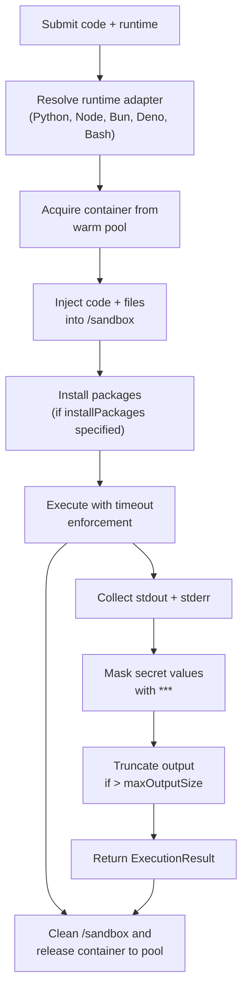

## Prerequisites

Before you begin, make sure you have:

- **[Docker](https://docs.docker.com/get-docker/)** installed and running (verify with `docker info`)
- **[Bun](https://bun.sh)** or **Node.js 18+** installed

## Installation

Install isol8 as a project dependency:

<CodeGroup>
```bash npm
npm install isol8
```

```bash bun
bun add isol8
```
</CodeGroup>

To use the CLI globally, install it as a global package:

<CodeGroup>
```bash npm
npm install -g isol8
```

```bash bun
bun install -g isol8
```
</CodeGroup>

If you prefer not to install globally, you can run the CLI directly via your package manager's runner:

```bash
bunx isol8 <command>   # Bun
npx isol8 <command>    # npm
pnpx isol8 <command>   # pnpm
```

## Build Docker Images

Before running any code, you need to build the isol8 runtime images. Run the setup command:

```bash
isol8 setup
```

This command performs two steps:

1. **Checks Docker connectivity** — verifies the Docker daemon is reachable.
2. **Builds 5 base images** — one per supported runtime:
   - `isol8:python` — Python 3.x with pip
   - `isol8:node` — Node.js LTS with npm
   - `isol8:bun` — Bun runtime with its built-in package manager
   - `isol8:deno` — Deno runtime with deno cache
   - `isol8:bash` — Alpine Linux with Bash and apk

You can also bake additional packages into the images during setup:

```bash
isol8 setup --python numpy,pandas --node lodash,express
```

These packages are pre-installed in custom images (`isol8:python-custom`, etc.) so they're available instantly at execution time without per-run install overhead.

## Execution Flow

The following diagram shows what happens when you submit code for execution:



## Run Your First Code

<Tabs>
  <Tab title="CLI">
    **Inline code** — pass code directly with `-e`:

    ```bash
    # Python (default runtime for inline code)
    isol8 run -e "print('Hello from isol8!')"

    # Explicit runtime
    isol8 run -e "console.log('Hello from Node.js')" --runtime node

    # Bash
    isol8 run -e "echo 'Hello from Bash'" --runtime bash
    ```

    **Run a file** — runtime is auto-detected from the file extension:

    ```bash
    isol8 run script.py
    isol8 run app.js
    isol8 run index.ts      # Resolves to Bun
    isol8 run handler.mts   # Resolves to Deno
    isol8 run deploy.sh
    ```

    **Install packages on the fly**:

    ```bash
    isol8 run -e "import numpy as np; print(np.array([1,2,3]))" \
      --runtime python --install numpy

    isol8 run -e "const _ = require('lodash'); console.log(_.chunk([1,2,3,4,5,6], 2))" \
      --runtime node --install lodash
    ```

    **Pipe stdin**:

    ```bash
    echo '{"name": "isol8"}' | isol8 run -e "import sys, json; print(json.load(sys.stdin)['name'])" --runtime python
    ```
  </Tab>

  <Tab title="TypeScript Library">
    ```typescript
    import { DockerIsol8 } from "isol8";

    // Create an engine with network access disabled (default)
    const isol8 = new DockerIsol8({ network: "none" });
    await isol8.start();

    // Execute Python code
    const result = await isol8.execute({
      code: 'print("Hello from isol8!")',
      runtime: "python",
    });

    console.log(result.stdout);     // "Hello from isol8!"
    console.log(result.exitCode);   // 0
    console.log(result.durationMs); // ~125-145ms with warm pool

    // Execute Node.js with a package
    const nodeResult = await isol8.execute({
      code: `
        const _ = require('lodash');
        console.log(_.chunk([1, 2, 3, 4, 5, 6], 2));
      `,
      runtime: "node",
      installPackages: ["lodash"],
    });

    console.log(nodeResult.stdout); // "[ [ 1, 2 ], [ 3, 4 ], [ 5, 6 ] ]"

    // Stream output in real-time
    for await (const event of isol8.executeStream({
      code: `
        import time
        for i in range(5):
            print(f"Step {i+1}")
            time.sleep(0.5)
      `,
      runtime: "python",
    })) {
      if (event.type === "stdout") process.stdout.write(event.data);
      if (event.type === "exit") console.log(`\nExited with code ${event.data}`);
    }

    // Clean up
    await isol8.stop();
    ```
  </Tab>

  <Tab title="HTTP Server">
    **Start the server**:

    ```bash
    isol8 serve --port 3000 --key my-secret-key
    ```

    **Execute code** via REST API:

    ```bash
    curl -X POST http://localhost:3000/execute \
      -H "Authorization: Bearer my-secret-key" \
      -H "Content-Type: application/json" \
      -d '{
        "request": {
          "code": "print(\"Hello from isol8!\")",
          "runtime": "python"
        }
      }'
    ```

    **Stream output** via Server-Sent Events:

    ```bash
    curl -N -X POST http://localhost:3000/execute/stream \
      -H "Authorization: Bearer my-secret-key" \
      -H "Content-Type: application/json" \
      -d '{
        "request": {
          "code": "import time\nfor i in range(5):\n    print(f\"Step {i+1}\")\n    time.sleep(0.5)",
          "runtime": "python"
        }
      }'
    ```

    Each SSE event is formatted as:

    ```
    data: {"type":"stdout","data":"Step 1\n"}
    data: {"type":"stdout","data":"Step 2\n"}
    ...
    data: {"type":"exit","data":"0"}
    ```

    **Connect from TypeScript** using the `RemoteIsol8` client:

    ```typescript
    import { RemoteIsol8 } from "isol8";

    const remote = new RemoteIsol8(
      { host: "http://localhost:3000", apiKey: "my-secret-key" },
      { network: "none" }
    );

    await remote.start();
    const result = await remote.execute({
      code: 'print("Hello from remote isol8!")',
      runtime: "python",
    });
    console.log(result.stdout);
    await remote.stop();
    ```
  </Tab>
</Tabs>

## Execution Modes

<AccordionGroup>
  <Accordion title="Ephemeral (Default)">
    In ephemeral mode, each execution acquires a fresh container from the warm pool. The code runs, output is collected, and the container's `/sandbox` directory is wiped clean before being returned to the pool for reuse.

    **Key characteristics:**
    - No state persists between executions
    - Fastest startup thanks to the warm container pool (~125-145ms)
    - Most secure — every run starts with a clean slate
    - Ideal for one-off code execution, AI agent tool calls, and untrusted user code

    ```bash
    # CLI (ephemeral is the default)
    isol8 run -e "print('each run is isolated')" --runtime python
    ```

    ```typescript
    // Library (ephemeral is the default)
    const isol8 = new DockerIsol8(); // mode defaults to "ephemeral"
    ```
  </Accordion>

  <Accordion title="Persistent">
    In persistent mode, a single container is kept alive across multiple `execute()` calls. Files, installed packages, environment variables, and all filesystem state persist between runs.

    **Key characteristics:**
    - State persists between executions (files, packages, environment)
    - Container stays alive until `stop()` is called or the idle timeout is reached
    - Supports `putFile()` and `getFile()` for direct file transfer
    - Ideal for multi-step workflows, REPL-like sessions, and iterative development

    ```bash
    # CLI — use the --persistent flag
    isol8 run --persistent -e "echo 'data' > /sandbox/state.txt" --runtime bash
    isol8 run --persistent -e "cat /sandbox/state.txt" --runtime bash
    ```

    ```typescript
    // Library — set mode to "persistent"
    const isol8 = new DockerIsol8({ mode: "persistent" });
    await isol8.start();

    await isol8.execute({
      code: 'open("/sandbox/data.txt", "w").write("persistent state")',
      runtime: "python",
    });

    const result = await isol8.execute({
      code: 'print(open("/sandbox/data.txt").read())',
      runtime: "python",
    });
    console.log(result.stdout); // "persistent state"

    await isol8.stop();
    ```
  </Accordion>
</AccordionGroup>

<Warning>
  In persistent mode, each container is locked to **one runtime**. Once a container is created with a specific runtime (e.g., Python), attempting to execute with a different runtime (e.g., Node.js) on the same `DockerIsol8` instance will throw an error. Create a separate `DockerIsol8` instance for each runtime you need.
</Warning>

## Next Steps

<CardGroup cols={2}>
  <Card title="CLI Reference" icon="terminal" href="/cli/run">
    Explore all CLI commands, flags, and usage patterns including `run`, `setup`, `serve`, and `config`.
  </Card>
  <Card title="Library API" icon="brackets-curly" href="/library/overview">
    Use isol8 programmatically with `DockerIsol8` and `RemoteIsol8` — execute, stream, and transfer files.
  </Card>
  <Card title="HTTP Server" icon="server" href="/server/overview">
    Deploy isol8 as a remote execution service with REST API, SSE streaming, and Bearer token auth.
  </Card>
  <Card title="Configuration" icon="gear" href="/configuration">
    Customize defaults, resource limits, network filtering rules, container cleanup, and pre-installed dependencies.
  </Card>
</CardGroup>
