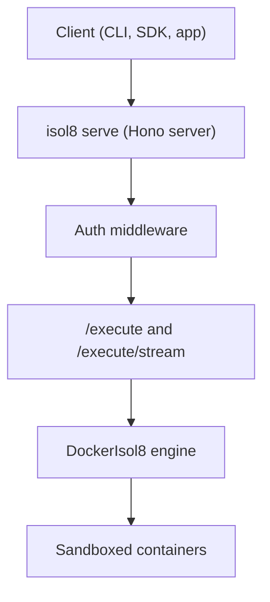

Use remote mode when you want centralized execution infrastructure and shared policy enforcement across multiple clients.

## Diagram 1: Remote architecture overview



## Start the server

<Tabs>
  <Tab title="CLI">
    ```bash
    isol8 serve \
      --key my-secret-key \
      --port 3000
    ```
  </Tab>
  <Tab title="CLI (env key)">
    ```bash
    export ISOL8_API_KEY=my-secret-key
    isol8 serve --port 3000
    ```
  </Tab>
</Tabs>

<Info>
  If `--key` and `ISOL8_API_KEY` are both missing, startup fails. `--key` takes precedence when provided.
</Info>

<Info>
  Port resolution order is `--port` > `ISOL8_PORT` > `PORT` > `3000`. If the chosen port is unavailable, `isol8 serve` prompts for another port or can auto-select an open port.
</Info>

## Serve runtime behavior

`isol8 serve` has two startup paths:

- **Bun/dev path**: runs server in-process.
- **Built CLI (Node) path**: downloads/runs standalone `isol8-server` binary and can prompt for version update.

Use `isol8 serve --update` to force binary re-download.

## Authentication contract

- `GET /health`: no auth required.
- all other endpoints: require `Authorization: Bearer <api-key>`.

| Status | Meaning |
|:--|:--|
| `401` | `Authorization` header missing |
| `403` | token provided but invalid |

## Where remote values are set

| Concern | CLI | Config | API body | Library |
|:--|:--|:--|:--|:--|
| Server listen/auth | `isol8 serve --port --key` | API key can come from env (`ISOL8_API_KEY`) | n/a | n/a |
| Server defaults | n/a | `defaults.*`, `maxConcurrent`, `cleanup.*`, `security.*` | merged with request `options` | n/a |
| Request overrides | `isol8 run --host --key ...` flags | baseline defaults only | `options` in `/execute` body | `new RemoteIsol8(..., isol8Options)` |
| Persistent session | `isol8 run --persistent --host ...` | cleanup policy affects idle sessions | `sessionId` | `RemoteIsol8Options.sessionId` |

## Request envelope

Remote execution endpoints use this shape:

```json
{
  "request": { "code": "print('ok')", "runtime": "python" },
  "options": { "timeoutMs": 30000 },
  "sessionId": "optional-session-id"
}
```

`options` are merged over server defaults for that request.

## Execute remotely

<Tabs>
  <Tab title="API">
    <CodeGroup>
      ```bash Request
      curl -sS -X POST http://localhost:3000/execute \
        -H "Authorization: Bearer $ISOL8_API_KEY" \
        -H "Content-Type: application/json" \
        -d '{
          "request": {
            "code": "print(2 ** 10)",
            "runtime": "python"
          }
        }'
      ```

      ```json Expected output excerpt
      {
        "stdout": "1024\n",
        "stderr": "",
        "exitCode": 0
      }
      ```
    </CodeGroup>
  </Tab>
  <Tab title="Library">
    <CodeGroup>
      ```typescript Input
      import { RemoteIsol8 } from "isol8";

      const engine = new RemoteIsol8(
        {
          host: "http://localhost:3000",
          apiKey: process.env.ISOL8_API_KEY!,
        },
        {
          timeoutMs: 30000,
          network: "none",
        }
      );

      await engine.start();
      const result = await engine.execute({
        code: "print(2 ** 10)",
        runtime: "python",
      });
      await engine.stop();
      console.log(result.stdout);
      ```

      ```text Expected output
      1024
      ```
    </CodeGroup>
  </Tab>
  <Tab title="CLI">
    ```bash
    isol8 run -e "print(2 ** 10)" \
      --runtime python \
      --host http://localhost:3000 \
      --key "$ISOL8_API_KEY"
    ```
  </Tab>
</Tabs>

## Persistent sessions

A stable `sessionId` reuses one container across calls.

<Tabs>
  <Tab title="API">
    <CodeGroup>
      ```bash First call (create/reuse session)
      curl -sS -X POST http://localhost:3000/execute \
        -H "Authorization: Bearer $ISOL8_API_KEY" \
        -H "Content-Type: application/json" \
        -d '{
          "sessionId": "session-123",
          "request": { "code": "x = 41", "runtime": "python" }
        }'
      ```

      ```bash Second call (same session)
      curl -sS -X POST http://localhost:3000/execute \
        -H "Authorization: Bearer $ISOL8_API_KEY" \
        -H "Content-Type: application/json" \
        -d '{
          "sessionId": "session-123",
          "request": { "code": "print(x + 1)", "runtime": "python" }
        }'
      ```

      ```json Expected output excerpt
      {
        "stdout": "42\n",
        "exitCode": 0
      }
      ```
    </CodeGroup>
  </Tab>
  <Tab title="Library">
    ```typescript
    const engine = new RemoteIsol8(
      {
        host: "http://localhost:3000",
        apiKey: process.env.ISOL8_API_KEY!,
        sessionId: "session-123",
      }
    );

    await engine.execute({ runtime: "python", code: "x = 41" });
    const result = await engine.execute({ runtime: "python", code: "print(x + 1)" });
    console.log(result.stdout); // 42\n
    ```
  </Tab>
  <Tab title="CLI">
    ```bash
    isol8 run -e "x = 41" \
      --runtime python \
      --host http://localhost:3000 \
      --key "$ISOL8_API_KEY" \
      --persistent
    ```
  </Tab>
</Tabs>

Destroy session when done:

```bash
curl -X DELETE http://localhost:3000/session/session-123 \
  -H "Authorization: Bearer $ISOL8_API_KEY"
```

<Warning>
  Idle persistent sessions remain until explicit delete or cleanup pruning (`cleanup.autoPrune`, `cleanup.maxContainerAgeMs`).
</Warning>

## Auto-pruning setup (idle session cleanup)

The server runs a periodic cleanup loop when `cleanup.autoPrune` is enabled.

- sweep interval: every `60_000` ms (60s)
- idle threshold: `cleanup.maxContainerAgeMs`
- active sessions are skipped while executing (`isActive === true`)
- `lastAccessedAt` is refreshed on execute and file upload/download calls

### Defaults

- `cleanup.autoPrune`: `true`
- `cleanup.maxContainerAgeMs`: `3_600_000` (1 hour)

### Configure in `isol8.config.json`

```json
{
  "cleanup": {
    "autoPrune": true,
    "maxContainerAgeMs": 1800000
  }
}
```

The example above prunes idle sessions after 30 minutes.

### Practical tuning guidance

- shorter idle timeout (`5m` to `30m`): lower container footprint, more frequent cold session starts
- longer idle timeout (`1h` to `24h`): better session reuse, higher idle resource usage
- disable auto-prune only if you have explicit lifecycle management (for example always calling `DELETE /session/:id`)

<Tip>
  If users report disappearing sessions, check `cleanup.maxContainerAgeMs` first before investigating execution errors.
</Tip>

## Streaming behavior

- `POST /execute/stream` emits SSE events (`stdout`, `stderr`, `exit`, `error`).
- current server implementation always uses ephemeral mode for streaming path.

<Note>
  Sending `sessionId` to `/execute/stream` does not create persistent streaming sessions in current implementation.
</Note>

## File APIs (persistent sessions only)

- `POST /file`: upload base64 content to session container
- `GET /file?sessionId=...&path=...`: download base64 content

<Tabs>
  <Tab title="API">
    <CodeGroup>
      ```bash Upload
      curl -sS -X POST http://localhost:3000/file \
        -H "Authorization: Bearer $ISOL8_API_KEY" \
        -H "Content-Type: application/json" \
        -d '{
          "sessionId": "session-123",
          "path": "/sandbox/input.txt",
          "content": "aGVsbG8K"
        }'
      ```

      ```bash Download
      curl -sS "http://localhost:3000/file?sessionId=session-123&path=/sandbox/input.txt" \
        -H "Authorization: Bearer $ISOL8_API_KEY"
      ```

      ```json Expected output excerpt
      {
        "content": "aGVsbG8K"
      }
      ```
    </CodeGroup>
  </Tab>
  <Tab title="Library">
    ```typescript
    await engine.putFile("/sandbox/input.txt", "hello\n");
    const file = await engine.getFile("/sandbox/input.txt");
    console.log(file.toString("utf-8")); // hello
    ```
  </Tab>
</Tabs>

## Operations checklist

- keep strict defaults in `isol8.config.json` (`network: "none"` by default)
- size `maxConcurrent` to host capacity
- configure cleanup pruning for session-heavy workloads
- place TLS/rate limiting in front of the service
- enable audit logging when provenance/compliance is required

## FAQ

<Accordion title="Why do I get 401 vs 403?">
  `401` means missing `Authorization` header. `403` means token provided but it does not match server API key.
</Accordion>

<Accordion title="What does RemoteIsol8.stop() do?">
  If a `sessionId` is configured, it calls `DELETE /session/{id}`. Without `sessionId`, there is no session to delete.
</Accordion>

<Accordion title="Can file endpoints work without sessionId?">
  No. File upload/download are bound to a persistent session container.
</Accordion>

## Troubleshooting

- **Server start fails with API key error**: pass `--key` or set `ISOL8_API_KEY`.
- **`Session not found` on file calls**: create session first via `/execute` with the same `sessionId`.
- **Session state unexpectedly gone**: check prune settings in `cleanup.autoPrune` and `cleanup.maxContainerAgeMs`.
- **Remote request hangs under load**: inspect `maxConcurrent` queueing and host saturation.

## Related pages

<CardGroup cols={2}>
  <Card title="Configuration reference" icon="gear" href="/configuration">
    Defaults, cleanup policy, and concurrency settings.
  </Card>
  <Card title="Architecture" icon="sitemap" href="/architecture">
    Internal engine/server/session architecture.
  </Card>
  <Card title="Library reference" icon="book-open" href="/library">
    Programmatic client usage for local and remote execution flows.
  </Card>
  <Card title="Troubleshooting" icon="wrench" href="/troubleshooting">
    Diagnose session, network, and remote execution failures.
  </Card>
</CardGroup>
