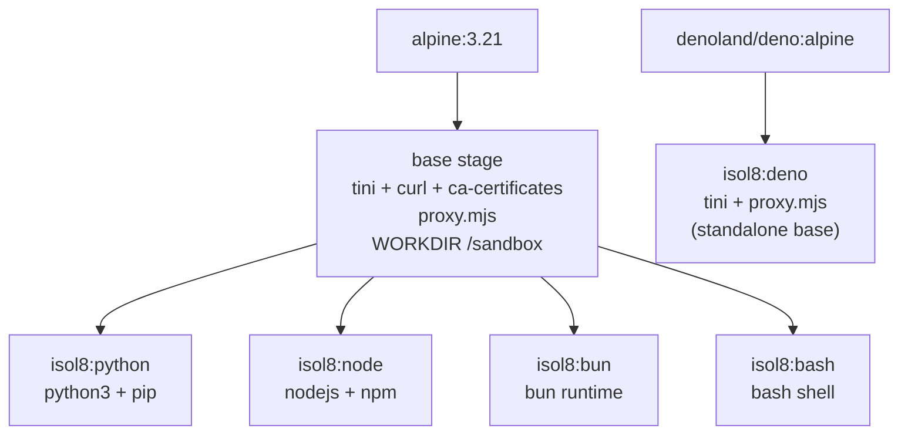

isol8 supports five language runtimes. Each runtime is implemented as a **RuntimeAdapter** — a small object that specifies the Docker image, the shell command to execute code, and the default file extension. Adapters are registered at import time in the `RuntimeRegistry`.

## Runtime summary

| Runtime | Image | Extension | Inline code (`-e`) | Command (inline) | Command (file) |
|:--------|:------|:----------|:--------------------|:------------------|:---------------|
| Python | `isol8:python` | `.py` | Yes | `python3 -c <code>` | `python3 <path>` |
| Node.js | `isol8:node` | `.js` | Yes | `node -e <code>` | `node <path>` |
| Bun | `isol8:bun` | `.ts` | Yes | `bun -e <code>` | `bun run <path>` |
| Deno | `isol8:deno` | `.mts` | No | Throws error | `deno run --allow-read=/sandbox,/tmp --allow-write=/sandbox,/tmp --allow-env --allow-net <path>` |
| Bash | `isol8:bash` | `.sh` | Yes | `bash -c <code>` | `bash <path>` |

## Auto-detection

When you run a file through the CLI (`isol8 run script.py`), isol8 auto-detects the runtime from the file extension using `RuntimeRegistry.detect()`. The mapping is:

| Extension | Runtime |
|:----------|:--------|
| `.py` | Python |
| `.js` | Node.js |
| `.ts` | Bun |
| `.mts` | Deno |
| `.sh` | Bash |

`.ts` files default to **Bun**, not Deno. This is because Bun is registered after Node in the registry and wins the `.ts` extension. To run TypeScript with Deno, either:
- Use the `.mts` extension, or
- Pass `--runtime deno` explicitly

## Registration order

Adapters are registered in this order:

1. Python (`.py`)
2. Node.js (`.js`)
3. Bun (`.ts`) — wins the `.ts` extension
4. Bash (`.sh`)
5. Deno (`.mts`) — uses `.mts` to avoid collision

The last adapter registered for a given extension wins. Since Bun registers `.ts` before Deno registers `.mts`, there is no collision and both coexist.

---

## Python

**Image:** `isol8:python` (built from `alpine:3.21` base stage)

**Installed packages:** `python3`, `py3-pip`

**Execution modes:**

```bash
# Inline code
python3 -c "print('hello')"

# File execution
python3 /sandbox/script.py
```

**Package installation:** Use `pip install` via the `installPackages` option in `ExecutionRequest`. isol8 runs `pip install <packages>` before executing your code.

**Dockerfile stage:**
```dockerfile
FROM base AS python
RUN apk add --no-cache python3 py3-pip
CMD ["python3"]
```

The Python stage inherits from the shared `base` stage, which provides:
- Alpine 3.21
- `tini` as PID 1 (proper signal handling)
- `curl` and `ca-certificates`
- The HTTP/HTTPS filtering proxy at `/usr/local/bin/proxy.mjs`
- Working directory set to `/sandbox`

---

## Node.js

**Image:** `isol8:node` (built from `alpine:3.21` base stage)

**Installed packages:** `nodejs`, `npm`

**Execution modes:**

```bash
# Inline code
node -e "console.log('hello')"

# File execution
node /sandbox/script.js
```

**Package installation:** Use `npm install` via the `installPackages` option. isol8 runs `npm install <packages>` inside the container before executing your code.

**Dockerfile stage:**
```dockerfile
FROM base AS node
RUN apk add --no-cache nodejs npm
CMD ["node"]
```

Inherits from the shared `base` stage (same as Python).

---

## Bun

**Image:** `isol8:bun` (built from `alpine:3.21` base stage)

**Installed packages:** `bash`, `unzip`, `libstdc++`, `libgcc`, plus Bun installed from `bun.sh/install`

**Execution modes:**

```bash
# Inline code
bun -e "console.log('hello')"

# File execution
bun run /sandbox/script.ts
```

**File extension:** `.ts` — Bun is the default runtime for TypeScript files. It has first-class TypeScript support with no compilation step.

**Package installation:** Use `bun add` via the `installPackages` option. isol8 runs `bun add <packages>` inside the container before executing your code.

**Dockerfile stage:**
```dockerfile
FROM base AS bun
RUN apk add --no-cache bash unzip libstdc++ libgcc \
    && curl -fsSL https://bun.sh/install | bash \
    && mv /root/.bun/bin/bun /usr/local/bin/bun \
    && ln -s /usr/local/bin/bun /usr/local/bin/bunx
CMD ["bun"]
```

Inherits from the shared `base` stage. The install script downloads and extracts Bun, then the binary is moved to `/usr/local/bin` so it is on the system PATH.

---

## Deno

**Image:** `isol8:deno` (built from `denoland/deno:alpine` — **not** the shared base stage)

**Execution modes:**

```bash
# File execution only
deno run \
  --allow-read=/sandbox,/tmp \
  --allow-write=/sandbox,/tmp \
  --allow-env \
  --allow-net \
  /sandbox/script.mts
```

<Warning>
Deno does **not** support inline code execution. The `-e` flag is not available for Deno. If you attempt to execute inline code with the Deno runtime, isol8 throws:

```
Error: Deno adapter requires a file path — inline code is not supported.
```

Always provide code as a file (via the `files` field in `ExecutionRequest`, or by passing a file path to the CLI).
</Warning>

**File extension:** `.mts` — chosen to avoid collision with Bun's `.ts`. The `.mts` extension signals "module TypeScript" and is natively understood by Deno.

**Permissions:** Deno runs with the following explicit permission flags:

| Flag | Scope | Purpose |
|:-----|:------|:--------|
| `--allow-read` | `/sandbox`, `/tmp` | Read files in the sandbox working directory and temp |
| `--allow-write` | `/sandbox`, `/tmp` | Write files in the sandbox working directory and temp |
| `--allow-env` | All | Access environment variables (needed for user-provided `env`) |
| `--allow-net` | All | Network access (actual connectivity depends on container's network mode) |

Note that `--allow-net` grants Deno permission to make network calls, but the **container's network mode** (`none`, `bridge`, or `filtered`) determines whether those calls actually succeed. With `network: "none"`, the container has no network interface regardless of Deno's permission flags.

**Dockerfile stage:**
```dockerfile
FROM denoland/deno:alpine AS deno
RUN apk add --no-cache tini curl ca-certificates
COPY proxy.mjs /usr/local/bin/proxy.mjs
RUN chmod +x /usr/local/bin/proxy.mjs
WORKDIR /sandbox
ENTRYPOINT ["/sbin/tini", "--"]
CMD ["deno"]
```

Unlike other runtimes, Deno does **not** inherit from the shared `base` stage. It uses `denoland/deno:alpine` directly and re-installs `tini`, `curl`, `ca-certificates`, and the proxy script. This is because the official Deno Alpine image includes a pre-built Deno binary that is easier to use than building from source.

---

## Bash

**Image:** `isol8:bash` (built from `alpine:3.21` base stage)

**Installed packages:** `bash`

**Execution modes:**

```bash
# Inline code
bash -c "echo hello"

# File execution
bash /sandbox/script.sh
```

**Use cases:** Shell scripting, running system commands, file manipulation, piping between commands. Bash is useful when your task is more about orchestrating system tools than running application code.

**Package installation:** Not directly supported through `installPackages`. Use `apk add` within your bash script if you need additional system packages (requires appropriate container permissions).

**Dockerfile stage:**
```dockerfile
FROM base AS bash
RUN apk add --no-cache bash
CMD ["bash"]
```

Inherits from the shared `base` stage. Alpine uses `ash` by default, so `bash` must be explicitly installed.

---

## Persistent containers and runtime locking

When using persistent sessions (`mode: "persistent"`), the container is created with a specific runtime's Docker image. Once created, the container **cannot switch runtimes**. Attempting to execute code with a different runtime on an existing persistent container throws:

```
Error: Cannot switch runtime from "python" to "node". Each persistent
container supports a single runtime. Create a new Isol8 instance for
a different runtime.
```

This is enforced because each runtime image contains only its own language toolchain. A Python container does not have Node.js installed, and vice versa.

## Runtime adapter interface

Every runtime adapter implements this interface:

```typescript
interface RuntimeAdapter {
  /** Runtime identifier (e.g. "python", "node"). */
  readonly name: Runtime;

  /** Docker image tag for this runtime (e.g. "isol8:python"). */
  readonly image: string;

  /**
   * Build the shell command to execute code.
   * @param code - The source code string.
   * @param filePath - If provided, execute this file instead.
   * @returns Command array (e.g. ["python3", "-c", "print(1)"]).
   */
  getCommand(code: string, filePath?: string): string[];

  /** Default file extension for this runtime (e.g. ".py"). */
  getFileExtension(): string;
}
```

### Custom runtime adapters

You can register custom runtime adapters when using isol8 as a library:

```typescript
import { RuntimeRegistry } from "isol8";

RuntimeRegistry.register({
  name: "ruby" as any,
  image: "isol8:ruby",
  getCommand(code: string, filePath?: string) {
    if (filePath) return ["ruby", filePath];
    return ["ruby", "-e", code];
  },
  getFileExtension() {
    return ".rb";
  },
});
```

You would also need to build a corresponding Docker image (`isol8:ruby`) using the same base stage pattern from the Dockerfile.

## Base image architecture

All runtime images (except Deno) share a common base stage:



The base stage provides:

| Component | Purpose |
|:----------|:--------|
| `tini` | PID 1 init process for proper signal forwarding and zombie reaping |
| `curl` | Used for health checks and package downloads |
| `ca-certificates` | TLS certificate bundle for HTTPS requests |
| `proxy.mjs` | HTTP/HTTPS filtering proxy for `network: "filtered"` mode |
| `/sandbox` | Working directory for all code execution |
