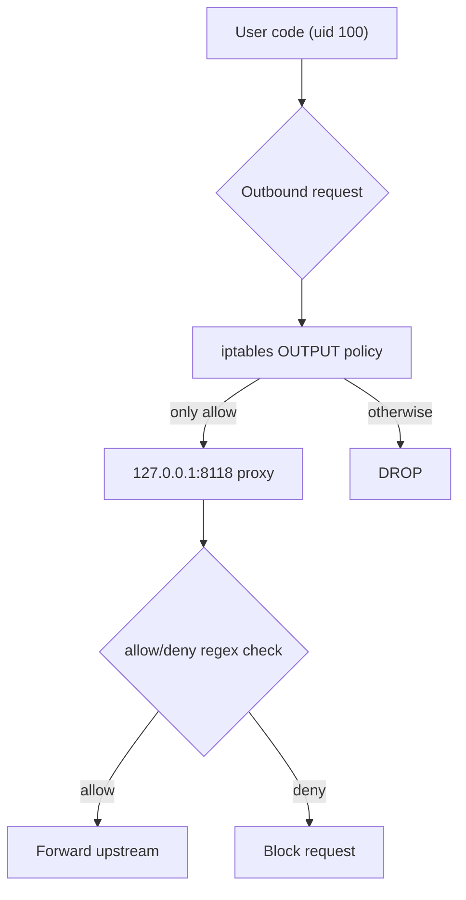

isol8 treats security as a layered system, not a single toggle. Container, process, filesystem, network, and output controls are combined for untrusted code execution.

## Default security baseline

Out of the box, executions run with:

- non-root process user (`sandbox`, uid 100)
- read-only root filesystem (`readonlyRootFs: true`)
- writable tmpfs only at `/sandbox` and `/tmp`
- network disabled (`network: "none"`)
- resource limits (timeout, CPU, memory, PID count)
- secret masking on stdout/stderr when secrets are configured

## Where to set security values

| Control | CLI | Config file | API (`/execute`) | Library |
|:--|:--|:--|:--|:--|
| Network mode | `--net` | `defaults.network` | `options.network` | `new DockerIsol8({ network })` |
| Filter allow rules | `--allow` | `network.whitelist` | `options.networkFilter.whitelist` | `networkFilter.whitelist` |
| Filter deny rules | `--deny` | `network.blacklist` | `options.networkFilter.blacklist` | `networkFilter.blacklist` |
| Seccomp mode/profile | not via `run` flag | `security.seccomp`, `security.customProfilePath` | `options.security.*` | `security.*` |
| PID limit | `--pids-limit` | no default key | `options.pidsLimit` | `pidsLimit` |
| Root FS writability | `--writable` flips readonly off | no default key | `options.readonlyRootFs` | `readonlyRootFs` |
| Secrets masking source | `--secret KEY=VALUE` | no default key | `options.secrets` | `secrets` |

<Info>
  The server merges config defaults with per-request `options`. Request-level `options` win for that execution.
</Info>

## Network modes

| Mode | Behavior | Use for |
|:--|:--|:--|
| `none` | outbound network blocked | safest default for untrusted code |
| `filtered` | outbound routed through in-container proxy + policy rules | controlled external API access |
| `host` | unrestricted host network | trusted workloads only |

<Warning>
  `network: "host"` removes the isolation benefits of blocked/filtered egress. Avoid it for untrusted code.
</Warning>

## Setting filtered mode policy

<Tabs>
  <Tab title="CLI">
    ```bash
    isol8 run script.py \
      --net filtered \
      --allow "^api\\.openai\\.com$" \
      --deny "^169\\.254\\."
    ```
  </Tab>
  <Tab title="Config">
    ```json
    {
      "defaults": {
        "network": "filtered"
      },
      "network": {
        "whitelist": ["^api\\.openai\\.com$"],
        "blacklist": ["^169\\.254\\."]
      }
    }
    ```
  </Tab>
  <Tab title="API">
    ```json
    {
      "request": {
        "code": "print('hello')",
        "runtime": "python"
      },
      "options": {
        "network": "filtered",
        "networkFilter": {
          "whitelist": ["^api\\.openai\\.com$"],
          "blacklist": ["^169\\.254\\."]
        }
      }
    }
    ```
  </Tab>
  <Tab title="Library">
    ```typescript
    const engine = new DockerIsol8({
      network: "filtered",
      networkFilter: {
        whitelist: ["^api\\.openai\\.com$"],
        blacklist: ["^169\\.254\\."],
      },
    });
    ```
  </Tab>
</Tabs>

### How filtered enforcement works



<Note>
  For pooled containers in filtered mode, cleanup flushes container OUTPUT iptables rules before reuse.
</Note>

## Seccomp modes

Available values for `security.seccomp`:

- `strict` (default)
- `unconfined`
- `custom` (requires `security.customProfilePath`)

<Tabs>
  <Tab title="Config">
    ```json
    {
      "security": {
        "seccomp": "custom",
        "customProfilePath": "./seccomp-profile.json"
      }
    }
    ```
  </Tab>
  <Tab title="API">
    ```json
    {
      "request": {
        "code": "console.log('ok')",
        "runtime": "node"
      },
      "options": {
        "security": {
          "seccomp": "custom",
          "customProfilePath": "./seccomp-profile.json"
        }
      }
    }
    ```
  </Tab>
  <Tab title="Library">
    ```typescript
    const engine = new DockerIsol8({
      security: {
        seccomp: "custom",
        customProfilePath: "./seccomp-profile.json",
      },
    });
    ```
  </Tab>
</Tabs>

<Warning>
  `unconfined` disables seccomp syscall filtering.
</Warning>

<Note>
  In `strict` mode, isol8 attempts to load a built-in seccomp profile. If that profile cannot be located at runtime, isol8 logs a warning and runs without a seccomp filter.
</Note>

## Filesystem and process guards

- `/sandbox` is writable and executable (required for native extensions and installed packages)
- `/tmp` is writable but mounted `noexec`
- `pidsLimit` constrains process fan-out
- `readonlyRootFs` keeps root filesystem immutable unless explicitly disabled

<Tabs>
  <Tab title="CLI">
    ```bash
    isol8 run script.py \
      --pids-limit 64 \
      --sandbox-size 512m \
      --tmp-size 256m
    ```
  </Tab>
  <Tab title="API">
    ```json
    {
      "request": {
        "code": "print('ok')",
        "runtime": "python"
      },
      "options": {
        "pidsLimit": 64,
        "readonlyRootFs": true,
        "sandboxSize": "512m",
        "tmpSize": "256m"
      }
    }
    ```
  </Tab>
  <Tab title="Library">
    ```typescript
    const engine = new DockerIsol8({
      pidsLimit: 64,
      readonlyRootFs: true,
      sandboxSize: "512m",
      tmpSize: "256m",
    });
    ```
  </Tab>
</Tabs>

## Secret masking behavior

Secrets are injected as environment variables and then masked from stdout/stderr by value matching.

<Tabs>
  <Tab title="CLI">
    <CodeGroup>
      ```bash Command
      isol8 run -e "print('token=abc123')" \
        --runtime python \
        --secret API_TOKEN=abc123
      ```

      ```text Expected output
      token=***
      ```
    </CodeGroup>
  </Tab>
  <Tab title="API">
    <CodeGroup>
      ```json Input
      {
        "request": {
          "code": "print('token=' + __import__('os').environ['API_TOKEN'])",
          "runtime": "python"
        },
        "options": {
          "secrets": {
            "API_TOKEN": "abc123"
          }
        }
      }
      ```

      ```json Expected output excerpt
      {
        "stdout": "token=***\n",
        "stderr": "",
        "exitCode": 0
      }
      ```
    </CodeGroup>
  </Tab>
  <Tab title="Library">
    <CodeGroup>
      ```typescript Input
      const engine = new DockerIsol8({
        secrets: { API_TOKEN: "abc123" },
      });

      const result = await engine.execute({
        runtime: "python",
        code: "print('token=' + __import__('os').environ['API_TOKEN'])",
      });

      console.log(result.stdout);
      ```

      ```text Expected output
      token=***
      ```
    </CodeGroup>
  </Tab>
</Tabs>

<Warning>
  Secret masking applies to stdout/stderr text. Retrieved file contents are not automatically redacted.
</Warning>

## FAQ

<Accordion title="Do I need both allow and deny lists in filtered mode?">
  No. You can use either. If both are provided, blacklist matches are denied even when whitelist would allow.
</Accordion>

<Accordion title="Can I configure seccomp from `isol8 run` flags?">
  Not in the current CLI `run` flags. Use `isol8.config.json`, API `options.security`, or library options.
</Accordion>

<Accordion title="Why keep `/sandbox` executable but `/tmp` noexec?">
  Native extensions and runtime package installs need executable paths. isol8 uses `/sandbox` for that and keeps `/tmp` non-executable to reduce abuse surface.
</Accordion>

## Troubleshooting

- **Filtered mode blocks expected domains**: test your regex patterns; remember they are hostname checks and blacklist wins.
- **Unexpected open egress**: verify `network` is not `host` in config defaults or request options.
- **Seccomp custom profile errors**: ensure `customProfilePath` exists and contains valid seccomp JSON.
- **Secret still appears in downloaded artifacts**: add explicit redaction before writing files you later retrieve.

## Related pages

<CardGroup cols={2}>
  <Card title="Execution guide" icon="terminal" href="/execution">
    Runtime flow, modes, request shape, and execution lifecycle.
  </Card>
  <Card title="Option mapping" icon="sliders-horizontal" href="/option-mapping">
    Exact mapping for CLI flags, config keys, API options, and library params.
  </Card>
  <Card title="Configuration reference" icon="gear" href="/configuration">
    Full schema defaults, limits, and production-safe baseline config.
  </Card>
  <Card title="Troubleshooting" icon="wrench" href="/troubleshooting">
    Common runtime and server failures with quick resolution paths.
  </Card>
</CardGroup>
