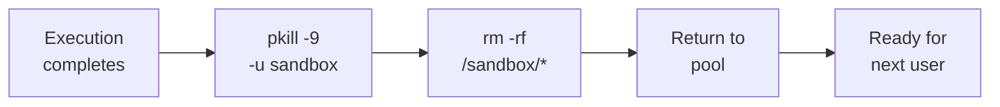

isol8 is designed to run untrusted code safely. Every execution is isolated in a Docker container with multiple layers of defense.

## Container Isolation

Each execution runs inside a Docker container with the following security constraints:

| Control | Default | Configurable |
|:--------|:--------|:-------------|
| Read-only root filesystem | Enabled | `--writable` / `readonlyRootFs: false` |
| No network access | `none` | `--net host\|filtered` / `network` |
| Memory limit | 512 MB | `--memory` / `memoryLimit` |
| CPU limit | 1 core | `--cpu` / `cpuLimit` |
| PID limit | 64 | `--pids-limit` / `pidsLimit` |
| Sandbox tmpfs | 512 MB | `--sandbox-size` / `sandboxSize` |
| Tmp tmpfs | 256 MB | `--tmp-size` / `tmpSize` |
| `no-new-privileges` | Enabled | Not configurable |
| Non-root user (`sandbox`) | Enabled | Not configurable |
| Process cleanup on pool reuse | Enabled | Not configurable |
| Seccomp Profile | Safety (Blacklist) | `security.seccomp` |
| Execution timeout | 30 seconds | `--timeout` / `timeoutMs` |

## Process Isolation

All user code runs as a non-root `sandbox` user (uid 100) inside the container. The container's init process (`tini` + `sleep infinity`) runs as root, which means:

- User code **cannot** kill the container's init process
- User code **cannot** escalate privileges (`no-new-privileges` is set)
- User code **cannot** access or modify root-owned system files

When containers are returned to the warm pool for reuse, **all processes owned by the `sandbox` user are killed** (`pkill -9 -u sandbox`) before the filesystem is wiped. This prevents background processes from one execution persisting into the next execution.

In **fast mode** (default), the pool uses a dual-pool system:
- Containers are returned to a "dirty" pool after use
- Background cleanup runs every 5 seconds to clean dirty containers
- If a clean container is needed but none are available, immediate cleanup is attempted on acquire

In **secure mode**, cleanup happens synchronously in `acquire()` — slower but guarantees a clean container.



## Seccomp Profile

isol8 applies a "safety" seccomp profile by default. This uses a blacklist approach (`SCMP_ACT_ALLOW` default) to block specific dangerous system calls while maintaining broad compatibility. Blocked operations include:

- **Kernel Module Operations**: `init_module`, `finit_module`, `delete_module`, etc.
- **Process Tracing**: `ptrace` (prevents inspecting other processes).
- **Mount Operations**: `mount`, `umount`, `pivot_root`.
- **Reboot/Kexec**: `reboot`, `kexec_load`.

This profile prevents container breakout and privilege escalation attempts while allowing standard application behavior.

## Container Filesystem

Containers use two tmpfs mounts for security and performance:

### `/sandbox` (default: 512 MB)

- **Purpose**: Working directory for code execution
- **Mount flags**: `rw,exec,nosuid,nodev`
- **Contents**: 
  - User code files
  - Package installations (`.local`, `.npm-global`, `.bun-global`)
  - User-created files and outputs
- **Execution**: Allowed (required for native extensions like numpy's `.so` files)
- **Configurable via**: `--sandbox-size` CLI flag or `sandboxSize` config option

### `/tmp` (default: 256 MB)

- **Purpose**: Temporary files and caches
- **Mount flags**: `rw,noexec,nosuid,nodev`
- **Contents**:
  - Temporary files created by programs
  - Package manager caches during installation
- **Execution**: Disabled (`noexec` flag) for security
- **Configurable via**: `--tmp-size` CLI flag or `tmpSize` config option

<Info>
Packages installed with `--install` are stored in `/sandbox` (not `/tmp`) because they often contain shared libraries (`.so` files) that need to be executable. The `/tmp` mount has the `noexec` flag which would prevent these libraries from loading.
</Info>

## Network Control

### `none` (Default)

The container has no network access. No DNS, no HTTP, no TCP — nothing leaves the container.

### `host`

Full host network access. Use only when you trust the code or need unrestricted connectivity.

### `filtered`

Bridge network with an HTTP/HTTPS proxy (`proxy.sh`) that filters requests by hostname:

- **Whitelist** — Only matching hostnames are allowed (regex patterns)
- **Blacklist** — Matching hostnames are blocked (regex patterns)

```bash
# Allow only OpenAI and GitHub APIs
isol8 run script.py --net filtered \
  --allow "^api\.openai\.com$" \
  --allow "^api\.github\.com$"
```

The proxy intercepts HTTP and HTTPS traffic via `HTTP_PROXY`/`HTTPS_PROXY` environment variables.

**Kernel-level enforcement:** In addition to the proxy, iptables rules are applied inside the container to ensure the `sandbox` user can **only** reach the proxy at `127.0.0.1:8118`. All other outbound traffic from the sandbox user is dropped at the kernel level. This prevents bypass via raw sockets, direct TCP connections, or any non-HTTP protocol — even if user code ignores the proxy environment variables.

<Info>
The container is given `CAP_NET_ADMIN` in filtered mode so iptables rules can be set. This capability is used only by the engine (as root) before user code runs — the sandbox user cannot modify iptables rules due to `no-new-privileges`.
</Info>

## Secret Masking

Secrets passed via `--secret KEY=VALUE` (CLI) or `secrets: { KEY: "VALUE" }` (library) are:

1. Injected into the container as environment variables
2. Automatically masked in all output (stdout and stderr)

Any occurrence of the secret value in the output is replaced with `***`.

```bash
isol8 run -e "import os; print(os.environ['API_KEY'])" \
  --runtime python --secret API_KEY=sk-1234
# stdout: ***
```

This prevents accidental leakage of credentials in logs, AI agent responses, or user-facing output.

## Output Truncation

Output is truncated to `maxOutputSize` (default 1 MB) to prevent memory exhaustion from programs that produce excessive output. When truncation occurs, `ExecutionResult.truncated` is set to `true`.

## Timeout Enforcement

When a timeout is reached:

1. The process inside the container is killed (via `timeout` shell wrapper)
2. `"EXECUTION TIMED OUT"` is appended to stderr
3. The container is cleaned up (ephemeral) or preserved minus the killed process (persistent)

This prevents runaway code from consuming resources indefinitely.

## Secure File I/O

All file writing operations (`writeFileViaExec`, `putFile`) use a secure streaming mechanism to transfer content into the container.

- **Stdin Streaming**: File content is streamed directly to the container's standard input.
- **No Argument Leaks**: Content is never passed as command-line arguments, preventing exposure in process listings (`ps`).
- **Binary Safety**: Handles binary data correctly without encoding overhead.

## Input Validation

isol8 validates all user-provided inputs to prevent injection attacks.

- **Package Names**: Package names passed to `--install` or setup commands are strictly validated against an allowlist of characters (`a-z`, `0-9`, `-`, `_`, `.`, `/`, `@`, `=`) to prevent command injection in shell-based package managers.
- **File Paths**: File paths are sanitized to prevent directory traversal attacks, ensuring they remain within the `/sandbox` or `/tmp` directories.

## Docker Image Security

Base images are built from a multi-stage Dockerfile with:

- Alpine Linux base (minimal attack surface)
- Non-root `sandbox` user
- Only the runtime binary and essential dependencies
- Proxy script for filtered networking

Custom images (`isol8 setup --python numpy`) extend the base image with additional packages but maintain the same security posture.

## Audit Logging

isol8 provides comprehensive audit logging for compliance, forensics, and operational monitoring. When enabled, every execution is recorded with:

### What Gets Logged

| Field | Description | Privacy Level |
|:------|:------------|:--------------|
| `executionId` | UUID for this execution | Public |
| `userId` | User identifier from metadata | Public |
| `timestamp` | ISO 8601 timestamp | Public |
| `runtime` | Runtime used (python, node, etc.) | Public |
| `codeHash` | SHA-256 hash of source code | Public |
| `containerId` | Docker container ID | Public |
| `exitCode` | Process exit code | Public |
| `durationMs` | Wall-clock execution time | Public |
| `resourceUsage` | CPU, memory, network metrics | Public |
| `securityEvents` | Network blocks, policy violations | Public |
| `metadata` | Custom context (userId, tenantId) | Public |
| `code` | Full source code | Private* |
| `stdout` | Standard output | Private* |
| `stderr` | Standard error | Private* |

\* Code and output logging is disabled by default for privacy. Enable with `includeCode` and `includeOutput` config options.

### Security Events

When running in `filtered` network mode, blocked network requests are captured as security events:

```json
{
  "type": "network_blocked",
  "message": "Security event: network_blocked",
  "details": {
    "method": "CONNECT",
    "host": "evil.com",
    "reason": "filter_mismatch"
  },
  "timestamp": "2026-02-17T20:00:00Z"
}
```

These events help detect and investigate attempts to access unauthorized resources.

### Log Storage

Audit logs are written as JSON Lines (JSONL) format, one JSON object per line. This format is:
- **Append-only**: New entries are added to the end without modifying existing data
- **Parseable**: Easy to ingest into log aggregation systems
- **Tamper-evident**: Each entry is independent and timestamped

Example log entry:

```json
{"executionId":"550e8400-e29b-41d4-a716-446655440000","userId":"user-123","timestamp":"2026-02-17T20:00:00.000Z","runtime":"python","codeHash":"a1b2c3d4...","containerId":"abc123","exitCode":0,"durationMs":82,"resourceUsage":{"cpuPercent":12.5,"memoryMB":64,"networkBytesIn":0,"networkBytesOut":0},"metadata":{"tenantId":"tenant-456"}}
```

### Retention and Cleanup

Configure `retentionDays` to automatically clean up old logs:

```json
{
  "audit": {
    "enabled": true,
    "retentionDays": 90
  }
}
```

Files older than the retention period are removed when the AuditLogger initializes.

### Integration with External Systems

Use `postLogScript` to forward logs to external systems:

```json
{
  "audit": {
    "enabled": true,
    "postLogScript": "/usr/local/bin/send-to-cloudwatch.sh"
  }
}
```

The script receives the log file path as its first argument and runs asynchronously (non-blocking).

## Best Practices

<Steps>
  <Step title="Use network: none by default">
    Only enable network access when the code genuinely needs it. Most code execution tasks don't require network.
  </Step>
  <Step title="Use filtered mode with tight allowlists">
    When network is needed, prefer `filtered` with explicit `--allow` patterns rather than `host` mode.
  </Step>
  <Step title="Set appropriate resource limits">
    Lower memory, CPU, and PID limits to the minimum your workload needs.
  </Step>
  <Step title="Use secrets for credentials">
    Never embed API keys in code strings. Use `--secret` to inject them as masked env vars.
  </Step>
  <Step title="Use ephemeral mode">
    Prefer ephemeral execution for one-off tasks. Persistent mode should only be used when state preservation is genuinely needed.
  </Step>
  <Step title="Keep timeout low">
    Set timeouts appropriate to your workload. 30 seconds is generous for most tasks.
  </Step>
  <Step title="Enable audit logging for production">
    Enable audit logging in production environments to maintain execution history for compliance and debugging.
  </Step>
  <Step title="Review security events regularly">
    Monitor audit logs for security events (blocked network requests) to detect potential abuse or misconfiguration.
  </Step>
</Steps>
