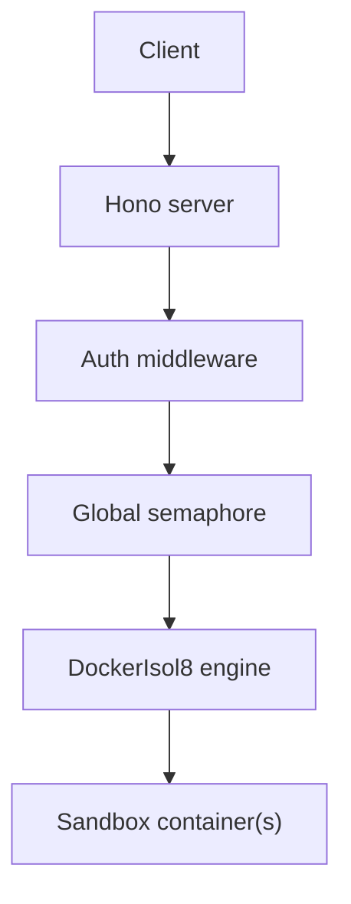

The isol8 server exposes remote code execution over HTTP for centralized infrastructure.

## Start server

```bash
isol8 serve --port 3000 --key "$ISOL8_API_KEY"
```

Port resolution order is `--port` > `ISOL8_PORT` > `PORT` > `3000`. If the selected port is already in use, startup prompts for a different port or can auto-select one.

## What the server provides

- authenticated execution APIs (`/execute`, `/execute/stream`)
- optional persistent sessions via `sessionId`
- file upload/download for active sessions
- global concurrency control via semaphore (`maxConcurrent`)
- idle session cleanup (`cleanup.autoPrune` + `cleanup.maxContainerAgeMs`)

## Authentication model

- `GET /health` is public
- all other routes require `Authorization: Bearer <api-key>`
- missing header -> `401`
- invalid token -> `403`

## Execution architecture



## Request envelope

`POST /execute` and `POST /execute/stream` accept:

```json
{
  "request": {
    "code": "print('ok')",
    "runtime": "python"
  },
  "options": {
    "timeoutMs": 30000,
    "network": "none"
  },
  "sessionId": "optional-session-id"
}
```

### Behavior rules

- no `sessionId`: ephemeral execution (fresh engine lifecycle)
- with `sessionId`: server creates/reuses persistent session
- request `options` merge over server config defaults
- `poolStrategy` and `poolSize` are always taken from server config
- audit settings are applied from server config

## Pool defaults (`isol8 serve`)

Server-created engines use config-level pool defaults:

- `poolStrategy` (default: `fast`)
- `poolSize` (default: `{ "clean": 1, "dirty": 1 }`)

```json
{
  "poolStrategy": "fast",
  "poolSize": { "clean": 2, "dirty": 2 }
}
```

<Note>
  API requests cannot override pooling per call. Set pooling once in `isol8.config.json` for consistent server behavior.
</Note>

## Auto-pruning and idle session cleanup

When `cleanup.autoPrune` is enabled:

- cleanup sweep runs every `60_000` ms
- sessions idle longer than `cleanup.maxContainerAgeMs` are stopped and removed
- active sessions are skipped while currently executing
- `lastAccessedAt` is updated on execute and file upload/download calls

Default values:

- `cleanup.autoPrune`: `true`
- `cleanup.maxContainerAgeMs`: `3_600_000` (1 hour)

```json
{
  "cleanup": {
    "autoPrune": true,
    "maxContainerAgeMs": 1800000
  }
}
```

<Warning>
  Auto-pruning depends on the server process being alive. If the process is terminated, in-memory session tracking stops; use `isol8 cleanup` to remove any orphaned containers.
</Warning>

## Related pages

<CardGroup cols={2}>
  <Card title="Server routes" icon="route" href="/server/routes">
    Full endpoint-by-endpoint request and response reference.
  </Card>
  <Card title="Remote server and client" icon="server" href="/remote">
    Practical remote usage patterns with CLI, API, and library examples.
  </Card>
  <Card title="Configuration reference" icon="gear" href="/configuration">
    Defaults and cleanup settings that affect server behavior.
  </Card>
  <Card title="Performance tuning" icon="gauge-high" href="/performance">
    Pool strategy, pool size, and concurrency tuning guidance.
  </Card>
  <Card title="Troubleshooting" icon="wrench" href="/troubleshooting">
    Diagnose auth, session, and remote execution issues.
  </Card>
</CardGroup>
