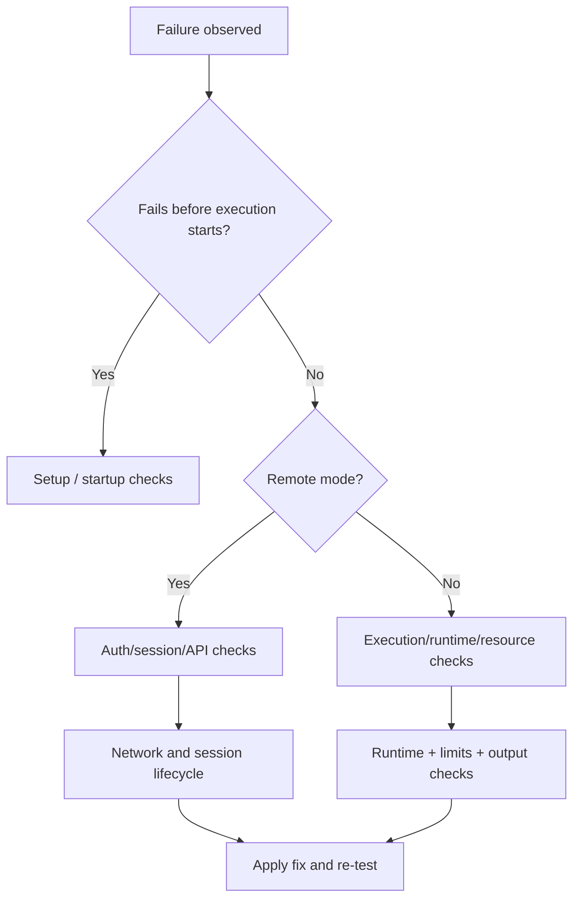

Use this page when behavior is not what you expect. Each section maps concrete symptoms to likely causes and fix paths.

## Diagram 1: Fast triage flow



## Setup and startup failures

### Docker unreachable

**Symptom**
- `isol8 setup` fails early with Docker check errors
- local `isol8 run` fails before code runs

**Checks**
```bash
docker info
```

**Fix**
- start Docker daemon/Desktop
- ensure current user can access Docker socket

### `isol8 serve` fails: missing API key

**Symptom**
- `[ERR] API key required...`

**Fix**
```bash
isol8 serve --key my-secret-key
```
or:
```bash
export ISOL8_API_KEY=my-secret-key
isol8 serve
```

### `isol8 serve` fails in built CLI mode with platform/binary errors

**Symptom**
- unsupported platform (`os-arch`)
- server binary not found for version

**Fix**
- verify platform is supported
- force refresh:
```bash
isol8 serve --update
```
- if release artifact is missing, use Bun/dev path temporarily (`bun run dev -- serve ...`)

### Standalone server arg parse errors

**Symptom**
- invalid port
- unknown argument

**Fix**
- use:
```bash
isol8 serve --port 3000 --key my-secret-key
```
- avoid unsupported flags in standalone mode

### `isol8 serve` fails because port is in use

**Symptom**
- `EADDRINUSE`
- startup fails on `localhost:3000`

**Fix**
- current behavior prompts you to:
  - enter another port, or
  - let isol8 find an available port automatically
- to set a port non-interactively, use precedence:
  1. `--port`
  2. `ISOL8_PORT`
  3. `PORT`
  4. fallback `3000`

## Input and runtime resolution failures

### File not found

**Symptom**
- `[ERR] File not found: ...`

**Checks**
```bash
ls -la path/to/file.py
```

**Fix**
- correct file path
- or use inline mode:
```bash
isol8 run -e "print('ok')" --runtime python
```

### Runtime auto-detect fails

**Symptom**
- `[ERR] Cannot detect runtime for ...`

**Cause**
- file extension not mapped in runtime registry

**Fix**
```bash
isol8 run script.unknown --runtime python
```

### Deno inline execution fails

**Symptom**
- `Deno adapter requires a file path — inline code is not supported.`

**Fix**
- run Deno from a file (`.mts`) instead of `-e`

### Unknown runtime error

**Symptom**
- `Unknown runtime: "..."`

**Fix**
- use one of: `python`, `node`, `bun`, `deno`, `bash`

## Resource limit and output issues

### Timeout failures

**Symptom**
- long-running process terminated near timeout limit

**Cause**
- command is wrapped with timeout and killed on expiry

**Fix**
```bash
isol8 run script.py --timeout 60000
```

### Memory limit format errors

**Symptom**
- `Invalid memory limit format: "..."`

**Fix**
- use accepted formats like `512m`, `1g`, `256k`, or bytes
```bash
isol8 run script.py --memory 1g
```

### OOM / abrupt kill

**Symptom**
- process exits unexpectedly, often with kill-like behavior

**Fix**
- increase memory and/or reduce workload footprint:
```bash
isol8 run heavy.py --memory 2g
```

### Output truncated

**Symptom**
- CLI warning: `[WARN] Output was truncated`
- result has `truncated: true`

**Fix**
```bash
isol8 run noisy.py --max-output 10485760
```

<Note>
  Large output can be a symptom of logging loops. Prefer reducing verbosity before only raising cap.
</Note>

## Package installation and filesystem issues

### Package install fails (exit code + stderr)

**Symptom**
- `Package install failed (exit code ...): ...`

**Checks**
- validate package names
- confirm runtime package source accessibility (if using networked install)

**Fix**
- test smaller package set first
- prefer pre-baked dependencies via `isol8 setup` for production stability

### Native extension problems

**Symptom**
- import/load issues for native libs (`.so`)

**Cause**
- executable paths required for native extension loading

**Fix**
- keep installs in `/sandbox` (default behavior)
- increase sandbox capacity if needed:
```bash
isol8 run script.py --sandbox-size 1g
```

## Persistence, sessions, and file API issues

### `No active container. Call execute() first in persistent mode.`

**Symptom**
- local `putFile`/`getFile` fails immediately

**Cause**
- no persistent container has been initialized yet

**Fix**
- run one `execute()` first in persistent mode, then file APIs

### Runtime switch rejected in persistent mode

**Symptom**
- `Cannot switch runtime from "python" to "node"...`

**Fix**
- create separate persistent engine/session per runtime

### `Session not found` in remote file/session calls

**Symptom**
- `404 Session not found`

**Cause**
- missing or stale session id

**Fix**
- initialize session with `/execute` using same `sessionId`
- verify session not auto-pruned

### Sessions disappearing unexpectedly

**Checks**
- inspect:
  - `cleanup.autoPrune`
  - `cleanup.maxContainerAgeMs`

**Fix**
- increase idle window or delete sessions explicitly at end of workflow

## Networking and security policy failures

### Filtered mode blocks expected hosts

**Symptom**
- outbound requests fail in `--net filtered`

**Checks**
```bash
isol8 run net.py \
  --net filtered \
  --allow "^api\\.openai\\.com$" \
  --log-network
```

**Fix**
- correct regex to match exact hostname
- remember blacklist wins over whitelist

### Filtered mode setup errors (proxy/iptables)

**Symptom**
- `Proxy failed to start within timeout`
- `Failed to set up iptables rules...`

**Likely causes**
- container-level startup issue
- capability/environment constraints

**Fix**
- retry with `--debug` and inspect logs
- validate Docker environment and image health

### Network logs missing

**Symptom**
- no `networkLogs` in result

**Fix**
- both must be true:
  - `network: "filtered"`
  - `logNetwork: true`

### Seccomp/profile issues

**Symptom**
- seccomp profile load errors before execution

**Fix**
- verify `security.customProfilePath` if using custom profile
- keep `security.seccomp: "strict"` for default hardening; standalone binaries can use the embedded default profile when on-disk profile files are absent
- if strict/custom profile loading fails, execution is blocked by design

## Remote API and client errors

### 401 vs 403 auth failures

**Symptom**
- API rejects request

**Meaning**
- `401`: missing `Authorization` header
- `403`: invalid Bearer token

### Remote health check failures

**Symptom**
- `Remote server health check failed: ...`

**Checks**
```bash
curl -sS http://localhost:3000/health
```

**Fix**
- verify host/port
- confirm server process is running

### Streaming client errors

**Symptom**
- `Stream failed: ...`
- `No response body for streaming`

**Fix**
- verify endpoint availability and proxy behavior
- test with non-streaming `/execute` first to isolate issue

### Remote file operations fail in client

**Symptom**
- `File operations require a sessionId (persistent mode)`

**Fix**
- instantiate `RemoteIsol8` with `sessionId` for file operations

## High-signal debug playbook

1. Reproduce with debug logs:
```bash
isol8 run script.py --debug
```
2. Inspect effective config:
```bash
isol8 config --json
```
3. Minimize to simplest repro:
- inline code
- explicit runtime
- no packages
- `--net none`
4. Add options back one by one:
- network
- install packages
- persistence/session
- custom limits
5. For remote issues, test raw endpoints with `curl` before SDK integration.

## FAQ

<AccordionGroup>
  <Accordion title="Why does local CLI `--persistent` not behave like a long-lived server session?">
    CLI is process-scoped and stops engine on exit. For multi-call persistence, use remote mode with stable `sessionId`.
  </Accordion>

  <Accordion title="Should I debug with `--persist` in production?">
    Usually no. `--persist` is best for controlled debugging because it intentionally leaves containers running.
  </Accordion>

  <Accordion title="What is the most common root cause of 'it worked yesterday'?">
    Config drift or runtime/package/environment changes. Always confirm effective config and runtime selection first.
  </Accordion>
</AccordionGroup>

## Related pages

<CardGroup cols={2}>
  <Card title="FAQ" icon="circle-question" href="/faq">
    Common behavioral questions and default semantics.
  </Card>
  <Card title="Configuration reference" icon="gear" href="/configuration">
    Validate defaults and override scopes.
  </Card>
  <Card title="Remote server and client" icon="server" href="/remote">
    Auth, sessions, file endpoints, and auto-pruning behavior.
  </Card>
  <Card title="Execution guide" icon="terminal" href="/execution">
    Understand the execution pipeline and mode-level behavior.
  </Card>
</CardGroup>
