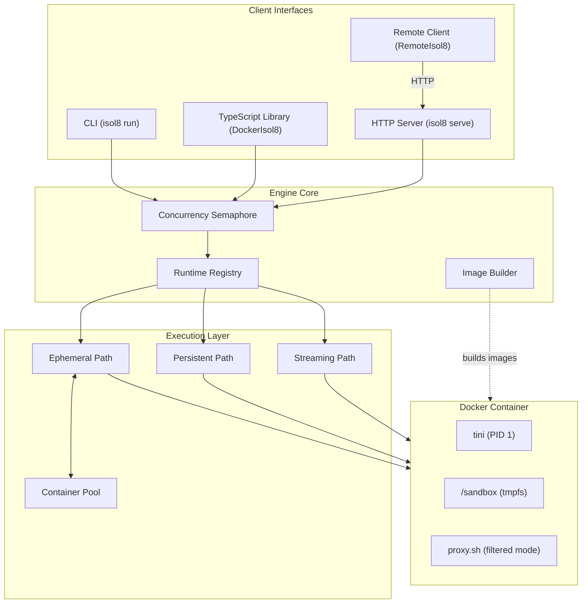
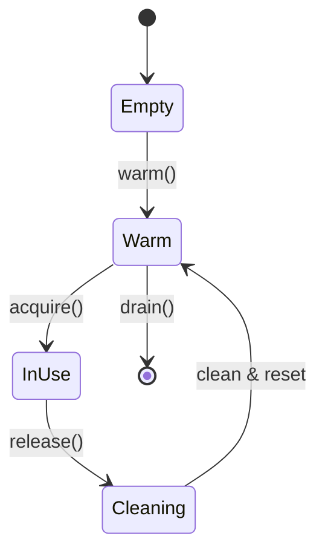

isol8 is built for speed and security. It combines a warm container pool with strict isolation mechanisms to deliver sub-150ms execution latency.

## System Overview

## Execution Modes

### Ephemeral Execution (Default)

The fastest way to run code. Containers are borrowed from a warm pool, used once, wiped, and returned.

<Steps>
  <Step title="Acquire">
    Get a warm container from the pool (or create one if empty).
  </Step>
  <Step title="Inject">
    Write code to `/sandbox` via `docker exec`.
  </Step>
  <Step title="Execute">
    Run the code with timeout enforcement.
  </Step>
  <Step title="Collect">
    Capture stdout/stderr.
  </Step>
  <Step title="Release">
    Kill user processes (`pkill -9 -u sandbox`), wipe `/sandbox`, and return to pool.
  </Step>
</Steps>

Latency: ~130ms (warm).

### Persistent Execution

For stateful workflows. A dedicated container is created and reused.

1. **Create**: Start a new container (if not exists).
2. **Execute**: Run code in the same container repeatedly.
3. **Persist**: Files and variables remain between runs.
4. **Stop**: Destroy container when session ends.

Latency: ~300ms (first run), ~120ms (subsequent).

### Streaming Execution

For real-time output. Creates a **fresh container** for each run (bypasses pool).

1. **Create**: Start a new container.
2. **Stream**: Output chunks are yielded via async iterator as they arrive.
3. **Destroy**: Container is removed immediately after execution.

## Container Pool

The secret to low latency. The `ContainerPool` keeps pre-started containers ready.

- **Pool Size**: Configurable via `--pool-size` (default: `{ clean: 1, dirty: 1 }`).
- **Lifecycle**:
    - `warm()`: Pre-creates containers.
    - `acquire()`: Returns a ready container.
    - `release()`: Cleans up processes and filesystem before returning.
    - `replenish()`: Background task to refill the pool.

## Security Layers

### Network Filtering

In `filtered` mode, traffic goes through a proxy *and* kernel-level enforcement.

1. **Proxy (`proxy.sh`)**: Listens on `127.0.0.1:8118`. Checks whitelist/blacklist.
2. **iptables**: Rules block all outbound traffic from the `sandbox` user except to the proxy.

This prevents bypass via raw sockets or non-HTTP protocols.

### Process Isolation

- **User**: Code runs as `sandbox` (uid 100).
- **Init**: `tini` runs as root (PID 1).
- **Cleanup**: `pkill -9 -u sandbox` ensures no lingering processes.

### Output Pipeline

1. **Collect**: Read stdout/stderr streams.
2. **Truncate**: Cap at `maxOutputSize` (default 1MB).
3. **Mask**: Replace secret values with `***`.
4. **Trim**: Remove whitespace.

## Image Architecture

Images are built from a common Alpine base.

- **Base**: `alpine:3.21` + `tini` + `curl` + `proxy.sh`.
- **Runtimes**: Python, Node, Bun, Bash extend base. Deno uses its own base.
- **Custom**: `isol8:python-custom` extends `isol8:python` with pip packages.

See [Packages & Images](/v2/packages) for details.
