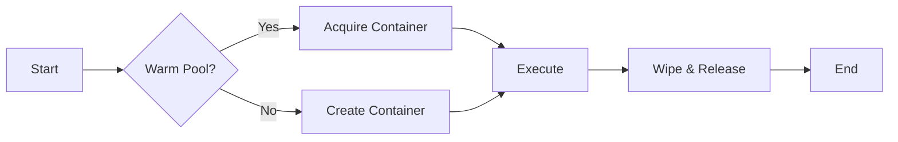

The core of isol8 is its execution engine, which takes untrusted code and runs it inside an isolated Docker container. This page covers how to execute code, the supported runtimes, and performance benchmarks.

## Supported Runtimes

isol8 supports Python, Node.js, Bun, Deno, and Bash.

<Card title="Runtime Reference" icon="layer-group" href="/v2/runtimes">
  View details for all supported runtimes, including Docker images and package managers.
</Card>

## Execution Methods

### 1. Inline Code

Perfect for quick snippets or testing.

<Tabs>
  <Tab title="CLI">
    Use the `-e` or `--eval` flag.

    ```bash
    isol8 run -e "print(2 ** 10)" --runtime python
    ```
  </Tab>
  <Tab title="Library">
    Pass the code string to `execute`.

    ```typescript
    const result = await isol8.execute({
      code: 'print(2 ** 10)',
      runtime: 'python'
    });
    ```
  </Tab>
  <Tab title="API">
    Send a POST request.

    ```bash
    curl -X POST http://localhost:3000/execute \
      -H "Authorization: Bearer <key>" \
      -d '{ "request": { "code": "print(2**10)", "runtime": "python" } }'
    ```
  </Tab>
</Tabs>

### 2. File Execution

Run a script file. The runtime is auto-detected from the extension in CLI.

<Tabs>
  <Tab title="CLI">
    Pass the file path.

    ```bash
    isol8 run script.py
    ```
  </Tab>
  <Tab title="Library">
    Read the file and pass content.

    ```typescript
    import { readFileSync } from 'fs';
    const result = await isol8.execute({
      code: readFileSync('script.py', 'utf-8'),
      runtime: 'python',
      fileExtension: '.py' // Hint for Deno/Bun
    });
    ```
  </Tab>
  <Tab title="API">
    Send file content as code.

    ```bash
    curl -X POST http://localhost:3000/execute \
      -d '{ "request": { "code": "...", "runtime": "python" } }'
    ```
  </Tab>
</Tabs>

### 3. Stdin Piping

Pipe data into the process.

<Tabs>
  <Tab title="CLI">
    Pipe via shell.

    ```bash
    echo '{"key": "val"}' | isol8 run script.py
    ```
  </Tab>
  <Tab title="Library">
    Use the `stdin` field.

    ```typescript
    const result = await isol8.execute({
      code: 'import sys; print(sys.stdin.read())',
      runtime: 'python',
      stdin: '{"key": "val"}'
    });
    ```
  </Tab>
  <Tab title="API">
    Use the `stdin` field in the request body.

    ```json
    {
      "request": {
        "code": "import sys; print(sys.stdin.read())",
        "runtime": "python",
        "stdin": "{\"key\": \"val\"}"
      }
    }
    ```
  </Tab>
</Tabs>

## Execution Lifecycle



## Real-Time Streaming

Don't wait for execution to finish. Stream stdout and stderr as they happen.

### CLI Streaming

Use the `--stream` flag (enabled by default in some contexts, use `--no-stream` to disable).

```bash
isol8 run long_task.py --stream
```

### Library Streaming

Use `executeStream()` to get an async iterable of events.

```typescript
for await (const event of isol8.executeStream({
  code: 'import time; time.sleep(1); print("done")',
  runtime: "python",
})) {
  if (event.type === "stdout") process.stdout.write(event.data);
}
```

### Server-Sent Events (SSE)

The HTTP server exposes a streaming endpoint.

```bash
curl -N -X POST http://localhost:3000/execute/stream 
  -d '{"code": "print(1)", "runtime": "python"}'
```

## Benchmarks & Performance

isol8 is designed for low latency.

### Cold Start vs Warm Pool

| Runtime | Cold Start (ms) | Warm Pool (ms) | Speedup |
|:--------|:----------------|:---------------|:--------|
| Python  | ~280ms          | ~130ms         | 2.3x    |
| Node.js | ~260ms          | ~140ms         | 2.0x    |
| Bun     | ~230ms          | ~130ms         | 1.9x    |
| Bash    | ~220ms          | ~125ms         | 1.8x    |

The **warm pool** pre-starts containers so they are ready instantly. When you run code, isol8 grabs a warm container, executes your code, wipes it clean, and returns it to the pool.

<Tip>
  Use ephemeral mode (default) to leverage the warm pool. Persistent mode creates a dedicated container which has a one-time setup cost.
</Tip>

### Latency Breakdown

Where does the time go?

- **Create + Start**: ~90-120ms (Eliminated by warm pool)
- **Write Code**: ~15ms
- **Run**: ~20-30ms (Runtime startup)
- **Cleanup**: ~40ms

## Troubleshooting

<AccordionGroup>
  <Accordion title="Execution Timed Out">
    The code ran longer than the configured limit (default 30s). Increase it using the `--timeout <ms>` flag.
  </Accordion>
  <Accordion title="OOM Killed">
    The container ran out of memory (default 512MB). Increase the limit using `--memory <size>` (e.g., `1g`).
  </Accordion>
  <Accordion title="Output Truncated">
    Output is capped at 1MB by default to prevent memory exhaustion. Use `--max-output <bytes>` to increase the limit.
  </Accordion>
</AccordionGroup>

## Reference

For a complete list of execution flags and options, see the CLI reference.

<Card title="CLI Reference" icon="terminal" href="/v2/cli">
  View all `isol8 run` flags and options.
</Card>
