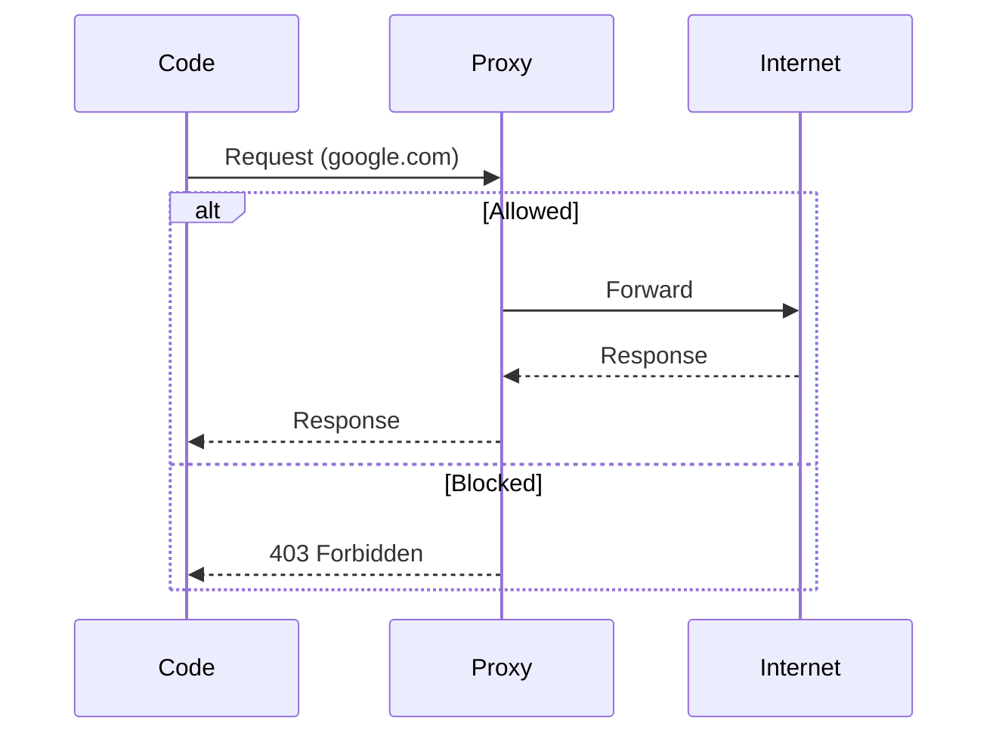

Security is the cornerstone of isol8. Every execution runs inside a Docker container with multiple layers of defense to prevent abuse, resource exhaustion, and data leakage.

## Container Isolation

By default, every execution is strictly isolated.

### File System
- **Read-Only Root**: The root filesystem is mounted as read-only (`ReadonlyRootfs: true`). Code cannot modify system files.
- **tmpfs Mounts**: Writable directories are limited to `/sandbox` (execution allowed) and `/tmp` (execution blocked).
- **Non-Root User**: All code runs as the `sandbox` user (uid 100), not root. `no-new-privileges` prevents privilege escalation.

### Process Isolation
- **PID Limit**: Limits the number of processes to prevent fork bombs (default: 64).
- **Cleanup**: After execution, all processes owned by the `sandbox` user are killed (`pkill -9 -u sandbox`) before the container is reused.

### Seccomp Profiles
isol8 applies a "safety" seccomp profile by default. It blocks dangerous syscalls like `ptrace`, `mount`, and `kexec_load` while allowing standard application behavior.

<Tip>
  You can customize seccomp profiles in your configuration. See the [Security Configuration](/v2/configuration#security-security) for details.
</Tip>

#### Custom Profiles

If the default "safety" profile is too restrictive, you can provide your own.

1. Create a seccomp profile JSON file (following Docker's format).
2. Point to it in your configuration.

```json
{
  "security": {
    "seccomp": "custom",
    "customProfilePath": "./seccomp.json"
  }
}
```

The profile should define `defaultAction` and `syscalls`.

```json
{
  "defaultAction": "SCMP_ACT_ERRNO",
  "architectures": ["SCMP_ARCH_X86_64", "SCMP_ARCH_AARCH64"],
  "syscalls": [
    {
      "names": ["read", "write", "exit", "sigreturn"],
      "action": "SCMP_ACT_ALLOW"
    }
  ]
}
```

## Network Control

Control exactly which domains your code can access.

### Network Modes

<CardGroup cols={3}>
  <Card title="none (Default)" icon="shield-check">
    **Highest Security**. No network interface. Blocks all traffic. Ideal for most tasks.
  </Card>
  <Card title="filtered" icon="filter">
    **High Security**. Bridge network with HTTP/HTTPS proxy + whitelist/blacklist.
  </Card>
  <Card title="host" icon="globe">
    **Low Security**. Full host network access. Use only for trusted code.
  </Card>
</CardGroup>

### Filtered Mode (`--net filtered`)

This mode routes all HTTP/HTTPS traffic through an internal proxy (`proxy.sh`) and enforces strict iptables rules.



- **Whitelist**: Allow only specific domains.
- **Blacklist**: Block specific domains.
- **Kernel Enforcement**: iptables rules ensure the `sandbox` user can **only** reach the proxy. Direct connections are dropped.

#### Example: Allow OpenAI API only

```bash
isol8 run script.py --net filtered --allow "^api\.openai\.com$"
```

#### Example: Block suspicious domains

```bash
isol8 run script.py --net filtered --deny ".*\.ru$" --deny ".*\.cn$"
```

<Warning>
  Filtered mode requires the container to have `CAP_NET_ADMIN` to set iptables rules. This capability is dropped for the user process but used during container setup.
</Warning>

## Resource Limits

Prevent runaway code from crashing your system.

### CPU & Memory

- **Memory**: Hard limit on RAM usage (default: 512MB). OOM-killed if exceeded.
- **CPU**: Limits CPU usage (default: 1 core).

```bash
# Increase limits for data processing
isol8 run script.py --memory 2g --cpu 2.0
```

### Timeouts

- **Execution Timeout**: Hard limit on execution time (default: 30s). Process is killed with SIGKILL if exceeded.

```bash
# Allow long-running script
isol8 run script.py --timeout 60000
```

## Secret Masking

Never leak credentials in logs or output.

When you pass secrets via `--secret`, isol8:
1. Injects them as environment variables.
2. Automatically masks their values in stdout and stderr with `***`.

```bash
# Pass API key safely
isol8 run -e "import os; print(os.environ['API_KEY'])" 
  --runtime python --secret API_KEY=sk-12345

# Output: ***
```

This ensures that even if your code prints the secret, it won't be exposed to the user.

## Audit Logging

For compliance and forensics, enable audit logging in your configuration. This records every execution with metadata, resource usage, and security events.

See [Observability](/v2/observability) for details on audit logs.
